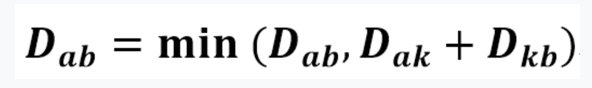

# 플로이드-워셜 알고리즘이란?

플로이드 워셜 알고리즘은 V개의 정점과 E개의 간선을 가진 가중 그래프 G에서 모든 정점사이의 최단경로를 구하는 알고리즘이다.

- 어떤 두 정점 사이의 최단경로는 특정한 경유지(K)를 거치거나 거치지 않는 경로 중 하나이다. (정점 A와 B의 최단경로는 A-K-B 또는 A- B 이다)
- 경유지 K를 거친다면 최단 경로를 이루는 부분 경로 역시 최단 경로이다. (A-B의 최단경로가 A-K-B라면 A-K 와 K-B도 최단경로이다.)
- cycle이 없다면 음수 가중치도 가능하다.
- DP로 접근한다.
  <p align="center"></p>

# 자바 코드

```java
    public class Main{
        public static void main(String[] args){

            // N은 정점의 개수
            // M은 간선의 개수
            int[][] graph = new int[N+1][M+1];

            for(int i=1; i<=M; i++){
                // 간선의 정보 저장
                graph[출발점][도착점] = 가중치;
            }

            for(int i=1; i<=N; i++){
                for(int j=1; j<=N; j++){
                    for(int k=1; k<=N; k++){

                        // j에서 k로 가는 중 j와 k가 자기 자신이 아닐때
                        // 경유지에 가는 경로가 있을 때
                        if(j != k && graph[j][i] != 0 && graph[i][k] != 0){
                            // j에서 k로 가는 경로가 없거나
                            // j에서 k로 가능 경로가 j에서 k로 가는중 i를 거치는것보다 클 경우
                            // 최단거리를 갱신한다.
                            if(graph[j][k] == 0 || graph[j][k] > graph[j][i] + graph[i][k]){
                                graph[j][k] = graph[j][i] + graph[i][k]
                            }
                        }
                    }
                }
            }
        }
    }
```

모든 정점에 대해 모든 경유지로 삼아 확인하며 모든 간선을 체크하기때문에 for문이 3번 발생한다. 따라서 시간복잡도는 O(N^3)이다.

# Reference
