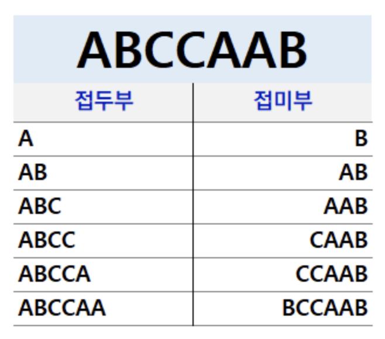
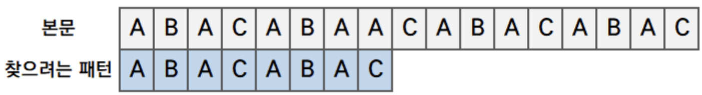
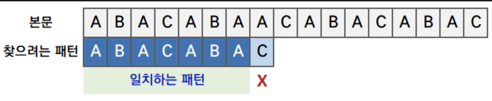
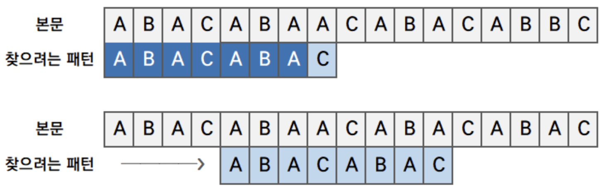
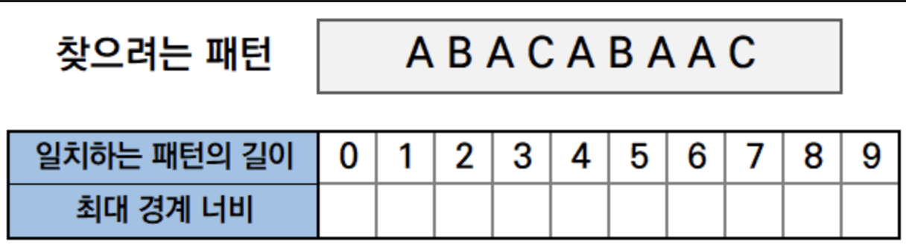
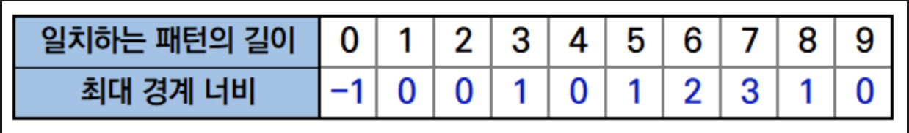
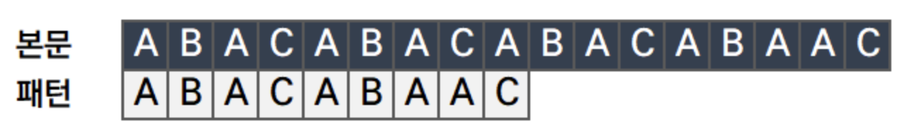
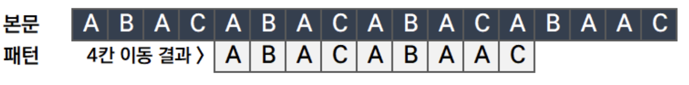

<!-- <p align="center"></p> -->

# KMP알고리즘 이란?

### Brute Force

만약 우리가 어떤 문자열A에서 어떠한 문자열 B가 있는지 확인하려면 대부분 문자열 A의 시작부터 끝까지 하나씩 B를 순차적으로 확인하는 방법을 생각할 것이다. 하지만 이때 문자열 A의 길이가 a, 문자열 B의 길이가 b라고 한다면 시간복잡도는 O(ab)가 되어버린다.

## KMP 알고리즘

KMP 알고리즘은 찾고자 하는 패턴으로 찾다가 `불일치가 발생하면 그 이전까지 검색했던 즉 찾았던 문자열에서 접두부, 접미부, 경계 를 개념을 이용하여` 비교 횟수를 줄이고 검색 알고리즘의 효율성을 높이는 알고리즘이다.

### 접두사와 접미사

<p align="center"></p>

문자열 `ABCCAAB`가 있을 때 이 문자열의 접두부와 접미부는 다음과 같다.

위의 표는 문자열의 길이에 따라 접두부와 접미부를 나눈 것이다. 접두부는 앞에서부터, 길이에 따라 맨 마지막 문자로 끝나는 문자열이다.

여기서 경계란 만약 ABCCAAB 에서 `접두부와 접미부가 같은 경우` 그때의 접두부와 접미부를 뜻하는 것이다.

## KMP 알고리즘 순서

[ChanBlog](https://chanhuiseok.github.io/posts/algo-14/)에서 너무 잘 정리해주셔서 해당 내용을 가지고 온다.

1. 비교할 문자열(본문)과 찾으려는 패턴을 처음에 놓는다.

   <p align="center"></p>

2. 순서대로 패턴을 찾되, 불일치가 발생할 경우 일치하는 패턴 내에서 접두부, 접미부를 이용하여 점프를 한다.

   <p align="center"></p>

   위의 사진에서 보면 알 수 있듯이 `ABACABA`까지 패턴이 일치했다. 따라서 ABA 가 접두부와 접미부가 일치하므로, 경계인 C를 점프하고 찾으려는 문자열을 접미부의 시작 문자열까지 이동시킨다.

   <p align="center"></p>

하지만 이런 KMP알고리즘이라도 매번 움직일 때마다 경계를 찾으려 접두부, 접미부를 반복적으로 분석한다면 이는 KMP알고리즘의 효율성을 떨어트린다.

## KMP최적화 - 이동경로 테이블 만들기

이동 경로 테이블이란, 찾으려는 패턴을 분석하여 패턴내의 접두부 접미부를 분석해놓은 테이블이다.

- 일치하는 패턴이 길이 : 본문과 찾으려는 패턴을 맨 앞에서부터 비교하여 불일치가 발생하기 직전까지의 일치하는 패턴의 길이
- 최대 경계 너비 : 본문과 패턴간의 일치하는 부분에서 경계를 찾고, 이중 최대 값을 의미한다.

   <p align="center"></p>

위의 사진에서 최대 경계너비를 찾으면

- 일치 패턴의 길이 : 0
  - 한칸을 이동시켜야(이동 공식 아래서 설명) 하므로 최대 경계너비값을 -1로 넣어준다.
- 일치 패턴의 길이 : 1
  - A 하나이므로 경계를 찾을수 없기에, 최대 경계 너비 값 = 0
- 일치 패턴의 길이 : 2
  - AB 에서의 경계는 없으므로, 최대 경계 너비 값 = 0
- 일치 패턴의 길이 : 3
  - ABA 에서의 경계는 B이므로, 최대 경계 너비 값 = 접두부(접미부의 길이) = 1
- 일치 패턴의 길이 : 4
  - ABAC 에서의 경계는 없으므로, 최대 경계 너비 값 = 0
- 일치 패턴의 길이 : 5
  - ABACA 에서의 경계는 A이므로, 최대 경계 너비 값 = 1
- 일치 패턴의 길이 : 6
  - ABACAB 에서의 경계는 AB이므로, 최대 경계 너비 값 = 2
- 일치 패턴의 길이 : 7
  - ABACABA 에서의 경계는 ABA이므로(A도 경계가 될 수 있지만 최대는 아님), 최대 경계 너비 값 = 3
- 일치 패턴의 길이 : 8
  - ABACABAA 에서의 경계는 A이므로, 최대 경계 너비 값 = 1
- 일치 패턴의 길이 : 9
  - ABACABAAC 에서의 경계는 없으므로, 최대 경계 너비 값 = 0

<p align="center"></p>
따라서 위의 방법으로 최대 경계너비를 채우면 다음과 같다.

이제 이동거리에 대한 공식은 다음과 같다.

```
                  이동거리 = 일치하는 패턴의 길이 - 최대 경계 너비
```

이에 대한 예시는 다음과 같다.

<p align="center"></p>

다음과 같이 본문과 패턴이 있을 때 해당 패턴의 일치하는 길이는 7이다. 이때의 최대 경계너비는 3이므로 `이동거리는 일치하는 패턴의 길이 - 최대경계 너비` 이므로 `7-3=4`이다.

<p align="center"></p>
따라서 4칸 이동하여 다시 처음부터 패턴을 찾기 시작한다.

다음과 같은 방법을 KMP알고리즘은 진행된다.

# 자바 코드

```java

public class KMP {
    static int[] table;
    public static void main(String[] args) {
        String str = "ABACABACABACABAAC";
        String patten = "ABACABAAC";
        createTable(patten);
        for(int t : table){
            System.out.print( t + " ");
        }
        kmp(str, patten);
    }
    static void createTable(String patten){
        int k = 0;
        table = new int[patten.length()+1];
        table[0] = -1;
        for(int i=1; i<patten.length(); i++){
            while(k > 0 && (patten.charAt(k) != patten.charAt(i))){
                k = table[k];
            }
            if(patten.charAt(k) == patten.charAt(i)){
//                System.out.println("i : " + i + " k+1: " + (k+1));
                table[i+1] = ++k;
            }
        }
    }
    static void kmp(String str, String pattern){
        int distance = 0, idx = 0, cnt = 0;
        int findFlag = 0;

        while(true){
            idx = 0;

            // 허용 범위를 벗어나면 반복문 나가기
            if((idx + distance) + pattern.length() > str.length()) break;

            while(str.charAt(idx+distance) == pattern.charAt(cnt)){
                cnt++;
                idx++;

                if(cnt == pattern.length()){
                    System.out.printf("%d번째에서 찾기 완료!\n", distance+1);
                    findFlag++;
                    break;
                }
            }
            distance = distance + (cnt - table[cnt]); // 전체 배열의 총 이동거리 계산
            cnt = 0; //일치하는 갯수 초기화
        }
    }
}

```

# KMP 내용추가

더욱 효율적으로 KMP알고리즘을 해결하는 방법이 있기 때문에 다음의 코드를 추가한다. 관련 설명은 [DDijkstra's Record 블로그](https://devje8.tistory.com/24) 에 잘 설명되어있다.

```java
import java.io.BufferedReader;
import java.io.InputStreamReader;

public class KMP2 {
    public static int result;
    public static int[] pi;
    public static String origin, pattern;

    public static void main(String[] args) throws Exception{
        BufferedReader br = new BufferedReader(new InputStreamReader(System.in));
        origin = br.readLine();
        pattern = br.readLine();

        pi = new int[pattern.length()];
        getPi();
        KMP();
    }
    private static void getPi(){
        int j=0;
        for(int i=1; i<pattern.length(); i++){
            // 맞는 위치가 나올 때까지 j-1칸의 공통 부분 위치로 이동
            while(j>0 && pattern.charAt(i) != pattern.charAt(j)){
                j = pi[j-1];
            }
            // 맞는경우
            if(pattern.charAt(i) == pattern.charAt(j)){
                // i길이 문자열의 공통길이는 j의 위치 + 1
                pi[i] = ++j;
            }
        }
    }
    private static void KMP(){
        int j=0;
        for(int i=0; i<origin.length(); i++){
            // 맞는 위치가 나올 때까지 j-1칸의 공통 부분 위치로 이동
            while (j > 0 && origin.charAt(i) != pattern.charAt(j)){
                j = pi[j-1];
            }
            // 맞는 경우
            if(origin.charAt(i) == pattern.charAt(j)){
                if(j == pattern.length() - 1){
                    result = 1;
                    break;
                }
                // 맞았지만 패턴이 끝나지 않았다면 j를 증가
                else ++j;
            }
        }
    }
}

```

# Reference

- https://chanhuiseok.github.io/posts/algo-14/
