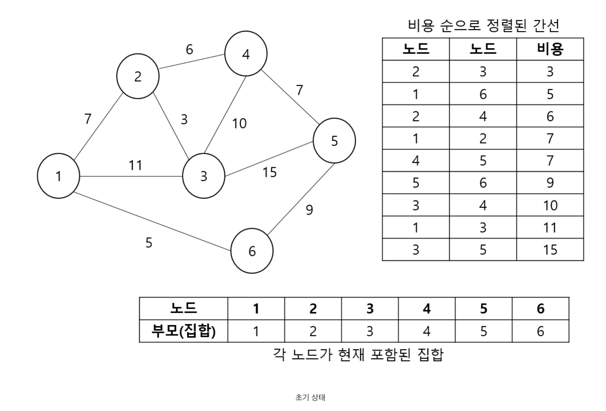

<!-- <p align="center"></p> -->

# 크루스칼 알고리즘이란?

크루스칼 알고리즘은 그래프에서 최소 비용 신장 부분 트리를 구하는 알고리즘이다. 크루스칼알고리즘은 Union&Find와 그리디 알고리즘을 같이 사용하여 구현한다.

### 신장 트리

- 신장 트리란 각 노드가 모두 연결이 되어있고, 싸이클 즉 순환이 없는 트리를 말한다.

## 크루스칼 알고리즘 구현

1. 주어진 그래프의 모든 간선에 대해서, 간선의 가중치가 낮은 순으로 오름차순 정렬한다. (ArrayList or Array 사용)
2. 이후 정렬된 순서대로 간선을 하나하나씩 다음 3, 4번을 반복한다.

   3. 간선의 양 끝 정점을 Union할 수 있는 지 Find함수를 통해 판단한다.(싸이클 여부를 확인하는 것)

   4. Union할 수 있다면 두 정점을 Union해주고 길이를 증가시킨다.

이러한 과정을 반복하면 크루스칼 알고리즘이 구현 된다.

<p align="center"></p>

이런 그림이 있다면 다음과 같은 순서대로 알고리즘이 진행될 것이다.

1. 간선의 비용 순으로 정렬하고, 정렬된 순서대로 진행
2. 비용이 3인 노드 2와 노드 3이 Union 가능한지 확인(Find 사용)
3. 연결 가능 -> Union
4. 비용이 5인 노드 1와 노드 6이 Union 가능한지 확인(Find 사용)
5. 연결 가능 -> Union
6. 비용이 6인 노드 2와 노드 4이 Union 가능한지 확인(Find 사용)
7. 연결 가능 -> Union
8. 비용이 7인 노드 1와 노드 2이 Union 가능한지 확인(Find 사용)
9. 싸이클 발생 -> 연결 불가 Pass

......... 반복 .........

## 코드

```java
    static int[] chArr;
    static ArarayList<Node> nodeList;

    // NodeClass
    static class Node{
        int nodeA, nodeB, weight;
        public Node(int nodeA,int nodeB,int weight){
            this.nodeA = nodeA;
            this.nodeB = nodeB;
            this.weight = weight;
        }
    }

    // Find
    static int find(int n){
        if(chArr[n] == n) return n;
        return chArr[n] = find(chArr[n]);
    }
    // Union
    static void union(int a, int b){
        chArr[find(a)] = chArr[find(b)];
    }
    public static void main(String[] args){
        /// 인풋받는거 ... 중략 ...///

        nodeList.sort(n1, n2 -> n1.weight - n2.weight); // weight에 따라 오름차순 정렬

        int distance = 0; // 최소길이

        for(int i=0; i<nodeList.size(0); i++){
            Node node = nodeList.get(i);
            if(find(node.nodeA) != find(node.nodeB)){
                union(node.nodeA, node.nodeB);
                distance+=node.weight;
            }
        }
    }
```

# Reference

- https://sskl660.tistory.com/72
