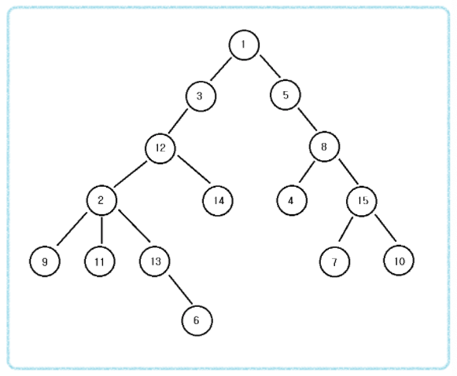

# LCA알고리즘이란?

LCA 알고리즘은 Lowest Common Ancestor의 약자로 영어 해석 그대로 어떠한 트리에서 최소 공통 조상을 찾는 알고리즘이다.

<p align="center"></p>

위의 사진에서 두 정점 u,v 의 가장 가까운 조상을 LCA(u,v)라고 한다.

- 예를들어 12와 5의 공통 조상 LCA(12,5)는 1이고, 6과 9의 공통 조상 LCA(6,9)는 2이다.
- LCA 알고리즘은 주로 트리에서 노드와 노드 간의 거리를 구하거나 공통 조상이 누구인지 묻는 문제에서 많이 등장한다.

## 구현 방법

1. 모든 노드에 대한 깊이(depth)를 계산한다.
2. 최소 공통 조상을 찾을 두 노드를 확인한다.
   1. 먼저 두 노드의 깊이(depth)가 동일하도록 거슬러 올라간다.
   2. 부모가 같아질 때까지 반복적으로 두 노드의 부모 방향으로 거슬러 올라간다.
3. 모든 LCA(a,b)연산에 대하여 2번의 과정을 반복한다.

# 코드

```java
public class LCA{
    // N은 노드의 개수, K는 조상에 대해 저장하는 값
    static int N, K;
    // 각 노드의 깊이값을 저장하는 배열
    static int[] depth;

    // parent[K][V] 는 정점 V의 2^K번째 조상의 정점 번호
    // parent[K][V] = parent[K-1][parent[K-1][V]] 이다.
    static int[][] parent;

    // 인접리스트 정보를 저장하는 tree이다.
    static ArrayList<Integer>[] tree;

    // 예를 들어 N이 60이라면 2^6 = 64이므로 K값은 6이 됌
    static void getK(){
        for(int i=1; i<=N; i*=2){
            K++;
        }
    }

    // id는 노드번호, cnt는 깊이
    static void getDepth(int id, int cnt){
        // 1.depth를 기록
        depth[id] = cnt;

        // 2. 자식들의 depth를 기록
        int len = tree[i].size();
        for(int i=0; i<len; i++){
            int next = tree[id].get(i);

            // 아직 깊이를 모르는 상태라면 즉 미방문 노드라면
            if(depth[next] == 0){
                getDepth(next, cnt+1);

                // 2^0 번째 부모 즉 바로위의 부모(첫번째 부모)를 저장하는 것
                parent[0][next] = id;
            }
        }
        return;
    }

    // 부모 채우기 즉 Sparse Table 그리기
    static void fillParent(){
        for(int i=1; i<K; i++){
            for(int j=1; j<=N; j++){
                parent[i][j] = parent[i-1][parent[i-1][j]];
            }
        }
    }

    // LCA 구하기
    static int lca(int a, int b){
        // 1. depth[a] >= depth[b] 가 되도록 조정
        if(depth[a] < depth[b]) return lca(b, a);

        // 2. 더 깊은 a를 2^K승 점프하여 depth를 맞추기
        for(int i=K-1; i>=0; i--){
        // 만약 depth가 5차이 난다면, 먼저 4를 선택하고, 이후 다시 1이 선택되므로 depth가 맞춰짐
            if(Math.pow(2,i) <= depth[a] - depth[b]){
                a = parent[i][a];
            }
        }

        // 3. depth를 맞췄는데 같다면 종료
        if(a == b) return a;

        // 4. a-b 는 같은 depth이므로 2^K승 점프하여 공통부모 바로 아래까지 올라가기
        for(int i=K-1; i>=0; i--){
            if(parent[i][a] != parent[i][b]){
                a = parent[i][a];
                b = parent[i][b];
            }
        }
        // 이후 공통부모 바로 아래에 a와 b값이 위치하므로 그것의 바로 한칸 위를 리턴해주기.
        return parent[0][a];
    }
}
```

# Reference

- https://www.youtube.com/watch?v=O895NbxirM8&ab_channel=%EB%8F%99%EB%B9%88%EB%82%98
- https://www.crocus.co.kr/660
- https://subbak2.tistory.com/60
