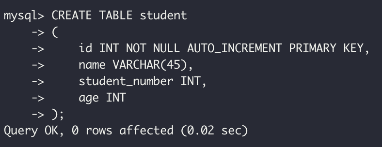

<!-- <p align="center"></p> -->

이번 포스팅에서는 MySQL을 사용하기위해 기본적으로 알아야할 C(create)R(read)U(update)D(delete)에 관한 문법에 대해 포스팅 해보겠다.

# CRUD에 들어가기 전에

- MySQL에서는 CREATE를 사용하여 데이터베이스와 테이블을 만들 수 있다.

## CREATE DATABASE

```sql
CREATE DATABASE 데이터베이스_이름

-- ex
CREATE DATABASE student;
```

다음 커맨드를 실행하고 정상적으로 실행이 되었을 경우 Query OK. 이런게 뜬다.

이후 `show databases`를 통해 sutdent가 생성된 것을 확인할 수 있다.

<p align="center"></p>

이후 `use 데이터베이스_이름` 을 선택하여 원하는 데이터베이스로 이동할 수 있다.

## CREATE TABLE

CREATE TABLE은 새로운 테이블을 생성해준다. 다음과 같은 방법으로 생성한다.

```sql
CREATE TABLE 테이블이름
(
    필드이름1 필드타입1,
    필드이름2 필드타입2
    ...
);
```

이와 같이 선언하여 Table을 생성할 수 있다. Mysql에서 타입은 다음과 같다.

<p align="center"></p>

나는 Student table에서 필요한 컬럼은 이름, 학번, 나이이므로 이에 맞는 쿼리를 작성하면 다음과 같다.

```sql
CREATE TABLE student
(
    id INT NOT NULL AUTO_INCREMENT PRIMARY KEY,
    name VARCHAR(45),
    student_number INT,
    age INT
);
```

- 위에 AUTO_INCREMENT는 그냥 자동으로 id를 생성해주는 조건이다.
  - 사실 student_number로 id를 대신할 수 있지만 그냥 실험삼아 만들어 주었다.

이 쿼리를 실행하면 다음과 같이 테이블이 생성된다.

<p align="center"></p>

테이블이 잘 생성되었는지 확인해보면

<p align="center"></p>
다음과 같이 잘 생성되어있고, id column이 auto_increment 설정이 되어있음을 알 수 있다.

## Drop

```sql
DROP DATABASE 데이터베이스이름
DROP TABLE 테이블이름
```

위에 DROP 명령어를 통해 만든 DATABASE와 TABLE을 삭제할 수 있다.

# 1. C(create) : 생성

MySQL에서는 INSERT INTO 문을 사용하여 테이블에 새로운 레코드를 추가할 수 있다. 다음과 같이 두가지 방법이 있다.

```sql
INSERT INTO 테이블이름(필드이름1, 필드이름2, 필드이름3, ...) VALUES (데이터값1, 데이터값2, 데이터값3, ...)

INSERT INTO 테이블이름 VALUES (데이터값1, 데이터값2, 데이터값3, ...)
```

두번째 방법처럼 생략시에는 데이터베이스의 컬럼과 같은 순서대로 값이 자동 대입된다.

이때 생략할 수 있는 필드

1. NULL을 저장할 수 있도록 설정된 필드
2. DEFAULT 제약 조건이 설정된 필드
3. AUTO_INCREMENT 키워드가 설정된 필드

```sql
insert into student(name, student_number, age) values("An", 21611111,27);
```

다음과 같은 명령어로 나는 record를 추가해주었다.

<p align="center"></p>
잘 추가됨을 확인할 수 있다. 근데 id를 보면 내가 이전에 테스트 하느라 데이터를 넣었다가 삭제했었어서 auto_increment가 1부터 시작하지 않은 것을 볼수 있다.

> ALTER TABLE student AUTO_INCREMENT = 1

을 통해 테이블의 AUTO_INCREMENT를 다시 1부터 증가하게끔 만들 수 있다.

원할한 확인을 위해 테이블에 데이터를 다 삭제하고 다시 진행하였다.

<p align="center"></p>

다음과 같이 id가 다시 1부터 증가하여 새로 만들어짐을 알 수 있다.

# 2. R(read) : 조회

SELECT 문을 통해 데이터베이스를 조회 할수 있다. 예시를 보여줄 때 조건을 붙여가며 데이터를 조회하도록 하겠다.

## 모든 데이터 조회

`SELECT * FROM 테이블_이름` 을 통해 테이블내의 모든 데이터를 조회할 수 있다.

<p align="center"></p>

## 특정 컬럼만 조회

`SELECT 컬럼1, 컬럼2, ... FROM 테이블이름`

- 위에서 사용했던 쿼리문에 \* 대신에 컬럼의 이름을 적어주면 해당 컬럼들만 조회할 수 있다.
  <p align="center"></p>

## WHERE절 (조건부 조회)

`SELECT 컬럼1, 컬럼2, ... FROM 테이블이름 WHERE 조건`

- WHERE문을 통해 조건을 걸어줄 수 있다.
- 여러조건을 AND, OR 로 묶어줄 수 있다.
  <p align="center"></p>

## ORDER BY (정렬)

`SELECT 컬럼1, 컬럼2, ... FROM 테이블이름 WHERE 조건 ORDER BY 정렬기준 [ASC,DESC]`

- ORDER BY 문을 통해 정렬을 해줄 수 있다
- 이때 WHERE문은 없어도 된다.
- ASC는 오름차순(default), DESC는 내림차순이다.
  <p align="center"></p>

## LIMIT 와 OFFSET

`LIMIT [숫자]`

- LIMIT를 맨 마지막에 붙여 줌을 통해 조회할 record의 수를 제한할 수 있다.

`LIMIT [숫자1] OFFSET [숫자2]`

- OFFSET을 통해 조회할 데이터의 OFFSET을 지정할 수 있다.
- LIMIT 개의 데이터를 OFFSET이후의 데이터부터 조회할 수 있다.

<p align="center"></p>

# 3. U(update) : 수정

`UPDATE 테이블이름 SET 컬럼명1=바꿀값1, 컬럼명2=바꿀값2, ... WHERE 조건`

- 조건에 따라 컬럼의 데이터를 바꿔줄 수 있다.
- 다음과 같이 여러 컬럼의 데이터를 바꾸고 싶을 경우 , 를 통해 나눠주면 된다.
  `UPDATE 테이블이름 SET 컬럼명1=바꿀값1, 컬럼명2=바꿀값2, ... WHERE 조건 AND 조건 OR 조건`
- UPDATE할때도 마찬가지로 AND와 OR을 통해 여러 조건을 줄 수 있다.
  <p align="center"></p>
  다음 사진처럼 update 명령어를 통해 im 을 kim으로 바꿔줬다.

# 4. D(delete) : 삭제

`DELETE FROM 테이블이름 WHERE 조건`

- 조건에 따라 테이블의 데이터를 삭제할 수 있다.
- 전체 레코드를 제거하고 싶으면 그냥 `DELETE FROM 테이블이름` 을 하면 된다.
  <p align="center"></p>

# Reference

- http://tcpschool.com/mysql/mysql_basic_create
- https://lgphone.tistory.com/85
