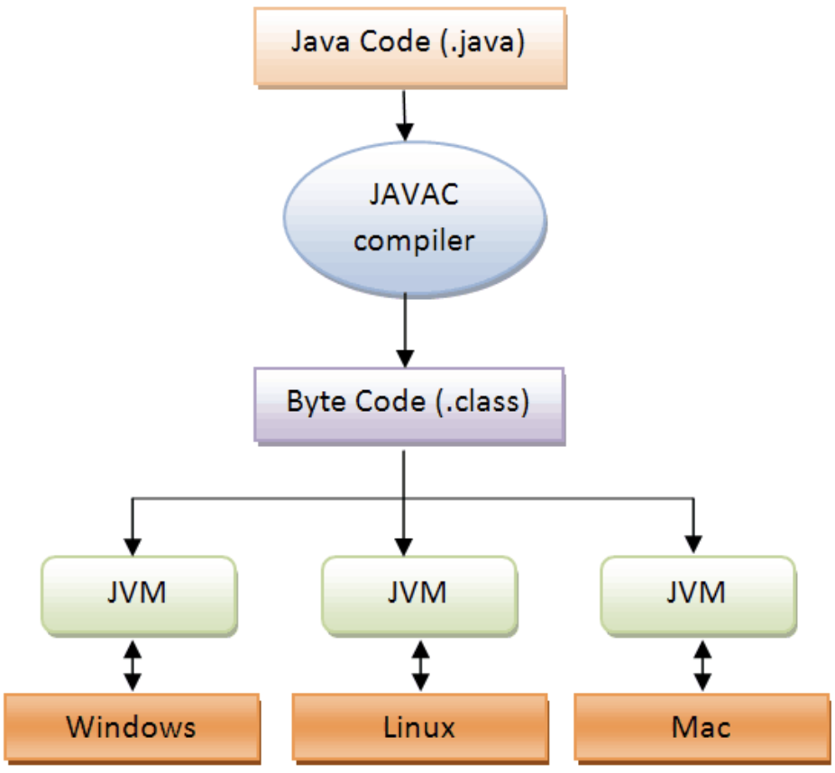
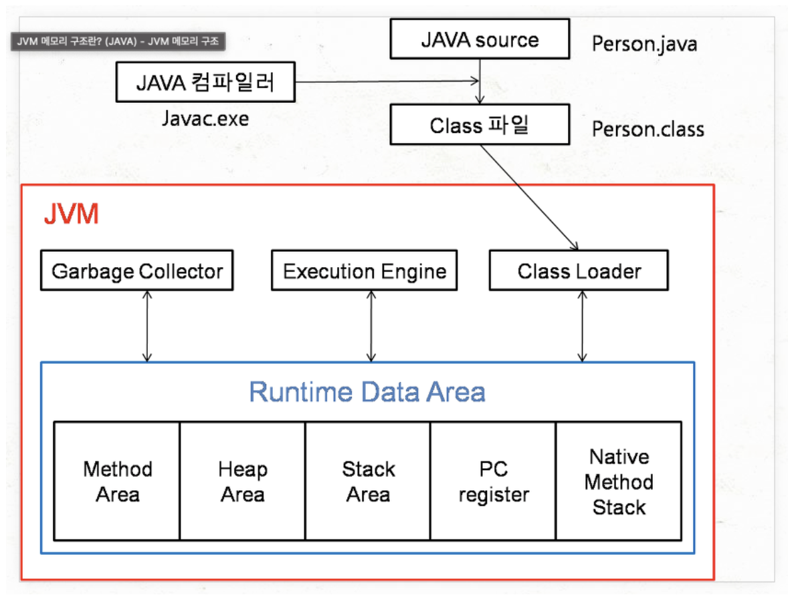
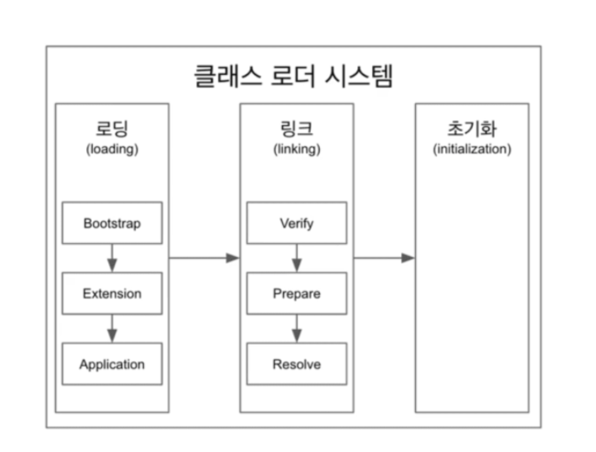
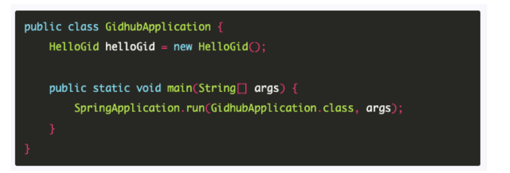
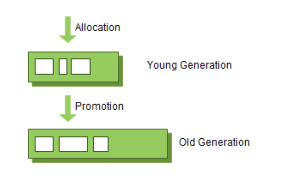
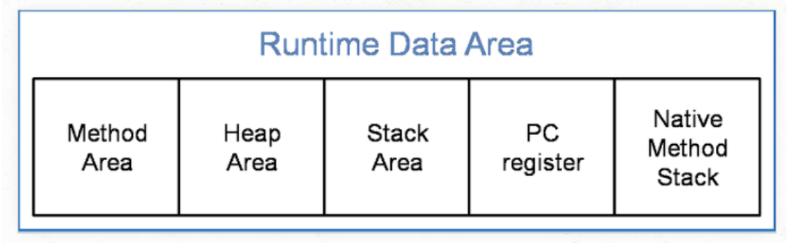

# 자바의 특징

- 운영체제의 독립적 (**JVM**)을 통해서 가능
- 객체지향언어
- 자동 메모리관리 : **가비지 컬렉터**
- 네트워크와 분산처리 지원
- 멀티쓰레드 지원
- 동적로딩
  - 실행시 모든 클래스가 로딩되지 않고 필요한 시점에 클래스를 로딩하여 사용한다.

# JVM

JVM은 Java Virtual Machine의 약자로 자바 가상머신이라고 부른다.

순서

1. 자바 컴파일러에 의해 자바소스파일이 바이트코드로 변환된다.
2. JVM에서 이를 읽어 들인 다음에 기계언어로 바꿔준다.

- 운영체제에 관계없이 실행가능

## 메모리구조

JVM의 메모리구조는 크게 Garbage Collector, Execution Engine, Class Loader, Runtime Data Area 로 나뉜다.

## Class Loader

- 자바 컴파일러에 의해 바이트 코드 형태로 Class 파일이 생성된다. 이를 Class Loader가 로드해주고 링크를 통해 배치하는 작업을 수행하는 모듈이다.
- 런타임시에 동적으로 클래스를 로드한다.

### 역할

- **Loading** : 클래스 파일에서 클래스 이름, 상속관계, 클래스의 타입(class, interface, enum) 정보, 메소드 & 생성자 & 멤버변수 정보, 상수 등에 대한 정보를 로딩해서 Binary 데이터로 메소드영역에 저장한다.

  로딩이 끝나면 Class객체를 생성하여 힙 영역에 저장한다.

  - Bootstrap → Extension (Core Java Class) → Application 순서로 찾게 된다.
  - 일반적으로 99%는 Application에 존재한다.
  - 만약 Class가 없다면 ClassNotFoundException이 발생하게 된다.

- **Linking** : Verification 과 Preparation, Resolution 단계를 거치면서 바이트코드를 검증하고 필요한 만큼의 메모리를 할당한다. Resolution 과정에서는 Symbolic Reference 를 Direct Reference 등으로 바꿔준다.

  - Verify → Prepare → Resolve 순으로 진행된다
  - Verify : 바이트 코드를 수정 했을 수도 있기 때문에 **.class 파일** 형식이 유효한지 체크한다.
  - Prepare : 클래스 변수(static 변수)와 기본값에 필요한 메모리를 준비하는 과정이다.
  - Resolve : 심볼릭 메모리 레퍼런스를 메소드 영역에 있는 실제 레퍼런스로 교체한다. ㅏ

  

  - new HelloGid 부분에서 실제 힙에 있는 인스턴스를 가르킬 수 있도록 실제 레퍼런스를 Resolve 시점에 교체해준다.

- **Initialization** : 링크에서 Prepare 단계에서 확보한 메모리 영역에 static block 의 초기화 및 static 데이터들을 할당한다. Top->Bottom 방식으로 클래스들을 해석한다.

## Execution Engine

- 클래스 로더를 통해 JVM 내의 Runtime Data Area에 배치된 바이트 코드들을 명렁어 단위로 읽어서 실행한다.
- 최초 JVM이 나왔을 당시에는 인터프리터 방식이었기때문에 속도가 느렸지만 JIT 컴파일러 방식을 통해 이 점을 보완.
  - JIT는 바이트 코드를 어셈블러 같은 네이티브 코드로 바꿈으로써 실행이 빠르지만 역시 변환하는데 비용이 발생하였습니다. 이 같은 이유로 JVM은 모든 코드를 JIT 컴파일러 방식으로 실행하지 않고, 인터프리터 방식을 사용하다가 일정한 기준이 넘어가면 JIT 컴파일러 방식으로 실행합니다.

## Garbage Collector

- 힙 메모리 영역에 생성된 객체들 중에서 참조되지 않은 객체들을 탐색 후 제거하는 역할을 합니다.
- 개발자가 직접 메모리관리를 하지 않아도 되는 이유

JVM에는 일반적으로 Young Generation / Old Generation 이라는 두가지 물리적 공간이 존재한다.

GC는 2가지 전제를 갖고 있다. 대부분의 객체가 금방 Unreachable한 상태가 된다는 것과 Old 객체에서 Young 객체로의 참조가 적다는 점이다.

### Young Generation 영역

- 새롭게 생성한 객체가 위치한다. 많은 객체가 이 영역에서 생성 되었다 사라지며 이를 **Minor GC** 라고 한다.
- Young 영역은 다시 Eden 영역과 Survivor 영역으로 나뉜다.
- Eden 영역 : New를 이용해서 객체를 생성하면 이 객체는 Eden 영역에 위치하게 된다.
- Survivor 영역 : Eden 영역에서 GC가 한번 발생후 살아남은 객체는 Survivor 영역 중 하나로 이동한다.
  - 이때 Eden 영역에서 Survivor1, Survivor2 영역으로 이동할 때 Minor GC가 수행된다.
  - Suvivor 영역이 가득차면 Old 영역으로 이동한다.

### Old Generation 영역

- 접근 불가능한 상태가 되지 않아 Young 영역에서 살아남은 객체가 이 영역으로 복사된다.
- Young 영역보다 크게 할당되며 GC는 적게 발생한다.
- 이 영역에서 객체가 사라질 때 **Major GC** 또는 **Full GC**가 발생한다
- 데이터가 가득 찼을 때 GC를 수행한다.
  - GC 방식은 Serial GC, Paraller GC, Paraller Old GC, CMS GC, GI GC 이 있다.

### GC의 동작 방식

Young 영역과 Old 영역은 서로 다른 메모리 구조로 되어있기 때문에 세부적인 동작방식은 다르지만 2가지의 공통적인 단계를 따른다.

1. Stop The World
2. Mark and Sweep

**Stop The World**

- Stop The World 는 가비지 컬렉션을 실행하기 위해 JVM이 어플리케이션의 실행을 멈추는 작업이다.
- GC가 실행될 떄는 GC를 실행하는 쓰레드를 제외한 모든 쓰레드들의 작업이 중단되고, GC가 완료되면 작업이 재개된다.
- GC의 성능 개선을 위해 튜닝을 한다고 하면 보통 stop-the-world의 시간을 줄이는 것이다.

**Mark and Sweep**

- Mark : 사용되는 메모리와 사용되지 않는 메모리를 식별하는 작업
- Sweep : Mark 단계에서 사용되지 않음으로 식별된 메모리를 해제하는 작업

Stop The World 를 통해 모든 작업을 중단시키면, GC는 스택의 모든 변수 또는 Reachable객체를 스캔하면서 각각이 어떤 객체를 참고하고 있는지를 탐색하게 된다. 이때 사용되고 있는 메모리를 식별하고 Mark되지 않은 객체를 메모리에서 제거한다.

### **Minor GC**

- Eden 영역이 꽉 차면 Minor GC가 발생한다.
- 사용되지 않는 메모리는 해제되고, 사용중인 객체는 Survivor 영역으로 이동한다.

### Major GC

- Young영역에서 오래 살아남은 객체들은 Old 영역으로 Promotion 되는데 Major GC는 객체들이 계속 Promotion되어 Old 영역의 메모리가 부족해지면 발생한다.

Young 영역은 일반적으로 Old 영역보다 크키가 작기 때문에 GC가 보통 0.5초에서 1초 사이에 끝난다. 그렇기 때문에 Minor GC는 애플리케이션에 크게 영향을 주지 않는다. 하지만 Old 영역은 Young 영역보다 크며 Young 영역을 참조할 수도 있다. 그렇기 때문에 Major GC는 일반적으로 Minor GC보다 시간이 오래걸리며, 10배 이상의 시간을 사용한다.

## Runtime Data Area

JVM의 메모리 영역으로 자바 애플리케이션을 실행할 때 사용되는 데이터들을 적재하는 영역입니다. 이 영역은 크게 Method Area, Heap Area, Stack Area, PC Register, Native Method Stack로 나눌 수 있습니다.

Method Area

- 모든 쓰레드가 공유하는 메모리 영역입니다. 메소드 영역은 클래스, 인터페이스, 메소드, 필드, Static 변수 등의 바이트 코드를 보관합니다.

Heap Area

- 모든 쓰레드가 공유하며, new 키워드로 생성된 객체와 배열이 생성되는 영역입니다. 또한, 메소드 영역에 로드된 클래스만 생성이 가능하고 Garbage Collector가 참조되지 않는 메모리를 확인하고 제거하는 영역입니다.

Stack Area

- 메서드 호출 시마다 각각의 스택 프레임(그 메서드만을 위한 공간)이 생성합니다. 그리고 메서드 안에서 사용되는 값들을 저장하고, 호출된 메서드의 매개변수, 지역변수, 리턴 값 및 연산 시 일어나는 값들을 임시로 저장합니다. 마지막으로, 메서드 수행이 끝나면 프레임별로 삭제합니다.

PC Register

- 쓰레드가 시작될 때 생성되며, 생성될 때마다 생성되는 공간으로 쓰레드마다 하나씩 존재합니다. 쓰레드가 어떤 부분을 무슨 명령으로 실행해야할 지에 대한 기록을 하는 부분으로 현재 수행중인 JVM 명령의 주소를 갖습니다.

Native Method Stack

- 자바 외 언어로 작성된 네이티브 코드를 위한 메모리 영역입니다.

# Reference

- 남궁성, Java의 정석 (3rd Edition), 도우출판

- [https://jins-dev.tistory.com/entry/Java-클래스로더ClassLoader에-대한-이해](https://jins-dev.tistory.com/entry/Java-%ED%81%B4%EB%9E%98%EC%8A%A4%EB%A1%9C%EB%8D%94ClassLoader%EC%97%90-%EB%8C%80%ED%95%9C-%EC%9D%B4%ED%95%B4)

- [https://steady-coding.tistory.com/305](https://steady-coding.tistory.com/305)

- [https://goodgid.github.io/Java-Class-Loader/](https://goodgid.github.io/Java-Class-Loader/)

- [https://jins-dev.tistory.com/entry/가비지-컬렉터Garbage-Collector-의-개념과-동작-원리](https://jins-dev.tistory.com/entry/%EA%B0%80%EB%B9%84%EC%A7%80-%EC%BB%AC%EB%A0%89%ED%84%B0Garbage-Collector-%EC%9D%98-%EA%B0%9C%EB%85%90%EA%B3%BC-%EB%8F%99%EC%9E%91-%EC%9B%90%EB%A6%AC)

- [https://mangkyu.tistory.com/118](https://mangkyu.tistory.com/118)
