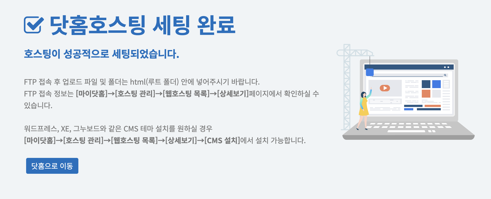
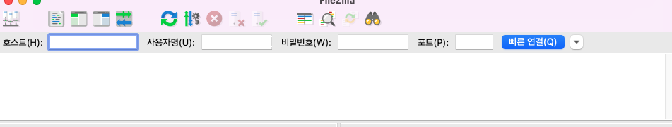
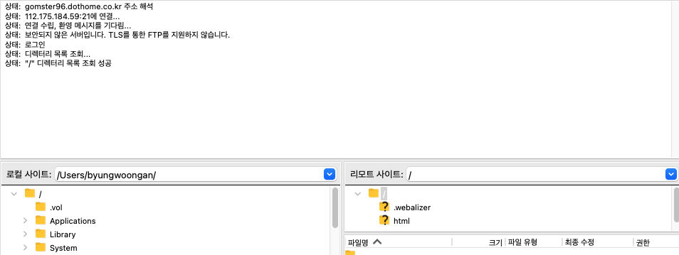
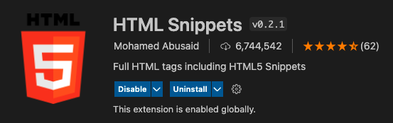
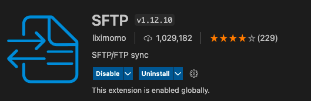
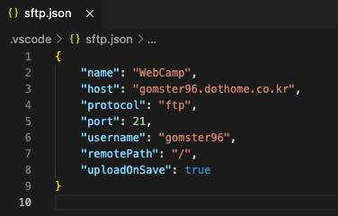
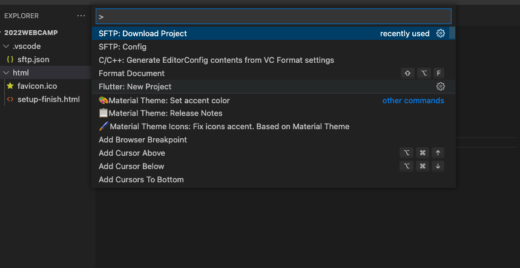

# 닷홈(dothome)이란

[닷홈](https://www.dothome.co.kr/)은 웹 호스팅을 해주는 사이트이다. 닷홈에서는 무료 호스팅을 3달간 지원해주기 때문에 사용하도록 한다.

## 호스팅이란

웹 페이지를 만들기 위해서는 일단 서버가 필요하다. 하지만 개인이 서버를 구매하며 이를 유지하는 것은 쉽지 않다. 따라서 이런 서버를 가지고 있는 기업들에게 유지하는 비용을 내고 빌려 쓰는 것을 **호스팅**이라고 한다.

# 닷홈으로 웹 호스팅하기

닷홈으로 웹 호스팅을 하는데에는 다음과 같은 순서로 진행된다.

## 1. 닷홈에서 무료 호스팅 신청하기

닷홈 홈페이지에서 무료 호스팅을 신청할 수 있다. [무료호스팅링크](https://www.dothome.co.kr/web/free/index.php)를 클릭하면 무료호스팅을 신청하는 페이지로 이동한다. 회원 가입을 하고 신청하면 된다.

무료 호스팅을 완료하고 해당 도메인으로 접속해보면 다음과 같은 페이지가 나온다.

- 업로드 할 파일은 html 폴더 안에 넣어주면 된다.

## 2. FTP 클라이언트 프로그램 설치 (Filezilla)

FTP란 File Transfer Protocol의 약자로 사용자 PC와 호스팅 서버 간의 파일을 송수신하는 프로그램을 의미한다. 닷홈에서 무료 호스팅한 웹 서버(ssh 접속 불가)는 FTP로 html파일을 넘겨 줄 수 있으므로 FTP 클라이언트 프로그램인 Filezilla를 설치해서 사용해야한다. [설치링크](https://filezilla-project.org/)

설치후 filezilla를 실행시키면 창이 생기는데 가장 상단에 위치하는 호스트(도메인 명), 사용자명 (닷홈 ftp아이디), 비밀번호 (닷홈 ftp 비밀번호)를 입력해줌으로서 닷홈에서 제공하는 웹 호스팅 서버와 연결 할 수 있다.

연결을 진행하면 다음과 같이 Filezilla 프로그램이 변한다.

- 이후 remote에서 보이는 html 폴더에 html파일을 넣어주면 된다.

## 3. 개발환경 설정

- HTML Snippets extension
  - HTML 태그 자동완성

- sftp extension

  

- Syncs your local directory with a remote server directory. Allows you to optionally edit upload a file to the remote directory after it saves locally. This allows you to edit more or less directly on the server similar to WinScp or other similar programs. 쓰여있는 설명인데 단순히 하면 ftp 설정 후 편집하면 바로 로컬에 변화를 remote에 적용되도록 해준다.

- F1키를 누른 후 SFTP:Config를 변경해주면 된다.

  - host : 도메인 이름
  - name은 그냥 이름
  - protocol : 우리는 닷홈의 ftp를 사용할 것이므로 ftp로 변경
  - port : 닷홈 연결은 21번 포트를 사용하므로 21번으로 적음

        

        

    위에 SFTP : Download Project를 통해 remote에 있는 프로젝트를 local로 가져올 수 있다. 이후 html, css, js 파일을 수정함으로서 내가 원하는 웹페이지를 개발 할 수 있다.
