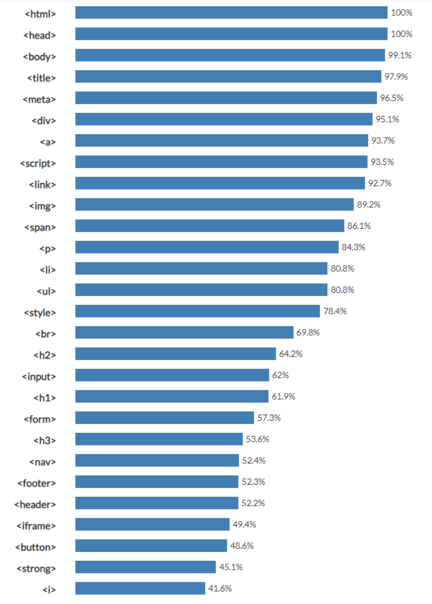
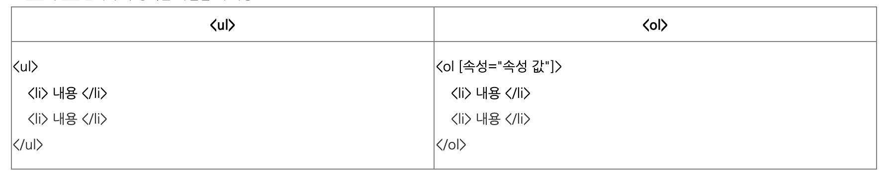

<!-- 

 -->

# HTML

HTML이란 Hyper Text Markup Language의 약자로 하이퍼 텍스트 문서가 마크업 언어 형태로 만들어 진 것이다.

# 태그(Tag)란

마크업 언어란 태그라는 형식으로 둘러진 언어를 의미하는데, 이때 태그는 표현이나 어떤 기능의 수행을 지시하는 짧은 낱말을 의미한다.

[HTML 태그 사용 순위 사이트](https://www.advancedwebranking.com/seo/html-study/)에 보면 웹페이지들에서 많이 쓰는 태그들의 평균을 나타내어 있다.

오늘 포스팅에서는 간단하게 해당 테그들의 기능들을 간략하게 설명할 것이다. 상세한 사용은 각 태그들을 필요 할 때마다 하나하나 더 깊게 찾아가면서 사용하도록 하자.

## \<html>

웹 페이지의 시작과 끝을 감싸주는 태그이다. 모든 웹페이지는 \<html>로 시작해서 \</html>로 끝난다.

- `<! doctype html>` 이를 통해 맨 처음 html문서라는 것을 주로 알려준다.

## \<head>

웹 페이지의 정보, 문서에서 사용할 외부 파일들을 링크할 때 사용한다.

- \<title>
- \<style>
- \<base>
- \<link>
- \<meta>
- \<script>
- \<noscript>
  의 내용들이 포함되어 있어야한다.

## \<body>

해당 HTML 문서의 텍스트, 하이퍼링크, 이미지, 리스트 등과 같은 모든 콘텐츠를 포함하는 영역을 정의할 때 사용한다.

- HTML문서에는 단 하나의 \<body>요소만이 존재한다.

## \<title>

문서의 제목을 표시한다.

## \<meta>

문자의 인코딩 및 문서 키워드에 대한 요약 정보를 입력한다.

- 우리는 한글을 사용하므로 대부분 utf-8 의 인코딩 방식으로 사용한다
- ex: `<meta charset="utf-8">`

## \

HTML문서에서 특정 영역(division)이나 section을 정의할 때 사용한다.

- 주로 html 요소들을 묶어주는 일종의 컨테이너(container) 역할을 많이 한다.

## \<a>

anchor태그라고 부르며, 웹 페이지나 외부사이트에 연결할 때 사용한다.

## \<script>

코드를 삽입할 때 사용한다. 보통 JavaScript코드를 넣을 떄 사용한다.

## \<link>

외부 파일을 연결할 때 사용한다.

## \

이미지 삽입에서 사용한다. 내 사용 예를 들면 이 포스트의 사진을 삽입할 때 해당 태그를 다음과 같이 사용하였다.

- `

`

## \

단락을 구분해주는 태그이다. 사용하면 단락을 구분하기 때문에 내용 앞 뒤로 빈 줄이 생긴다.

## \<li>

ul, ol을 사용하여 항목을 나열 할 때 사용한다. 즉 ul, ol이 틀이라면 li는 그 틀 안에 있는 list이다.

## \<ul>

unordered list , 순서가 없는 list를 만들 때 감싸주는 틀의 역할을 하는 태그이다.

## \<ol>

ordered list , 순서가 있는 list를 만들 때 감싸주는 틀의 역할을 하는 태그이다.

- type을 변경해주면 숫자나, 영어, 로마숫자로 표현 가능하다.
  - 1 : 숫자 default
  - a : 영어 소문자
  - A : 영어 대문자
  - i : 로마 숫자 소문자
  - I : 로마 숫자 대문자

## \<style>

스타일 정보를 정의 할 때 사용하는 태그로 head태그 사이에 정의한다.

## \ 

\ 태그가 삽입되면 해당 위치에 줄이 바뀐다.

## \<h(n)>

제목을 지칭할 때 사용하는 태그들이다. h1, h2, h3, h4, h5, h6 까지 태그들이 있고 h1이 제일 크며 h6이 제일 작다.

## \<input>

form의 요소 중 하나로 사용자가 정보를 입력하는 부분을 만들 때 사용한다.

## \<form>

form을 만들어 주는 태그이다. input태그가 여러개 들어 있을 수 있고, submit태그를 통해 통신을 할 수 있다.

## \<iframe>

웹 페이지 안에 다른 웹페이지를 삽입할 때 사용한다.

- `<ifreame src="삽입할 페이지 주소"[속성="속성값"]></ifreame>`

## \<nav>

같은 사이트 안의 페이지나 다른 사이트의 페이지로 연결 해주는ㄹ ㅣㅇ크를 말한다.

## \<strong>

중요한 내용을 strong태그로 묶으면 bold처리와 기울임 처리를 할 수 있다. 내용을 강조할때 사용하는 태그이다.

## \<footer>

제작 정보와 저작권 관련 정보를 넣을 때 사용한다.

## \<header>

문서에 상단 범위 지정할 때 사용하는 태그이다. \<head>태그와 다르기에 여러번 사용할 수 있다.

## \<button>

form 요소중 하나로 들어갈 수 있으며, 버튼을 추가하는 태그이다.

## \<i>

내용을 기울여준다.

# reference

HTML 태그 관련 정보 : http://tcpschool.com/html-tags/intro
태그 설명 사진 및 표 : https://pridiot.tistory.com/6
