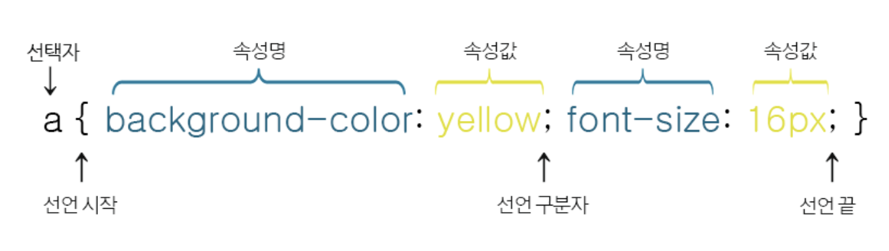
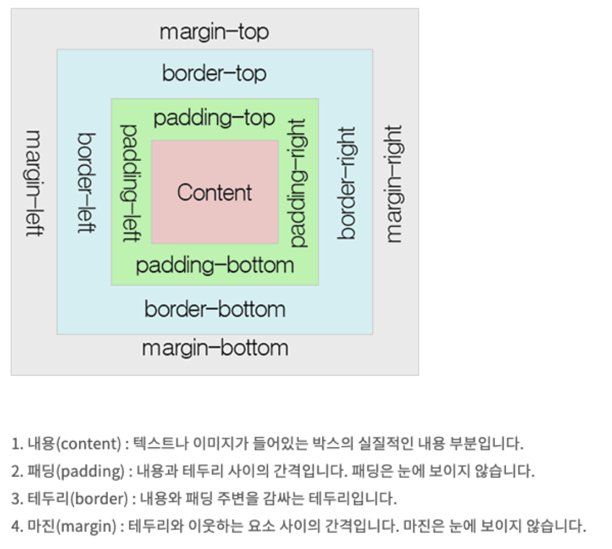
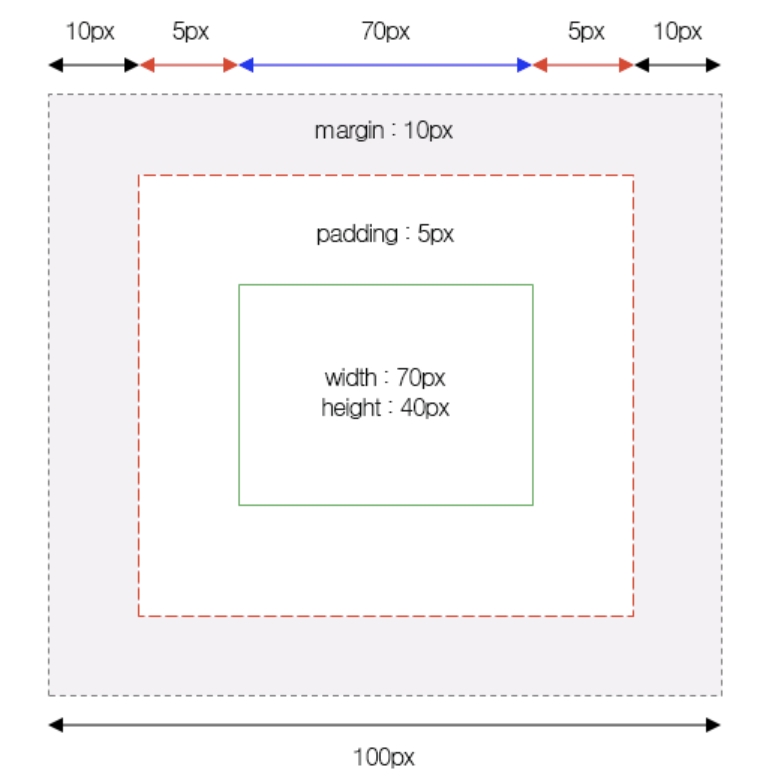
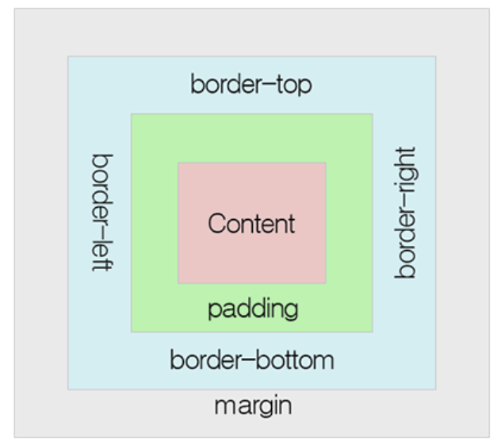
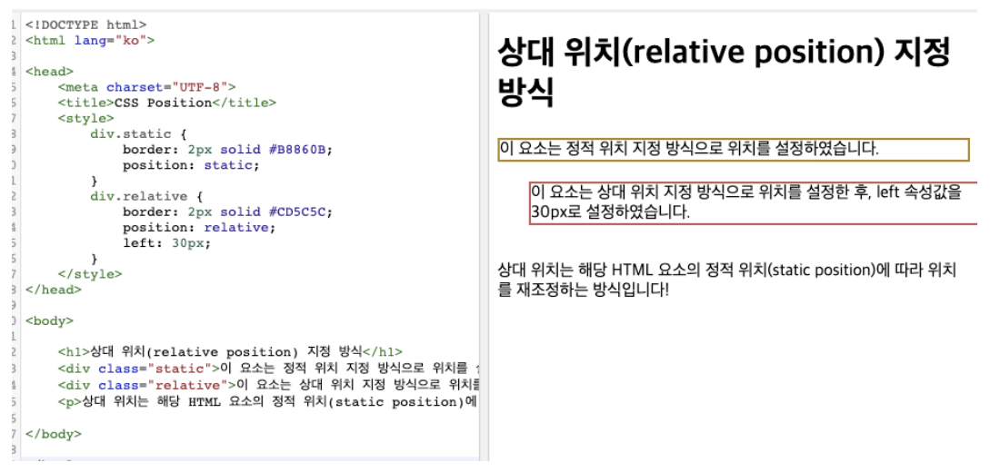
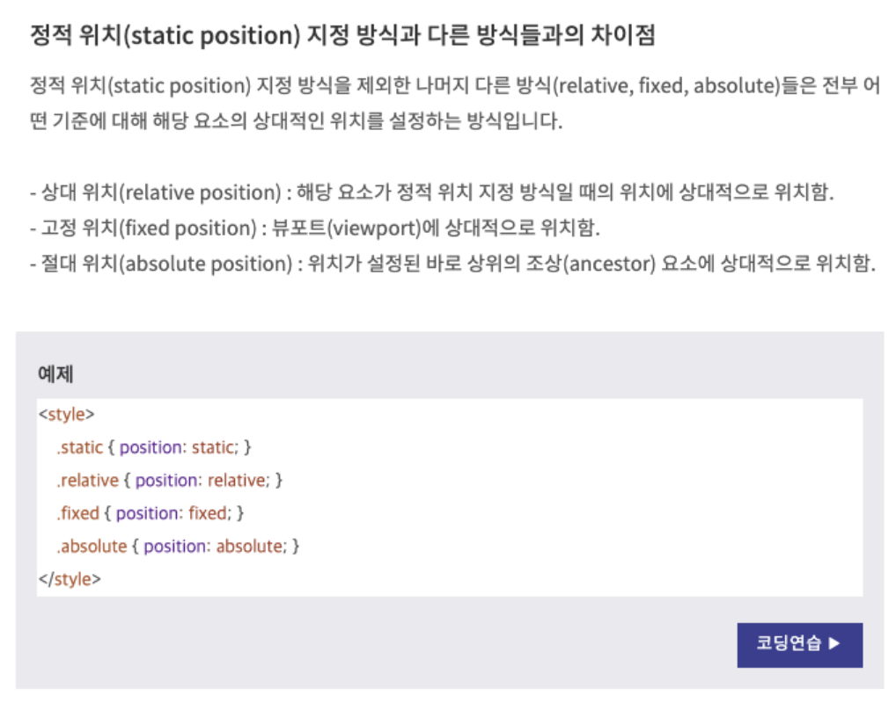
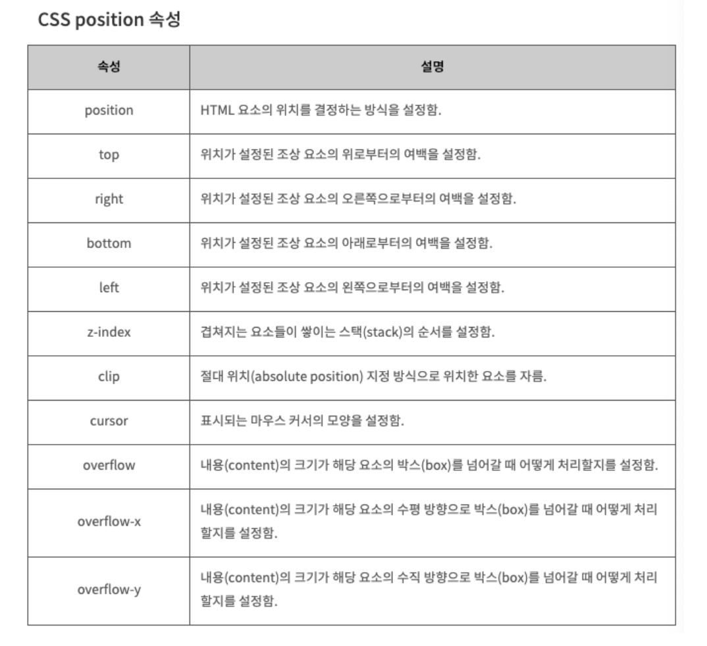

<!-- <p align="center"></p> -->

이번 포스팅은 CSS이다. CSS는 태그들과 기능들이 워낙 많기 때문에 관련 태그들은 필요할 때마다 각 사이트에서 검색해보며 사용하고, 오늘은 CSS의 정의와 문법들을 사용할 때 필요한 개념들에 대해 정리해볼 것이다.

### CSS 공부 관련 검색 사이트

- [TCP School](http://tcpschool.com/css/intro)
- [MDN](https://developer.mozilla.org/ko/docs/Web/CSS)
- [W3School](https://www.w3schools.com/css/default.asp)

# CSS

- CSS는 Cascading Style Sheet의 약자로, 문서의 콘텐츠와 레이아웃, 글꼴 및 시각적 요소들로 표현되는 문서의 외관(디자인)을 분리하기 위한 목적으로 만들어졌다. 즉 HTML 요소들이 각종 미디어에서 어떻게 보이는가를 정의하는데 사용되는 스타일 시트 언어이다. 오늘날 대부분의 웹 브라우저들은 모두 CSS를 지원하고 있다.

- HTML만으로 웹 페이지를 제작 할 경우 HTML요소의 세부 스타일을 일일이 따로 지정해주어야하는 불편함을 해소하기위해 W3C(World Wide Web Consortium)에서 만든 스타일 시트 언어이다.

- 확장자로 .css를 사용한다.

# CSS 문법

<p align="center"></p>
CSS의 문법은 선택자(Selector)와 선언부(declaratives)로 구성된다.

CSS에서 각 선택자에 따라 속성들을 정의할 때 해당 방법을 따르므로 위 사진에 나와있는 대로만 속성을 정의하면 원하는대로 CSS문법에 따라 웹페이지의 스타일을 변경시킬 수 있다.

## 선택자

선택자는 CSS를 적용하고자 하는 HTML 요소(element)를 가리킨다.

- HTML 요소 선택자

  ```css
  <style>
    div {color: yellow;}
  </style>
  ```

  이런식으로 각 요소를 직접 선택하면 된다.

- 아이디(id) 선택자

  ```css
  <style>
    #test {color: yellow;}
  </style>

  <div id="test">이 부분에 스타일을 적용</div>
  ```

  - 이렇게 각 태그에 id가 있을 경우 # 연산자를 사용하여 특정 아이디를 선택할 수 있다.
  - 한 웹페이지에 속하는 요소에는 하나의 id만 사용하여 작업할 수 있다. (그러지 않을 시 JS에서 오류발생)

- 클래스(class) 선택자

  ```css
  <style>
    .test {color: yellow;}
  </style>

  <div class="test">이 부분에 스타일을 적용</div>
  ```

  - 이렇게 각 태그에 class가 있을 경우 . 연산자를 사용하여 특정 아이디를 선택할 수 있다.
  - 클래스는 특정 집단으로 같은 클래스이름을 가지는 요소들을 모두 선택해준다.
    들이 있다.

- 그룹(group) 선택자

  ```css
  <style>
    div, h1 {color: yellow;}
  </style>

  <div>div 태그, 이 부분에 스타일을 적용</div>
  <h1>h1태그, 이 부분에 스타일을 적용</h1>
  ```

  - 이렇게 여러 태그에 , 연산자를 사용하여 각 선택자를 구분하여 사용할 수 있다.
  - 이렇게 , 로 구분된 모든 태그들에 같은 스타일을 적용시킨다.
    들이 있다.

# 알면 좋은 CSS 내용

## CSS 테이블

### border

border 속성으로 테이블의 테두리를 설정할 수 있다

```css
table,
th,
td {
  border: 2px solid orange;
}
```

### birder-collapse

해당 테이블의 테두리는 한 줄로 표현된다.

border-cllapse: collapse;

### border-spacing

테이블 요소 간의 여백을 설정해준다.

```css
table,
th,
td {
  border: 1px solid black;
}
table {
  width: 100%;
  border-collapse: seperate;
  border-spacing: 20px 30px;
}
```

### text-align

테이블내부의 텍스트 요소의 수평 방향 정렬을 해준다.

```css
text-align: center;
text-align: left;
```

### vertical-align

테이블 내부의 수직 방향 정렬을 설정한다

```css
vertical-align: top; // bottm, center 등이 있다.
```

hover and border 예제

[http://tcpschool.com/examples/tryit/tryhtml.php?filename=css_basic_t_07](http://tcpschool.com/examples/tryit/tryhtml.php?filename=css_basic_t_07)

## CSS 박스 모델

### 크기(Dimension)

- height 와 width
  HTML요소의 크기를 설정

```css
height: 200px;
width: 500px;
```

- max-width
  해당 HTML요소가 가질 수 있는 최대 너비(width)를 설정한다.
  기본 설정값은 none이다. 단순히 width로 선언했을 때 보다 좀 더 유연한 결과를 얻기 위해 사용한다
  → 웹 브라우저 크기가 줄거나 이러한 상황일 경우에

```css
max-width: 500px;
```

- min-width
  위에 max-width와 마찬가지로 가질 수 있는 최소 너비를 사용한다.
  ```css
  min-width: 500px;
  ```
- 마찬가지로 max-height, min-height 가 있다.

## 박스 모델 (box model)

모든 HTML요소는 박스(box) 모양으로 구성된다. 이를 박스 모델이라고 부른다.

- 패딩(padding), 테두리(border), 마진(margin), 내용(content)으로 구성된다.

<p align="center"></p>

**height와 width의 경우 그 가르키는 크기는 내용(content) 부분만을 대상으로 한다.**

<p align="center"></p>

다음과 같은 그림이 있을 때

전체 너비는

→ width(70px) + left margin(10px) + left padding(5px) + right padding(5px) + right margin(10px)

= 100px 가 된다.

전체 높이는

→ height+top padding+bottom padding+top border+bottom border+top margin+bottom margin

## 테두리 (border)

border 속성은 내용(content)와 패딩(padding)영역을 둘러싸는 테두리의 스타일을 설정한다.

<p align="center"></p>

### border-style 속성

- dotted : 테두리를 점선으로 설정
- dashed: 테두리를 약간 긴 점선으로 설정
- solid : 테두리를 실선으로 설정
- double : 테두리를 이중 실선으로 설정
- groove : 테두리를 3차원인 입체적인 선으로 설정, border-color 속성값에 영향을 받음
- **none : 테두리를 없앰**
- hidden : 테두리가 존재하기는 하지만 표현되지는 않음

### birder-width 속성

border의 두께를 설정함

```css
border-width: 2px; // thin, thick, 등으로 표현 가능
```

## border color

테두리의 색상을 지정

## margin

margin auto

margin 속성값을 auto로 설정하면, 웹 브라우저가 수평 방향 마진(margin) 값을 자동을 설정한다.

## display

HTML 요소가 웹 브라우저에 언제 어떻게 보이는가를 결정한다.

### 블록 (block)

display 속성 값이 블록(block)인 요소는 언제나 새로운 라인(line)에서 시작하며, 해당 **라인의 모든 너비**를 차지한다.

→ div, h1, p, ul, ol, form 등이 블록 요소이다

### 인라인(inline)

display 속성 값이 인라인(inline)인 요소는 새로운 라인(line)에서 시작하지 않는다. 또한 요소 너비도 해당 라인 전체가 아닌 해당 **HTML 요소의 내용(content) 만큼만 차지**한다.

→ span, a, img 등이 인라인 요소이다.

HTML의 모든 요소는 각각의 기본 display 속성값을 가지고 있다. 하지만 블록인 요소를 인라인으로, 인라인인 요소를 블록으로 바꿔줄 수 있다.

```css
dispaly: inline;
```

### 인라인-블록 (inline-block)

display 속성값이 inline-block이면 해당 요소 자체는 인라인(inline)요소처럼 동작하지만 해당 요소 내부에는 블록(block) 요소처럼 동작한다.

→ 인라인-블록 요소는 인라인 요소와 비슷하지만 너비와 높이를 설정할 수 있다. 또한 블록 요소처럼 margin을 이용하여 여백을 지정할 수도 있다.

## HTML 요소 숨기기

HTML요소를 숨기기 위해서는 display 속성값을 none으로 설정하면 된다. display: none;

또한 visibility: hidden 으로 바꿀 수도 있지만 이럴경우 눈에만 보이지 않고 여전히 웹페이지 레이아웃에는 존재하는 상태이다.

## 포지션

Position 속성은 HTML 요소가 위치를 결정하는 방식을 설정한다

### 정적 위치 (static position) 지정 방식

HTML 요소의 위치를 결정하는 가장 기본적인 방식

static으로 설정된 요소는 top, right, bottom, left 속성 값에 영향을 받지 않는다.

웹 페이지의 흐름을 따라 차례대로 요소들을 위치시키는 방식이다.

**모든 HTML 요소의 Postion 속성의 default 값은 static 이다.**

```css
postion: static;
```

### **상대 위치 (relative position) 지정 방식**

상대 위치 (relative postion) 지정 방식은 해당 HTML 요소의 기본 위치를 기준으로 위치를 설정하는 방식이다.
여기서 기본위치란 static postion 지정방식일 때 결정되는 기준을 의미한다.

<p align="center"></p>

위에 예시처럼 원래 있어야할 정적위치의 대한 상대적인 위치의 값이 들어가게 된다.

### 고정 위치(fixed postion) 지정 방식

고정 위치(fixed position) 지정 방식은 뷰포트(viewport)를 기준으로 위치를 설정하는 방식이다.

즉 웹 페이지가 스크롤 되어도 고정 위치로 지정된 요소는 항상 같은 곳에 위치하게 된다.

→ 스크롤에 관계없이 항상 보여주고 싶은 부분이 있을경우 fixed postion 처리함

```css
postion: fixed;
```

### 절대 위치(absolute postion) 지정 방식

절대 위치의 지정 방식은 고정 위치가 뷰포트를 기준으로 위치를 결정하는 것과 비슷하다

단 뷰포트를 기준으로 하는 것이 아닌 위치가 설정된 조상 요소(부모 요소)를 기준으로 위치를 설정하게 된다.

<p align="center"></p>

### z-index 속성

HTML 요소의 위치를 설정하게 되면 어떤 요소들은 설정된 위치 및 방식에 따라 서로 겹칠 수도 있다.

z-index 속성은 겹쳐지는 요소들이 쌓이는 스택(stack)의 순서를 설정한다

→ 순서는 양수나 음수 모두 설정할 수 있으며 크기가 클 수록 앞쪽에 위치하고 작을 수록 뒤쪽에 위치하게 된다.

→ 즉 나중에 화면에 그려진다고 생각하면 편함

<p align="center"></p>

# Reference

CSS : http://tcpschool.com/css/intro
