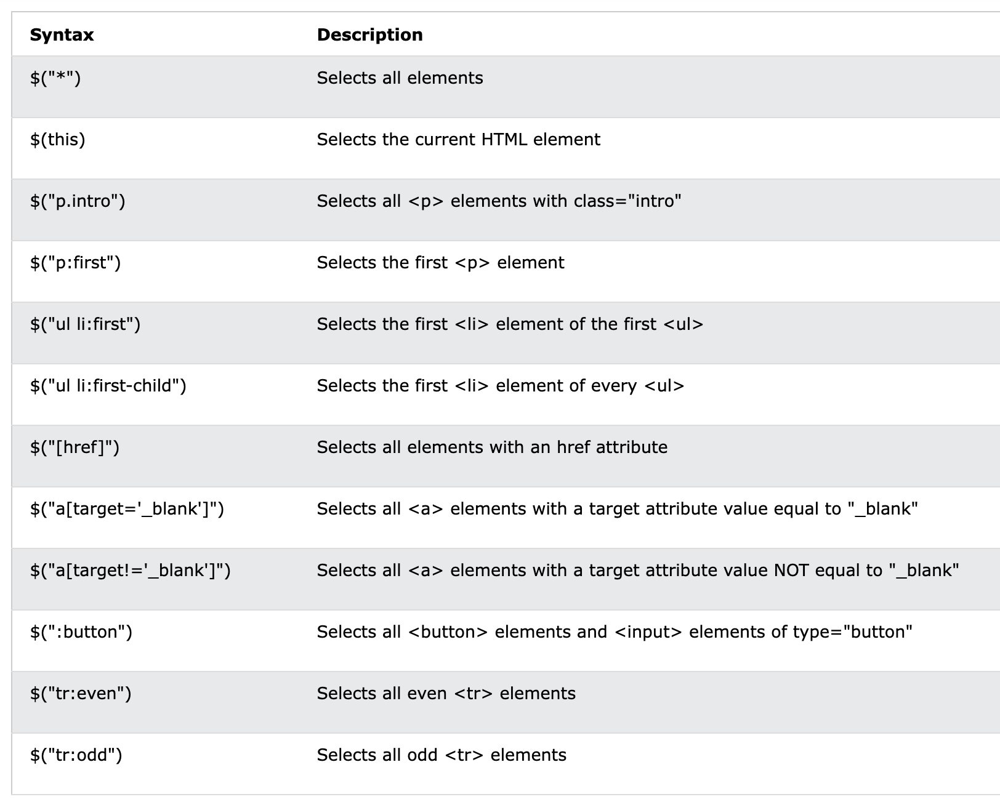
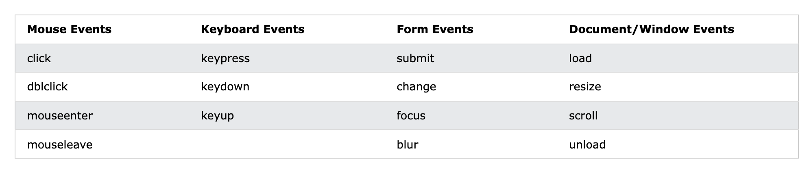

<!-- <p align="center"></p> -->

# jQuery란?

jQuery는 엘리먼트를 선택하는 강력한 방법과 선택된 엘리먼트들을 효율적으로 제어할 수 있는 다양한 수단을 제공하는 자바스크립트 라이브러리다. 최근에는 jQuery를 쓰는 빈도가 많이 낮아졌지만 SamsungSDS의 어떤 [포스팅](https://www.samsungsds.com/kr/insights/jQuery.html)에서는 그럼에도 불구하고 정적이고 가벼운 웹페이지를 신속하게 제작하는 용도로는 다른 라이브러리보다 적합하며, 아직까지는 제이쿼리를 대체할만한 획기적인 대안이 등장하기는 힘들 것이라고 한다.

## 특징

- CSS 선택자를 사용해 각 HTML 태그에 접근해서 작업하므로 명료하면서도 읽기 쉬운 형태로 표현할 수 있다.
- 메서드 체인 방식으로 수행하므로 여러개의 동작을 한줄로 나열 할 수 있다.
- 크로스 브라우징을 제공하므로 브라우저의 종류와 상관없이 동일한 기능을 할 수 있다.

## 사용방법

1. 직접 서비스할 때
   - http:/jquery.org 에서 jquery소스코드를 다운로드하여, 이를 서버에 업로드해서 웹 페이지 안에서 자바스크립트를 삽입한다.
2. CDN

- CDN이란 Content Delivery Network의 약자로써 온라인 상의 대용량 컨텐츠를 저렴한 비용으로 빠르게 전송하는 기술을 말한다. 주요 ISP의 CDN서버에 컨텐츠를 분상시키고 최종 사용자의 네트워크 경로상 가장 가까운 곳의 서버에서 컨텐츠를 전송받도록 하여서 트래픽이 특정 서버에 몰려서 과부하가 발생하는 것을 막는다.
  - jQuery.com 에서 제공하는 CDN
    - \<script src="https://code.jquery.com/jquery-2.2.1.js"></script>
  - Google.com 에서 제공하는 CDN
    - \<script type="text/javascript" src="http://ajax.googleapis.com/ajax/libs/jquery/1.4.2/jquery.min.js"></script>

# 사용법

## Selector

selector는 마치 css의 선택자처럼 htme element 를 선택할 수 있다. 문법은 다음과 같다. \$를 사용하여 css의 선택자를 적으면 해당 선택자를 사용할 수 있다.

<p align="center"></p>

### children, find, parent

자식, 부모 관계는 선택자로도 바로 선택이 가능하지만, 선택자로 선택한 뒤 메서드를 이용해서 선택해 줄 수도 있다.

```js
//부모
$('선택자').parent('선택자')
//직계자식
$('선택자').children('선택자')
//하위요소중 하나
$('선택자').find('선택자')
```

## Event

이벤트는 선택자로 선택한 element가 특정한 이벤트가 발생했을때 콜백함수를 실행한다. 마치 addEventLisner와 같다. 아래와 같은 syntax로 사용한다.

```js
$([선택자]).[이벤트](콜백함수);
```

사용할 수 있는 이벤트들은 다음과 같다.

<p align="center"></p>

## Effects

jquery를 통해 다양한 효과를 줄 수 있다.

### hide() & show

선택된 element를 숨기고, 다시 보여주는 기능을 한다.

```js
$('#hide').click(function() {
  $('p').hide()
})

$('#show').click(function() {
  $('p').show()
})
```

이외에도 Fade, Slide, Animate, stop 등이 있으므로 자세한 내용은 다음 [링크](https://www.w3schools.com/jquery/jquery_slide.asp)의 예제를 보며 찾아서 사용하면 된다.

### jquery Chaning

jquery는 chaning을 지원하여 여러 기능을 한번의 처리할 수 있다.

```js
$('#p1')
  .css('color', 'red')
  .slideUp(2000)
  .slideDown(2000)
```

위의 예제는 p1이라는 id를 가진 엘레멘트의 글씨를 red로 바꾸고 2000ms만큼 올라갔다가 다시 2000ms만큼 내려오는 예제이다. 이렇게 체이닝을 통해 여러 effect나 기능들을 한번에 처리해주어 가독성을 좋게 해줄 수 있다.

# 그외

또한 jQuery를 통해 엘레멘트의 뭔가 데이터를 Get()해오거나, Set()할 수 있고 css()도 변경해줄 수 있다. 하지만 이러한 것들은 너무 기존 js와 기능이 겹치므로 프로젝트의 성향, 팀원들이 요구하는 상황에 따라 jQeury를 쓸지 그외 다른 기능을 쓸지 찾아쓰면 될것 같다.

# Reference

- https://www.w3schools.com/jquery/jquery_selectors.asp
- CDN : https://m.blog.naver.com/PostView.naver?isHttpsRedirect=true&blogId=skyupup&logNo=220649195335
