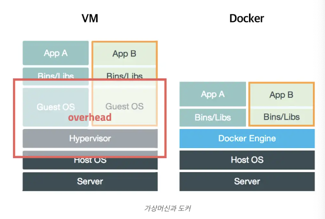
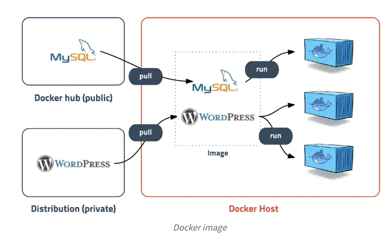
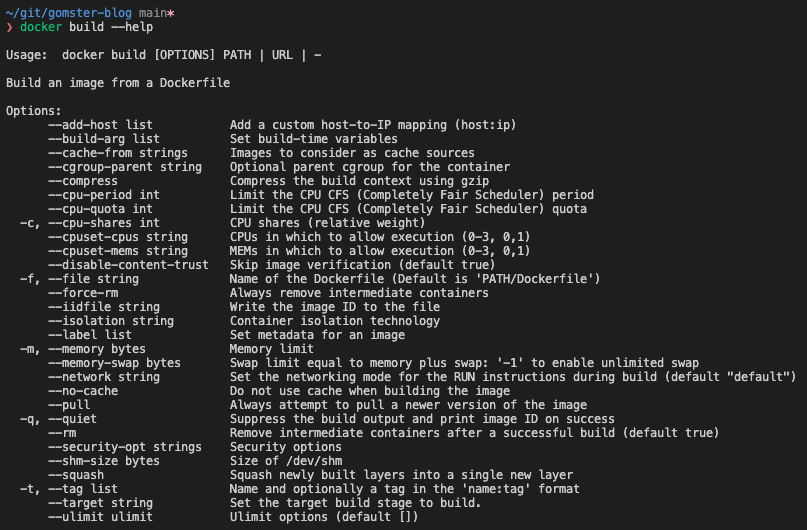

# 도커(Docker)란?

도커는 **컨테이너 기반의 오픈소스 가상화 플랫폼**이다.

이렇게 말하면 너무 추상적이니 먼저 몇가지 개념에 대해서 언급한 뒤 도커에 대해서 다시 재정의 하도록 하겠다.

## 컨테이너(Container)

소프트웨어는 OS와 라이브러리에 의존성을 가지고 있다. 따라서 하나의 컴퓨터에서 성격이 다른(OS, 라이브러리 버전이 다른) 소프트웨어를 한번에 실행할 때 어려움을 가질 수 있고 관련된 구성을 관리하기가 어렵다. 따라서 **기존의 가상화 방식은 주로 OS를 가상화** 하는 방법을 택했다. 하지만 OS를 가상화하는 것은 사용은 간단하지만 굉장히 무겁고, 느리기에 운영환경에선 사용할 수 없다.

따라서 컨테이너가 등장하였다. 컨테이너는 개별 Software의 실행에 필요한 **실행환경을 독립적으로 운용할 수 있도록 기반환경** 또는 다른 실행환경과의 간섭을 막고 실행의 독립성을 확보해주기 위해 프로세스를 격리 하는 방식이다.

<p align="center"></p>
기존의 가상머신과는 달리 CPU나 메모리를 딱 프로세스가 필요한 만큼만 추가로 사용하고 성능적으로도 거의 손실이 없기 때문에 매우 편리한 기능이다.

## 이미지(Image)

<p align="center"></p>

이미지는 **컨테이너 실행에 필요한 파일과 설정값 등을 포함**하고 있는 것으로 상태값을 가지지 않고 변하지 않는다.

따라서 같은 이미지로 여러개의 컨테이너를 생성할 수 있고, 해당 이미지로 만든 컨테이너가 삭제된다고 하더라도, 이미지는 사라지지 않는다.

도커 이미지는 [DockerHub](https://hub.docker.com/)에서 등록 할 수도 있고, 존재하는 이미지를 가지고와서 사용할 수도 있따.

## 다시 도커란?

다시 도커는 **컨테이너 기반의 오픈소스 가상화 플랫폼**이다. 즉 도커란 사용하고 싶은 오픈소스 라이브러리의 이미지를 사용하여 컨테이너를 통해 가상화 하여 사용하도록 하는 플랫폼이다.

- 도커를 사용하여 하나의 서버에서 여러개의 라이브러리 또는 여러 버전의 라이브러리를 사용할 수 있다.
- 서버세팅을 할 때 매 서버마다 똑같은 파일을 설치하는 것이 아닌, 이미지 파일을 통해서 한번에 동일한 서버세팅을 할 수 있다.

# 도커 사용 예시 (Spring, MySQL)

## Dockerfile

도커 이미지를 만들 디렉토리에서 `Dockerfile` 이라는 이름의 파일을 만들어서 이미지 파일을 만들 수 있다.

예시 - Spring build 파일 실행을 위한 image 파일

```docker
FROM openjdk:8-jdk
VOLUME /tmp
ARG JAR_FILE=./build/libs/*.jar
COPY ${JAR_FILE} test.jar
ENTRYPOINT ["java","-jar","/test.jar"]
```

- FROM : 사용할 base 이미지 파일 선택
- VOLUME : 볼륨경로 지정
- ARG : Build 시점에서 사용하는 변수
- COPY : 해당 파일들을 다음 이름으로 변경
- ENTRYPOINT : 해당 파일들로 다음과 같은 명령어 실행
  - ex) java -jar test.jar

### Build

다음과 같이 Docker파일을 만들면 build 명령어를 통하여 image 파일을 만들 수 있다.

```
docker build <옵션> <Dockerfile 경로>
```

<p align="center"></p>

--help를 통해 build를 위한 옵션을 찾을 수 있다.

-t의 경우 이미지파일의 이름과 태그의 이름을 지정할 수 있다.

```
docker build -t image_name:image_tag_name <Dockerfile 경로>
```

생성한 이미지는 docker images 명령어를 통해 확인할 수 있다.

```
docker images -a
```

### run

생성한 Docker 이미지는 run 명령어를 통해 실행할 수 있다.

```
docker run (<옵션>) <이미지 식별자> (<명령어>) (<인자>)
```

따라서 위에 예시처럼 도커파일을 실행하려면 다음과 같이 적으면 된다.

```
docker run image_name:image_tag_name
```

또한 docker ps 명령어로 현재 컨테이너들을 확인할 수 있다.

```
docker ps -a
```

### run option

- -d : 백그라운드 모드로 컨테이너가 실행되고 실행결과로 컨테이너 ID만을 출력한다.
- -it : 컨테이너를 종료하지 않은 채로 터미널에 입력을 계속해서 컨테이너로 전달해야할 때 사용한다.
- --rm : 컨테이너를 일회성으로 실행할 때 주로 쓰인다. 컨테이너가 종료될 때 컨테이너와 관련된 리소스(파일시스템, 볼륨)까지 깨끗이 제거해준다.

```
docker run --rm docker_image
```

## DockerCompose

Docker를 사용하다 보면 단순히 하나의 라이브러리만이 아니라 여러 라이브러리들을 합쳐서 사용해야할때가 온다. 예를 들어 Spring Boot를 실행함과 동시에 MySQL의 이미지를 설치하여 빌드해야할 때가 있다. 이럴 때 Docker Compose 를 사용한다.

예시

```yml
version: '3.7'
services:
  database:
    platform: linux/amd64
    image: library/mysql:8.0.26
    container_name: db_containser_name

    cap_add:
      - SYS_NICE
    environment:
      MYSQL_USER: db_user_name
      MYSQL_DATABASE: db_name
      MYSQL_PASSWORD: db_user_password
      MYSQL_ALLOW_EMPTY_PASSWORD: 'yes'
    command:
      [
        '--character-set-server=utf8mb4',
        '--collation-server=utf8mb4_unicode_ci',
      ]
    volumes:
      - './database/:/var/project/db'
    ports:
      - '3306:3306'

  app:
    build:
      context: .
      dockerfile: Dockerfile
    ports:
      - '8080:8080'
    depends_on:
      - database
    restart: always
    environment:
      SPRING_DATASOURCE_URL: jdbc:mysql://db_containser_name:3306/db_name?allowPublicKeyRetrieval=true&useSSL=false&serverTimezone=UTC&useLegacyDatetimeCode=false
      SPRING_DATASOURCE_USERNAME: db_user_name
      SPRING_DATASOURCE_PASSWORD: db_user_password
```

- image : 이미지 파일 선택
- contianer_name : 컨테이너 이름 설정
- cap_add : 권한 부여하는 것
  - root 계정이 아닌 권한을 계정을 검사하는데 계정에 대한 권한 이름 중 하나
  - 호출 프로세스에 대한 실시간 스케줄링 정책을 설정하고 임의 프로세스에 대한 스케줄링 정책 및 우선순위를 설정한다.
  - 임의 프로세스에 대한 CPU 선호도를 설정한다.
  - 임의 프로세스에 대한 I/O 스케줄링 클래스 및 우선순위를 설정한다.
- port :
  - 외부접근포트 : 컨테이너 내부 매핑 포트
- depend_on :
  - 해당 컨테이너가 실행 된 뒤에 실행된다.
- restart :
  - 컨테이너가 종료되면 다시 실행시킨다.

# Reference

- https://subicura.com/2017/01/19/docker-guide-for-beginners-1.html
- https://medium.com/dtevangelist/docker-기본-5-8-volume을-활용한-data-관리-9a9ac1db978c
- https://dongle94.github.io/docker/docker-basic-use/
- https://blog.d0ngd0nge.xyz/docker-dockerfile-write/
