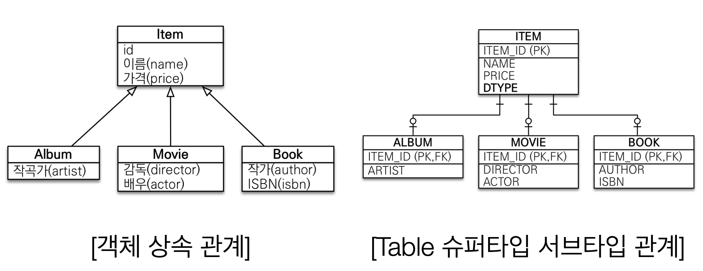
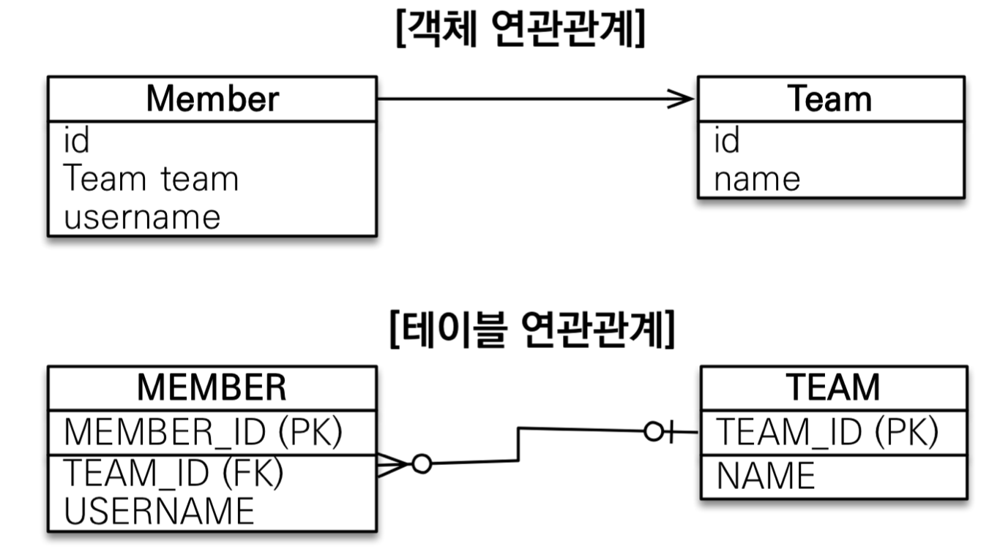
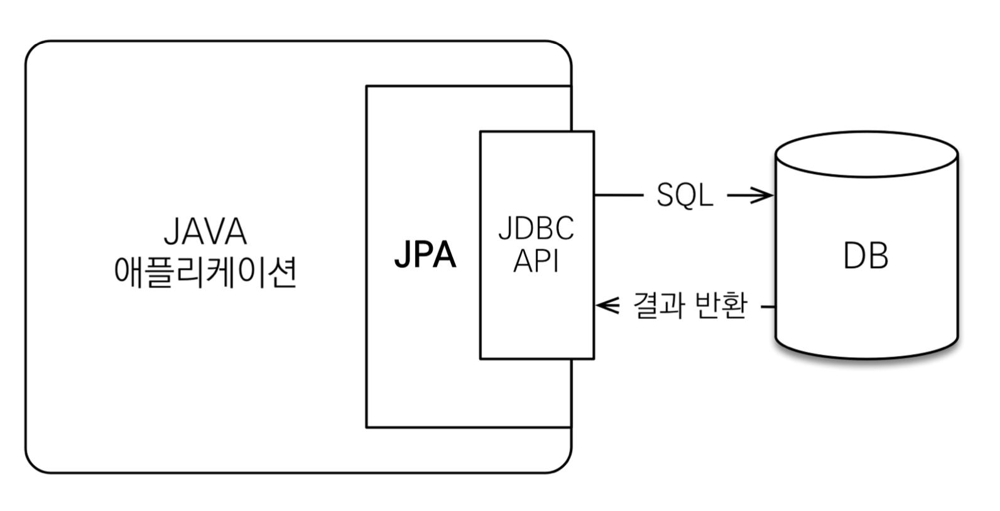

# JPA 란?

JPA는 (Java Persistence API)의 약자로 자바 진영에서 ORM(Object-Relational Mapping) 기술 표준으로 사용되는 인터페이스의 모음이다.

JPA는 객체와 관계형 데이터베이스의 차이를 줄이기 위해 나타난 기술이다.

## 객체와 관계형 데이터베이스의 차이

### 1. 상속

   

   위의사진을 보면 왼쪽 사진은 객체의 상속 관계이고 오른쪽 사진은 일반적으로 관계형 데이터베이스에서는 상속관계를 가지고 있지 않지만 그래도 테이블의 슈퍼 타입, 서브 타입을 만들어서 마치 객체의 상속관계처럼 만든 사진이다.
     
   
**객체 관점**

- 만약 list 컬렉션에 저장되어 있다고 가정하면, 단순히 Album album = list.get(albumId); 이렇게 가지고 오면 된다.

**관계형 데이터베이스 관점**

- 이렇게 했을 경우 만약에 Album의 값을 table에서 조회한다고 할때, ITEM과 ALBUM에서 해당 원하는 값을 찾기위해 각 테이블을 찾고, 조인해야하는 정말 불편하고 긴 프로세스를 지닌다. 따라서DB에 저장할 객체에는 대부분 상속관계를 사용하지 않는다.

### 2) 연관관계

**객체 관점**

- 객체는 참조를 사용한다. 따라서 getter 를 사용하여 데이터를 가져올 수 있지만, Team에서 Member를 조회할 수 없다.

**관계형 데이터베이스 관점**

- 관계형데이터베이스는 외래키를 사용하므로 JOIN을 통해 연관관계에 있는 데이터를 가져올 수 있다. 대신에 MEMBER, TEAM 어디든 서로가 서로의 정보를 접근할 수 있다.

### 3) 데이터 타입

### 4) 데이터 식별 방법

## JPA(ORM)의 등장

ORM(Object Relational Mapping)의 등장으로 객체는 객체대로, 관계형 데이터베이스는 관계형 데이터베이스 대로 설계 할 수 있도록 하였고, ORM 프레임워크가 중간에서 이들을 매핑해주게 되었다.

# JPA를 사용해야 하는 이유

## 1. 생산성이 좋음 & SQL 중심적인 개발에서 객체 중심으로 개발

JPA는 우리가 대부분 사용하는 CRUD를 다음 4개의 메소드로 가능하게 한다.

- 저장 : jpa.persist(MyObject)
- 조회 : MyObject myObject = jpa.find(objectId)
- 수정 : myObject.setName("변경할 오브젝트이름")
- 삭제 : jpa.remove(myObject)

마치 우리가 일반 Java Collection에서 객체를 사용하듯이 ORM을 통해 데이터베이스에 접근하고, 수정할 수 있게 되었다.

## 2. 유지보수가 좋음

테이블 필드를 바꿔야할 때 처럼 무엇인가를 수정해야할 때, 이전에는 모든 SQL 쿼리문에 수정을 해주어야했지만 JPA를 사용하면 개발자는 java 코드에서 entity의 필드만 바꾸면 된다.

- JPA에서 자동으로 우리가 적은 코드를 해석하여 SQL쿼리문을 쓰기 때문이다.

* 유지보수가 좋음
* 패러다임의 불일치 해결
* 성능

# Reference

- [김영한, 자바 ORM 표준 JPA 프로그래밍 - 기본편](https://www.inflearn.com/course/ORM-JPA-Basic)
