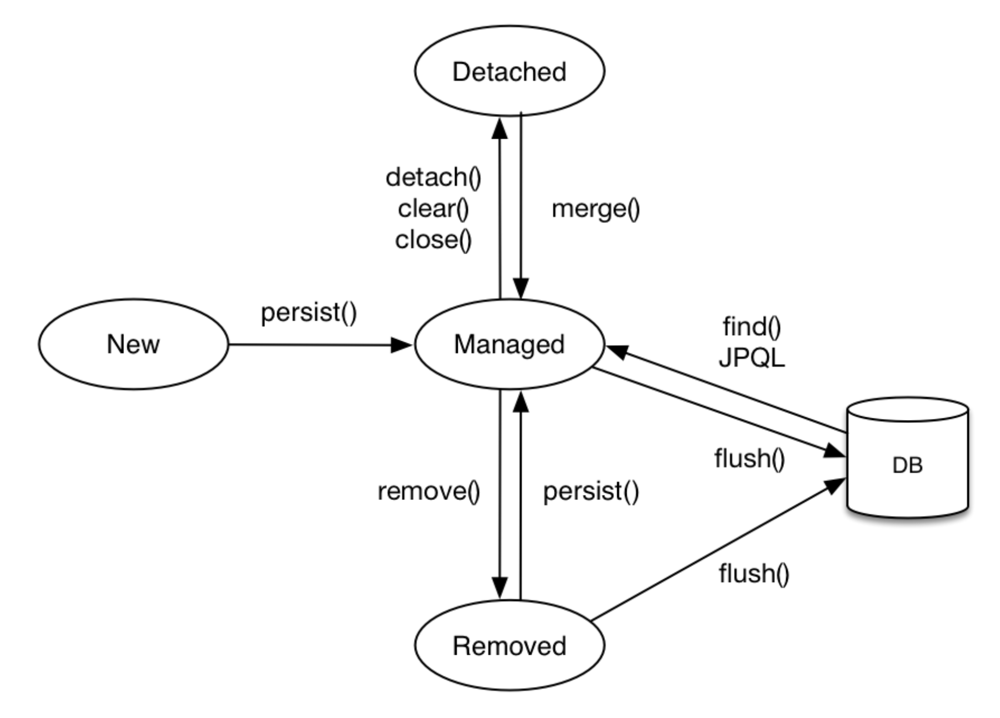

# 영속성 컨텍스트란?

영속성 컨텍스트는 "엔티티를 영구 저장하는 환경" 이라는 뜻으로 논리적인 개념이다. 이렇게만 정의하면 어떤 뜻인지 잘 모르는데 아래에 하나씩 설명하겠다.

## 엔티티의 생명주기

먼저 영속성 컨텍스트에 대해서 알기전에 JPA에서 엔티티의 생명주기에 대해서 알아야한다.

위의 그림을 보면 4가지 New, Detaced, Manged, Removed 상태로 나뉘고, 각 메소드를 통해서 서로 이동할 수 있다.

### 비영속 (new/transient)

- 영속성 컨텍스트와 전혀 관계가 없는 새로운 상태 즉 객체를 생성한 상태이다.
  - 이때 객체는 영속성 컨텍스트에 들어가지 않고, 그냥 생성된 딱 그 상태이다.

### 영속 (managed)

- 영속성 컨텍스트에 관리되는 상태
  - 객체가 영속성 컨텍스트에 들어간 상태이다.
  - EntityManger.persist(객체) 를 통해 객체를 영속성 컨텍스트에 Manage 되도록 할 수 있다.

### 준영속 (detached)

- 영속성 컨텍스트에 저장되었다가 분리된 상태
  - EntityManger.detach(객체) 를 통해 영속성 컨텍스트에서 객체를 분리할 수 있다.

### 삭제 (removed)

- 객체를 삭제된 상태
  - EntityManger.remove(객체) 를 통해 삭제할 수 있다.

## 다시 영속성 컨텍스트란?

영속성 컨텍스트는 위에서 보인 것처럼 Entity를 관리해주는 공간이다. 그렇다면 영속성컨텍스트에 의해 관리가 되면 어떠한 장점이 있을까?

1. 1차캐시
   - 엔티티를 조회할 때, 먼저 바로 DB에서 쿼리문을 날려 찾는 것이 아닌 영속 컨텍스트 내에 있는 캐시에서 해당 Entity가 있는지 찾는다.
   - 엔티티를 조회할때 JPA는 다음과 같은 순서를 가진다. `1차캐시에서 찾기 -> DB 조회 -> 1차캐시에 저장 -> 반환`
2. 동일성(identity) 보장
3. 트랜잭션을 지원하는 쓰기 지연
4. 변경 감지 (Dirty Checking)
5. 지연 로딩 (LazyLoading)

## 플러시

- 영속성 컨텍스트의 변경내용을 데이터베이스에 반영하는 것이다.

  - 플러시는 영속성 컨텍스트를 비우는 것이 아니라 영속성 컨텍스트의 변경 내용을 데이터 베이스에 동기화 하는 것이다.
  - 트랜잭션이라는 작업 단위로 반영해야한다.

  다음과 같은 방법으로 영속성 컨텍스트를 플러시할 수 있다.

  - em.flush() - 직접 호출
  - 트랜잭션 커밋 - 플러시 자동 호출
  - JPQL 쿼리 실행 - 플러시 자동 호출

# Reference

- [김영한, 자바 ORM 표준 JPA 프로그래밍 - 기본편](https://www.inflearn.com/course/ORM-JPA-Basic)
