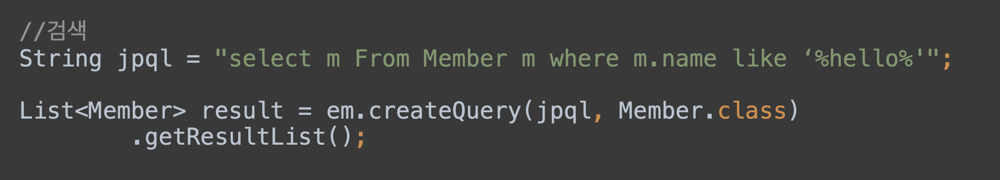
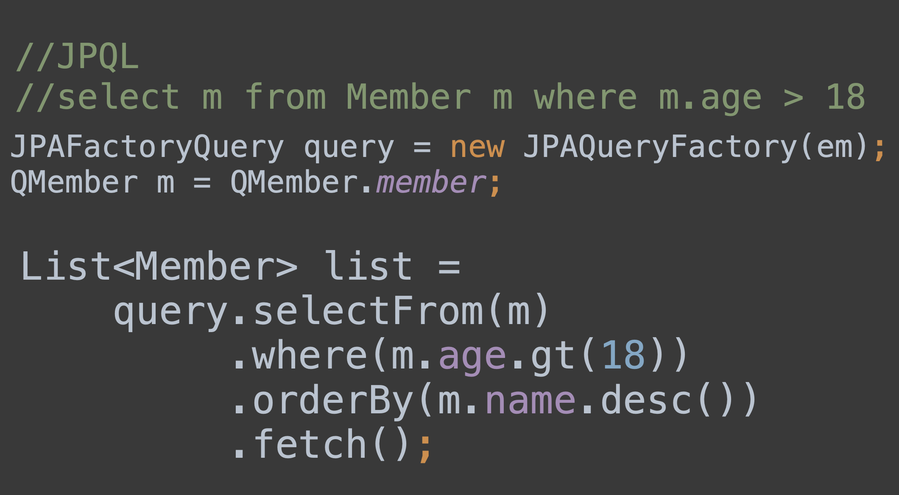
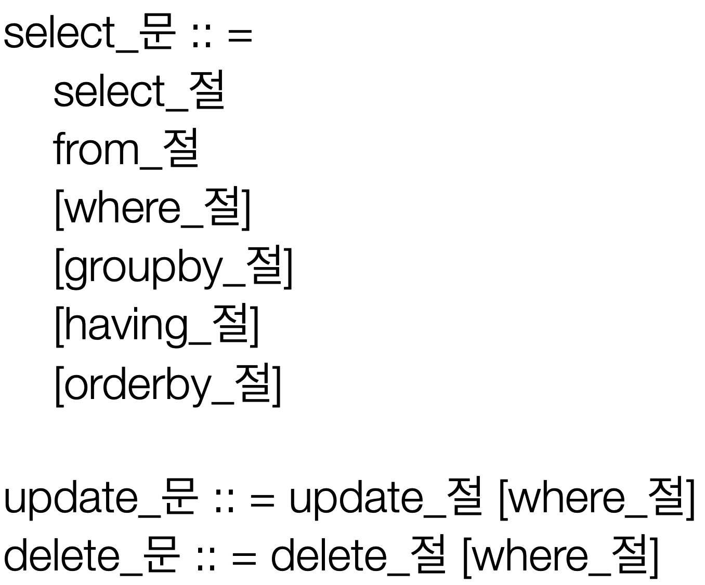

# JPQL이란?

JPA를 사용하면 엔티티 객체를 중심으로 개발하게 된다. 하지만 이때 DB를 검색할 때도 테이블이 아닌 엔티티 객체를 대상으로 검색한다. 모든 DB데이터를 객체로 변환해서 검색하는 것은 불가능 하므로, 결국 검색 조건이 포함된 SQL이 필요하다.

- JPA에서 제공하는 SQL을 추상화한 JPQL이라는 객체 지향 쿼리 언어이다.
- JPQL은 엔티티 객체를 대상으로 쿼리를 보낸다. 이후 이것이 번역되어 데이터베이스 테이블을 대상으로 쿼리를 보낸다.

<p align="center"></p>

위의 코드를 보면 알 수 있듯이 JPQL은 일반 쿼리와 달리 `테이블이 아닌 entity를 대상`으로 from 절을 사용한다.

## Query DSL

- 문자가 아닌 자바코드로 JPQL을 작성할 수 있음
- JPQL 빌더 역할
- 컴파일 시점에 문법 오류를 찾을 수 있음
- 동적쿼리 작성이 편리하고, 단순하고 쉬우므로 실무에서 사용 권장

<p align="center"></p>

### 분석

- JPAQueryFactory를 사용하여 QueryDSL 을 작성한다.
- .selectFrom(원하는Entity의 클래스) 를 통해 원하는 Entity를 선택한다.
- Configuration 을 통해 QueryDSL을 사용하기 위한 Q클래스가 필요하다(QMember)
- .where를 통해 원하는 조건을 넣을 수 있다.
- .orderBy를 통해 정렬을 할 수 있다.

# JPQL 기본 문법

JPQL은 객체지향 쿼리 언어로 엔티티 객체를 대상으로 쿼리하지만, 결국 SQL로 변환되어 테이블을 대상으로 쿼리를 날린다.

<p align="center"></p>

## 프로젝션

Select 절에 조회할 대상을 지정하는 것을 프로젝션이라고 한다. 아래 예시처럼 엔티티, 임베디드 타입, 스칼라 타입이 프로젝션의 대상이 될 수 있다.

```java
SELECT m FROM Member m  //엔티티 프로젝션
SELECT m.team FROM Member m // Member안의 team 엔티티 프로젝션
SELECT m.address FROM Member m  // 임베디드타입 adress 프로젝션
SELECT m.username, m.age FROM Member m // 스칼라 타입 프로젝션 -> 이렇게 될 시에 Object[] 타입으로 조회하는 것이 편하다.
```

### 결과 조회 API

- query.getResultList() 결과가 하나 이상일 때, 리스트를 반환
  - 결과가 없으면 빈 리스트 반환
- 결과가 정확히 하나일 때 단일 객체 반환
  - 결과가 없거나 둘 이상이면 Exception이 발생하므로 사용에 관해선 논란이 많음

### 페이징 API

- setFirstResult(int startPosition) : 조회 시작위치
- setMaxResults(int maxResult) : 조회할 데이터 수

```java
// 페이징 API사용의 예시로 10번째 부터 최대 20개를 가지고온다.
String jpql = "select m from Member m order by m.name desc";
List<Member> resultList = em.createQuery(jpql, Member.class)
    .setFirstResult(10)
    .setMaxResults(20)
    .getResultList();
```

## 조건식

### CASE 식

```java
select
  case when m.age <= 10 then '학생요금'
       when m.age >= 60 then '경로요금'
       else '일반요금'
  end
from Member m
```

### COALESCE

coalesce 는 하나씩 조회하여 null이 아니면 반환하는 조건식이다.

```java
select coalesce(m.username, "이름 없는 회원') from Member m
```

### NULLIF

두 값이 같으면 null을 반환하고, 다르면 첫번째 값을 반환한다.

```java
select NULLIF(m.username, '관리자') from Member m
```

# 페치 조인 (fetch join)

페치조인은 JPQL에서 성능 최적화를 위해 제공하는 기능이다. 연관된 `엔티티나 컬렉션을 SQL 한 번에 함꼐 조회`하는 기능이다.

- 이전에 LAZY로딩을 만들었던 것보다 우선적으로 적용하기 때문에 페치조인이 필요한 곳에서 사용하면 된다. (LAZY로딩으로 대부분의 테이블 관계를 만들기 때문에 )
- fetch.EAGER 와 비슷하다.

```java
select t
from Team t join fetch t.members
where t.name = '팀A'
```

t의 이름이 '팀A'인 엔티티들과 그때 t의 mebers까지 한번에 가져온다.

위의 코드를 SQL로 번역하면 다음과 같다

```java
SELECT T.*, M.*
FROM TEAM T
INNER JOIN MEMBER M ON T.ID=M.TEMA_ID
WHERE T.NAME = '팀A'
```

페치조인을 사용할 때 일대다 관계일 경우 데이터가 뻥튀기 될 수 있음을 주의해야한다.

# Reference

- [김영한, 자바 ORM 표준 JPA 프로그래밍 - 기본편](https://www.inflearn.com/course/ORM-JPA-Basic)
