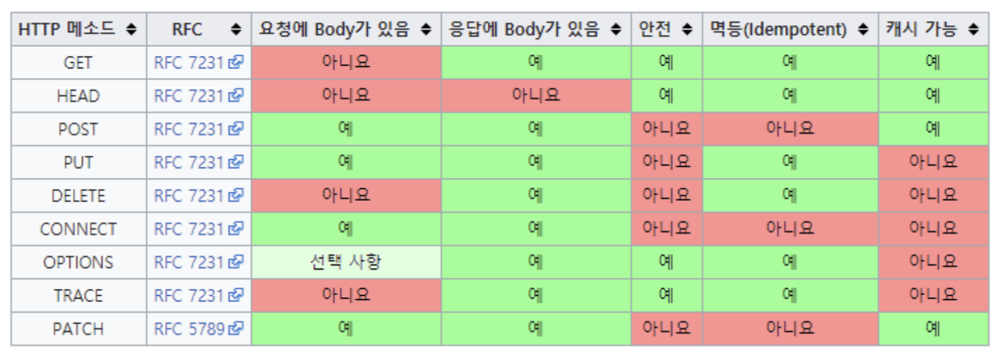

# HTTP 란?

> 인터넷에서 데이터를 주고 받을 수 있는 프로토콜.

HTTP 는 Hyper Text Transfer Protocol의 약자로 프로토콜 규칙이라고 생각하면 된다.

## HTTP Method

> 클라이언트와 서버 사이에 이루어지는 요청(Request)과 응답(Response)데이터를 전송하는 방식

즉 서버에 요청을 보내는 방법을 말한다.

### GET

- **리소스**를 조회할 때 사용한다.
- 서버에 전달하고 싶은 데이터는 query를 통해 전달한다.
- 메시지 바디를 사용해서 전달 할 수 는 있지만 지원하지 않는 곳이 않아서 주로 사용하지 않는다.

### POST

- **요청 데이터를 처리하고, 주로 데이터 등록**에 사용한다.
- 메시지 바디를 통해 서버로 데이터를 전달한다.
- 주로 신규 리소스를 등록하거나 프로세스 처리에 사용된다.

### PUT

- **리소스를 대체, 해당 리소스가 없으면 생성**
- 데이터를 덮어쓰는 역할을 한다.

### PATCH

- PUT처럼 리소슬츨 수정하지만, PATCH는 리소스를 일부분만 변경할 수 있다.

### DELETE

- 리소스를 제거할 때 사용한다.

## HTTP 메소드의 속성

1. 안전 (Safe Methods)

- **메소드를 계속 호출해도 리소스를 변경하지 않는다**.
- 주요 메소드 중에는 GET 메소드가 안전하다고 볼 수 있다.

2. 멱등 (Idempotent Methods)

- **메소드를 계속 호출해도 결과가 똑같다**는 뜻이다.
- GET, PUT, DELETE는 멱등하다고 볼 수 있지만, POST, PATCH는 멱당하다고 볼 수 없다.
- Patch의 경우 멱등하게 할수도 있고, 멱등하지 않게 할 수도 있다
  - 값을 kim으로 바꾸는 경우 -> 멱등
  - num을 증가시키는 경우 -> 멱등하지 않음

3. 캐시가능 (Cacheable Methods)

- 캐싱을 해서 데이터를 효율적으로 가져올 수 있다는 뜻이다.
- GET, HEAD, POST, PATCH가 가능하지만 주로 GET, HEAD만 캐싱에 쓰인다.

## HTTP 상태코드

> HTTP 상태코드는 클라이언트가 보낸 요청의 처리 상태를 응답으로 알려주는 기능이다.

- 1xx (Information) : 요청이 수신되어 처리중
- 2xx (Successful) : 요청 정상 처리
- 3xx (Redirection) : 요청을 완료하려면 추가 행동이 필요
- 4xx (Client Error) : 클라이언트 오류, 잘못된 문법 등으로 서버가 요청을 수행할 수 없음
- 5xx (Server Error) : 서버 오류, 서버가 정상 요청을 처리하지 못함

## HTTP 상태코드 종류와 의미

### 2xx (Successful) : 요청 정상 처리

- 200 OK : 요청 성공
- 201 Created : 요청 성공해서 새로운 리소스가 생성됨
- 202 Accepted : 요청이 접수되었으나 처리가 완료되지 않았음
- 204 No Content : 서버가 요청을 성공적으로 수행했지만, 응답 페이로드 본문에 보낼 데이터가 없음

### 3xx (Redirection) : 요청을 완료하려면 추가 행동이 필요

리다이렉션인데 location 헤더가 있으면 location 위치로 자동 이동하는 것을 리다이렉트라고 한다.

- 301 Movend Permanently : 리다이렉트 요청 메서드가 GET으로 변하고, 본문이 제거될 수 있다.
- 302 FOUND : 리다이렉트 요청 메서드가 GET으로 변하고 본문이 제거될 수 있음
- 303 See Other 리다이렉트 요청 메서드가 GET으로 변경
- 304 Not Modified : 캐시를 목적으로 사용
- 307 Temporary Redirect : 리다이렉트 요청 메서드와 본문 유지 (요청 메서드를 변경하면 안된다.)
- 308 Permanent Redirect : 리다이렉트시 요청 메서드와 본문 유지(처음 POSt를 보내면 리다이렉트도 POST 유지)

### 4xx (Client Error) : 클라이언트 오류, 잘못된 문법 등으로 서버가 요청을 수행할 수 없음

클라이언트 측에서 오류가 발생함을 알려주는 status코드

- 400 Bad Request : 클라이언트가 잘못된 요청을 해서 서버가 요청을 처리할 수 없음
- 401 Unauthorized : 클라이언트가 해당 리소스에 대한 인증이 필요함
- 403 Forbidden : 서버가 요청을 이해했지만 승인을 거부함
- 404 Not Found : 요청 리소스를 찾을 수 없음

### 5xx (Server Error) : 서버 오류, 서버가 정상 요청을 처리하지 못함

- 500 Internal Server Error : 서버 문제로 오류 발생
- 501 Not Implemented : 아직 구현되지 않음
- 502 Bad Gateway : 서버에서 잘못된 응답을 수신했을 때
- 503 Service Unavailiable : 서비스 이용 불가

# Reference

- https://www.zerocho.com/category/HTTP/post/5b344f3af94472001b17f2da
- https://kyun2da.dev/CS/http-%EB%A9%94%EC%86%8C%EB%93%9C%EC%99%80-%EC%83%81%ED%83%9C%EC%BD%94%EB%93%9C/
