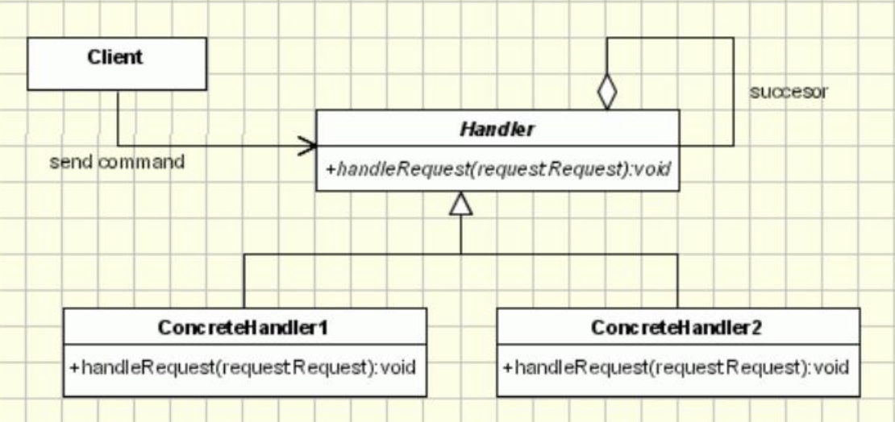
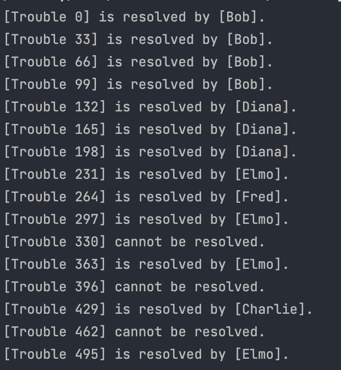

# 역할 사슬 패턴 (Chain Of Responsiblity)

역할 사슬 패턴은 여러 개의 객체 중에서 어떤 것이 요구를 처리할 수 있는지를 사전에 알 수 없을 때 사용한다. 요청 처리가 들어오게 되면 그것을 수신하는 객체가 자신이 처리 할 수 없는 경우에는 다음 객체에게 문제를 넘김으로써 최종적으로 요청을 처리 할 수 있는 객체의 의해 처리가 가능하도록 하는 패턴이다.

역할 사슬을 사용하는 목표는 다음과 같다.

1. to avoid coupling the sender of a request to its receiver, by giving more than one object a chance to handle the request. (둘 이상의 객체에 요청을 처리할 기회를 줌으로써 요청의 발신자와 수신자가 결합 되는 것을 방지하기 위해)
2. to isolate the clients from knowledge of how responsibilities are assigned. (책임 즉 역할이 할당되는 것에 대한 것을 클라이언트가 알지 못하게 하기 위해)
3. A request will be sent to the chain of objects. The request will be handled by a chain of servers until the request is resolved (요청은 각 서버 object들의 체인에 의해서 해결되며, 요청이 해결될 때 까지 각 서버를 방문한다.)

# 패턴 구조

<p align="center"></p>

다음 사진처럼 Client는 단순히 request를 부르기만하고, Handler를 통해서 각 Handler에 연결되어 Request를 처리한다.

# 예제 코드

## Main 클래스

프로그램의 메인 실행을 하는 부분이다.

```java
public class Main{
    public static void main(String[] args){
        Support alice     = new NoSupport("Alice");
        Support bob     = new LimitSupport("Bob", 100);
        Support charlie   = new SpecialSupport("Charlie", 429);
        Support diana    = new LimitSupport("Diana", 200);
        Support elmo    = new OddSupport("Elmo");
        Support fred     = new LimitSupport("Fred", 300);

        // setNext를 마치 함수 체이닝하듯이 만들어 역할사슬패턴을 구현.
        alice.setNext(bob).setNext(charlie).setNext(diana).setNext(elmo).setNext(fred);


        for (int i = 0; i < 500; i += 33) {
            // 클라이언트의 request를 표현
            alice.support(new Trouble(i));
        }
    }
}
```

## Support 추상클래스

각 사슬이 될 클래스들의 기본 틀이 되는 역할을 한다.

```java
public abstract class Support{
    private String name;
    private Support next;
    public Support(String name){
        this.name = name;
    }

    public Support setNext(Support next){
        this.next = next;
        return next;
    }
    // support 함수는 해당 request를 처리하는 함수이다.
    public final void support(Trouble trouble){
        // 만약 현재의 인스턴스가 resolve 할 수 있다면 done 메서드를 시랳앟ㄴ다.
        if(resolve(trouble)){
            done(trouble);
        // 만약 현재의 인스턴스가 resolve를 할 수 없고, 다음 사슬이 존재한다면, trouble을 다음 사슬에게 넘긴다.
        } else if(next != null){
            next.support(trouble);
        }
        // 아무도 처리를 못할 경우 fail을 호출한다.
        else {
            fail(trouble);
        }
    }

    public String toString(){ return "[" + name + "]"; }
    protected abstract boolean resolve(Trouble trouble);
    protected void done(Trouble trouble) { System.out.println(trouble + " is resolved by " + this + "."); }
    protected void fail(Trouble trouble) {
        System.out.println(trouble + " cannot be resolved.");
    }
}
```

## Support 클래스의 구현클래스들

### NoSupport

이름 그대로 resolve를 해줄 수 없는 도움되지 않는 클래스이다. 그렇기 때문에 resolve 메서드가 있을 때 항상 false를 반환한다.

```java
public class NoSupport extends Support {
    public NoSupport(String name) {
        super(name);
    }
    // 항상 NoSupport클래스이기 때문에  false리턴한다.
    protected boolean resolve(Trouble trouble) {
        return false;
    }
}
```

### LimitSupport

이 클래스는 limit를 넘어서지 않으면 resolve를 해주는 메서드이다.

```java
public class LimitSupport extends Support {
    private int limit;
    public LimitSupport(String name, int limit) {
        super(name);
        this.limit = limit;
    }
    // trouble의 number가 limit보다 작다면 true를 리턴한다.
    protected boolean resolve(Trouble trouble) {
        if (trouble.getNumber() < limit) {
            return true;
        } else {
            return false;
        }
    }
}
```

### SpecialSupport

처음 생성될 때 주어지는 특정 숫자만 resolve 할 수 있는 Support 이다.

```java
public class SpecialSupport extends Support {
    private int number;
    // number 에 대한 숫자를 저장한다.
    public SpecialSupport(String name, int number) {
        super(name);
        this.number = number;
    }
    protected boolean resolve(Trouble trouble) {
        // trouble의 숫자가 해당 Number와 같으면 해결할 수 있다.
        if (trouble.getNumber() == number) {
            return true;
        } else {
            return false;
        }
    }
}
```

### OddSupport

```java
public class OddSupport extends Support {

    public OddSupport(String name) {
        super(name);
    }
    // 홀수인 trouble만 해결해준다.
    protected boolean resolve(Trouble trouble) {
        if (trouble.getNumber() % 2 == 1) {
            return true;
        } else {
            return false;
        }
    }
}
```

## Trouble 클래스

Client 의 request를 담당함

```java
public class Trouble {
    private int number;
    public Trouble(int number) {
        this.number = number;
    }
    public int getNumber() {
        return number;
    }
    public String toString() {
        return "[Trouble " + number + "]";
    }
}
```

# 실행결과

<p align="center"></p>
결과는 다음과 같다. Trouble에 의해 해결할 수 있는 인스턴스가 오면, 각 Support들이 자기 차례를 기다렸다가 해결한다.

## 알아야 할것

- the role of abstract keyword
  - abstract keyword를 통해 각 구현 클래스에서 만들어야할 틀을 제시해주었다. abstract 클래스는 그 자체로는 아무런 기능을 하지 못하지만, 이를 구현하여 사용할 때 공통적인 틀을 제공해준다.
  - 구현 클래스에서는 abstract 클래스에서 구현한 메서드를 바로 사용할 수 있따.
- how to chain multiple objects
  - abstract class 에서 setNext함수를 통해 마치 링크드리스트를 연결하는것처럼 다음 차례가 될 Support를 연결해주었다.
- the role of to String() method
  - 각 Support 추상클래스의 done이 실행할때 System.out.println 에 this가 들어가 있다. toString메서드는 System.out.println 에서 this가 호출될 때 자동적으로 호출된다.
