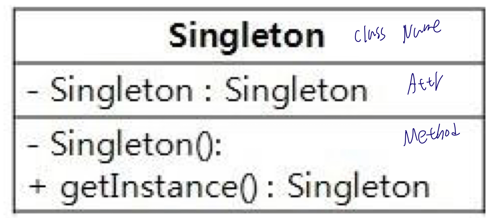

# 싱글톤 패턴이란?

<p align="center"></p>

객체의 인스턴스가 오직 1개만 생성되는 패턴을 의미한다.

- 위의 UML처럼 private인 생성자를 가지기 때문에 new 로 항상 생성할 수 없다.
- getInstance()라는 메서드를 통해서만 인스턴스를 받을 수 있다.
- 자바에서 존재하지 않는 Global Variable의 역할을 할 수 있다.

### 싱글톤을 사용하는 이유

- 한번의 new 연산자로 하나의 인스턴스만 생성하기 때문에 메모리 측면에서 이점이 있다.
- 이미 생성된 인스턴스만 사용하니, 다시 새롭게 만들 필요가 없어서 속도 측면에서도 이점이 있다.
- 다른 클래스와 데이터 공유가 쉽다. 하지만 동시성 문제가 발생할 수 있다.

# 이해를 위한 예제

## MySingleton.java

```java
public class MySingleton {

    private static  MySingleton theObject;

    private MySingleton() {
    }

    public static MySingleton createMySingleton() {

        if (theObject == null)
            theObject = new MySingleton();
        return theObject;
    }

}
```

위의 예제는 맨처음에 보여준 UML과 구조가 거의 같다. 결국 모든 클래스에서 공유할 수 있고, 객체의 생성없이 사용할 수 있도록 static으로 singleton object와 getter를 구현했다. `createMySingleton` 메서드에서 볼 수 있듯이 먼저 현재의 인스턴스가 null인지 확인하고, null이라면 instanciation을 해주고 아니라면 생성한 instance를 리턴한다.

## SingleObject.java

```java
public class SingleObject {


   private static SingleObject instance = new SingleObject();

   private SingleObject(){}

   public static SingleObject getInstance(){
      return instance;
   }

   public void showMessage(){
      System.out.println("Hello World!");
   }
}

```

또한 바로 위의 예제와는 다르게 객체에 바로 new 로 실행해주고 getInstance() method가 실행되면 바로 return 하도록 만들어줄 수 있다.

## Ticket 예제

티케팅을 할 때 의 예제도 싱글톤으로 구현할 수 있다.

TicketMaker

```java

public class TicketMaker {
    private int ticket = 1000;
    private static  TicketMaker singleton = new TicketMaker();
    private  TicketMaker() {
    }
    public static TicketMaker getInstance() {
        return singleton;
    }
    public synchronized int getNextTicketNumber() {
        return ticket++;
    }
}
```

```java

public class TicketMain {
    public static void main(String[] args) {
        System.out.println("Start.");
        for (int i = 0; i < 10; i++) {
            System.out.println(i + ":" + TicketMaker.getInstance().getNextTicketNumber());
        }
        System.out.println("End.");
    }
}
```

위의 TickerMaker는 Singleton으로 관리되기 때문에 ticket을 저장한 것은 객체는 하나로 볼 수 있다.

## Triple

싱글톤을 이용하여 생성한 객체의 수를 제한해줄 수도 있다.

```java
public class Triple {
    private static Triple[] triple = new Triple[]{
        new Triple(0),
        new Triple(1),
        new Triple(2),
    };
    private int id;
    private Triple(int id) {
        System.out.println("The instance " + id + " is created.");
        this.id = id;
    }
    public static Triple getInstance(int id) {
        return triple[id];
    }
    public String toString() {
        return "[Triple id=" + id + "]";
    }
}

public class TripleMain {
    public static void main(String[] args) {
        System.out.println("Start.");
        for (int i = 0; i < 9; i++) {
            Triple triple = Triple.getInstance(i % 3);
            System.out.println(i + ":" + triple);
        }
        System.out.println("End.");
    }
}
```

위의 처럼 static 배열을 사용하여 결국 객체의 수는 3개로 제한한다.

# Reference

- Yuki's Design Pattern Book
