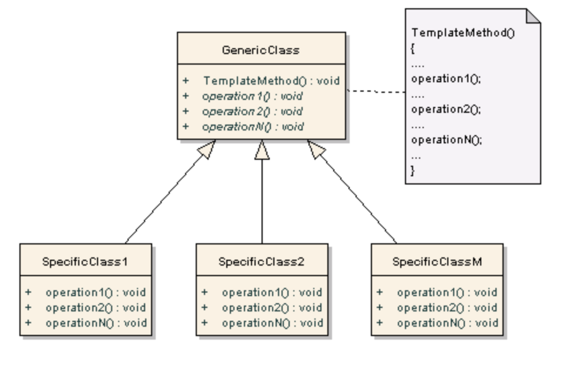

# 템플릿 메서드 패턴이란?

- 어떤 작업을 처리하는 부분을 서브클래스로 캡슐화해 전체 일을 수행하는 구조는 바꾸지 않으면서 특정 단계에서 수행하는 내역을 바꾸는 패턴이다.
  - 특정한 logic flow를 변화시키지 않고 기능을 바꾸게 할 수 있는 패턴이다.
  - 전체적으로는 동일하면서 부분적으로만 다른 구문으로 구성된 메서드의 코드 중복을 최소활 때 유용하다.
- 상위 클래스는 abstract로 만들고 이를 변화시키지 않으며, subclass들만 해당 부분 중 필요한 또는 바꾸고 싶은 부분만 따로 구현한다.

The intent of the template method is to define the overall structure of the operation, while allowing subclasses to refine, or redefine certain steps.
(템플릿 메서드 패턴의 목적은 작업의 전체 구조를 정의하는 동시에 하위 클래스가 특정 단계를 세분화 하거나 재정의 할 수 있도록 하는 것이다.)

## 장점

- 코드 중복을 줄일 수 있다.
- 자식 객체의 역할을 최대한 줄임으로서 핵심 로직에 집중한다.
- 쉽게 자식 객체를 추가, 확장해 나갈 수 있다.

## 단점

- 구현 클래스가 구현해야 하는 abstract method가 너무 많으면 관리가 곤란하다.
- 반드시 추상 클래스의 템플릿 메서드에서 구현클래스의 메서드를 부르는 식으로 로직을 구성해야한다.

# 패턴 구조

<p align="center"></p>

# 이해를 위한 예제 Game

먼저 Game를 구현하기 위한 메서드들을 abstract class 로 미리 만들어 놓는다.

```java
abstract class Game {
    protected int playersCount;
    abstract void initializeGame();
    abstract void makePlay(int player);
    abstract boolean endOfGame();
    abstract void printWinner();
}
```

이후 실행을 위한 template method를 정의한다.

```java

abstract class Game {
    protected int playersCount;
    abstract void initializeGame();
    abstract void makePlay(int player);
    abstract boolean endOfGame();
    abstract void printWinner();

    final  void playOneGame(int playersCount){
        this.playersCount = playersCount;
        initializeGame();
        int j = 0;
        while(!endOfGame()){
            makePlay(j);
            j = (j+1) % playersCount;
        }
        printWinner();
    }
}

```

이후 위에서 선언한 게임을 위한 template를 extend한 각각의 게임을 만든다.

Monopoly 게임

```java

public class Monopoly extends Game {
    @Override
    void initializeGame() {
        // initialize money
    }

    @Override
    void makePlay(int player) {
        // Process one turn of player
    }

    @Override
    boolean endOfGame() {
        // return true if game is over according to Monopoly rules
        return false;
    }

    @Override
    void printWinner() {
    // Display who wone
    }
}

```

체스게임

```java

public class Chess extends Game {
    @Override
    void initializeGame() {
        // initialize money
    }

    @Override
    void makePlay(int player) {
        // Process one turn of player
    }

    @Override
    boolean endOfGame() {
        // return true if game is over according to Monopoly rules
        return false;
    }

    @Override
    void printWinner() {
    // Display who wone
    }
}

```

# 예제 코드 - SNS

## Main 클래스

```java
import java.io.BufferedReader;
import java.io.IOException;
import java.io.InputStreamReader;

public class Main {
    public static void main(String[] args) throws IOException {
        BufferedReader reader = new BufferedReader(new InputStreamReader(System.in));
        Network network = null;
        System.out.print("Input user name: ");
        String userName = reader.readLine();
        System.out.print("Input password: ");
        String password = reader.readLine();

        // Enter the message.
        System.out.print("Input message : ");
        String message = reader.readLine();

        System.out.println("\nChoose social network for posting message.\n" +
                "1 - Facebook\n" +
                "2 - Twitter");
        int choice = Integer.parseInt(reader.readLine());

        // 선택되는 케이스에 따라 Facebook 또는 Twitter를 실행시켜주는 메서드이다.
        if (choice == 1) {
            network = new Facebook(userName, password);
        } else if (choice == 2) {
            network = new Twitter(userName, password);
        }
        network.post(message);
    }
}
```

## Network - 추상클래스

```java
public abstract class Network {
    String userName;
    String password;

    Network() {}


    // post 메서드가 실질적으로 현재 실행되는 템플릿메서드 패턴에서 fixed logic 부분이다.
    public boolean post(String message) {

        // 로그인이 정상적으로 된다면 sendData 를 호출해준다.
        if (logIn(this.userName, this.password)) {
            // Send the post data.
            boolean result =  sendData(message.getBytes());
            logOut();
            return result;
        }
        return false;
    }

    // 이때 logIn과 sendData, logOut은 추상메서드로 나중에 구현클래스마다 기능은 다르다.
    // 하지만 위에 post 메서드처럼 fixed logic의 부분으로 사용된다.
    // 따라서 전체적인 코드의 흐름은 같다.

    abstract boolean logIn(String userName, String password);
    abstract boolean sendData(byte[] data);
    abstract void logOut();
}
```

## Facebook - Network 추상클래스를 구현한 클래스

Facebook과 Twitter는 서로 다른 방법으로 각각 Network클래스의 abstract method를 구현하였지만, fixed로직에 의해 똑같은 flow로 실행된다.

```java
public class Facebook extends Network {
    public Facebook(String userName, String password) {
        this.userName = userName;
        this.password = password;
    }

    // 로그인 메서드지만 사실상 무엇인가를 확인하는 기능은 없다.
    // 마치 로그인을 하는 과정처럼 그냥 console에서 보여주는 기능이다.
    public boolean logIn(String userName, String password) {
        System.out.println("\nChecking user's parameters");
        System.out.println("Name: " + this.userName);
        System.out.print("Password: ");
        for (int i = 0; i < this.password.length(); i++) {
            System.out.print("*");
        }
        // 약 5초동안 기다리도록 wait를 하는 기능을 한다.
        simulateNetworkLatency();
        System.out.println("\n\nLogIn success on Facebook");
        return true;
    }

    // 마치 message를 보내는 것처럼 Console을 출력해주는 메서드이다.
    public boolean sendData(byte[] data) {

        boolean messagePosted = true;
        if (messagePosted) {
            System.out.println("Message: '" + new String(data) + "' was posted on Facebook");
            return true;
        } else {
            return false;
        }
    }

    public void logOut() {
        System.out.println("User: '" + userName + "' was logged out from Facebook");
    }

    private void simulateNetworkLatency() {
        try {
            int i = 0;
            System.out.println();
            while (i < 10) {
                System.out.print(".");
                Thread.sleep(500);
                i++;
            }
        } catch (InterruptedException ex) {
            ex.printStackTrace();
        }
    }
}
```

## Twitter - Network 추상클래스를 구현한 클래스

```java
public class Twitter extends Network {

    public Twitter(String userName, String password) {
        this.userName = userName;
        this.password = password;
    }

    public boolean logIn(String userName, String password) {
        System.out.println("\nChecking user's parameters");
        System.out.println("Name: " + this.userName);
        System.out.print("Password: ");
        for (int i = 0; i < this.password.length(); i++) {
            System.out.print("*");
        }
        simulateNetworkLatency();
        System.out.println("\n\nLogIn success on Twitter");
        return true;
    }

    public boolean sendData(byte[] data) {
        boolean messagePosted = true;
        if (messagePosted) {
            System.out.println("Message: '" + new String(data) + "' was posted on Twitter");
            return true;
        } else {
            return false;
        }
    }

    public void logOut() {
        System.out.println("User: '" + userName + "' was logged out from Twitter");
    }

    private void simulateNetworkLatency() {
        try {
            int i = 0;
            System.out.println();
            while (i < 10) {
                System.out.print(".");
                Thread.sleep(500);
                i++;
            }
        } catch (InterruptedException ex) {
            ex.printStackTrace();
        }
    }
}
```

## 알아야 할것

- 어떻게 Template method pattern을 유지하면서 즉 template method를 사용하여 logic flow를 변화하지 않고 각각 서로 다른 코드를 돌릴 수 있는지 이해하는 것이 중요하다.

# Reference

- https://m.blog.naver.com/PostView.naver?isHttpsRedirect=true&blogId=2feelus&logNo=220669520535
