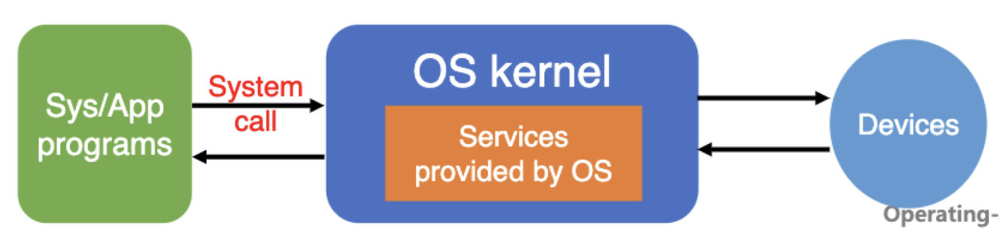
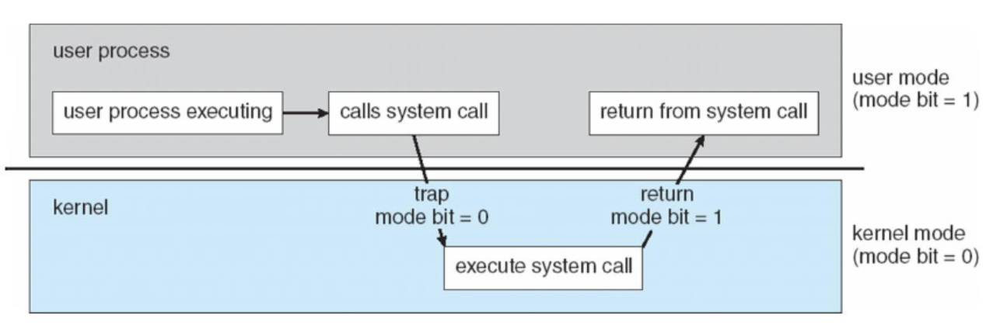
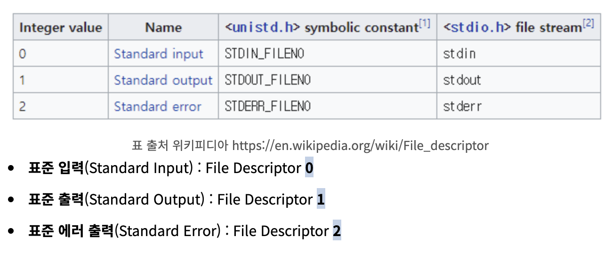
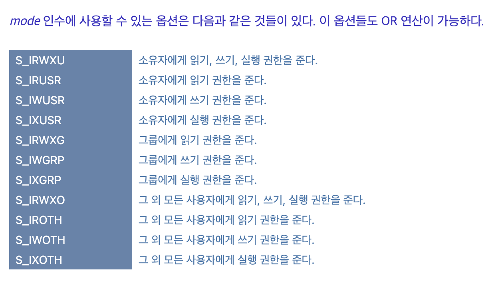

# System Call 이란?

- System call 이란 OS를 사용하기위한 일종의 interface이다.
- `Function calls to OS kernel available` through interrupt 라고 불린다. 즉 interrup를 사용하여 OS kernel을 사용할 수 있도록 하는 함수이다.
- user-mode 에서 kernel 모드를 안전하게 사용할 수 있도록 한다.
- 직접적으로 kernel의 system call을 사용하는 것보다는 주로 Application Programming Interface(API)를 통해 접근할 수 있도록 한다.

<p align="center"></p>

## System Call 과 Dual-mode operation

System call 을 잘 이해하려면 Dual-mode operation에 대해 알아야한다. Dure mode operation 이란 사용하는 mode를 user mode와 kernel mode로 나누어서 kernel을 사용하는데에 제한을 두는 것을 말한다.

mode bit 를 사용하여 user mode와 kernel mode를 변경해가며 사용된다.

### User mode

- user defined code가 작동하는 공간이다.
- Privileged instruction 은 제한된다. 하지만 Privileged instruction은 OS System call을 통해 사용할 수 있다.

### Kernel mode

- OS code 이다.
- Privileged instruction 이 허용된다.

<p align="center"></p>

# System call 의 예

## File Descriptor

관련 함수들에 대해 들어가기 전에 File Descriptor에 대해 알아야한다.

File Descriptor란 리눅스 계열의 시스템에서 프로세스(process)가 파일(file)을 다룰 때 사용하는 개념으로, 프로세스에서 특정 파일에 접근할 때 사용하는 추상적인 값이다.

파일디스크립터에서 0번에서 2번까지는 고정되어있다.

<p align="center"></p>

파일 discriptior가 int인 이유는 프로세스가 유지하고 있는 file descriptors 테이블의 인덱스이기 때문이다.

따라서 프로세스가 실행 중에 파일을 Open 하면 커널은 해당 프로세스의 파일 디스크립터 숫자 중에 사용하지 않는 가장 작은 값을 할당해준다. (즉 프로세스마다 파일 디스크립터 숫자들이 있다.)

프로세스가 열려있는 파일에 시스템 콜을 사용하여 접근할 때, 파일 디스크립터 값을 이용해 파일을 지칭할 수 있다.

## open()

- open 함수는 말 그대로 파일을 여는 기능을 한다.
- 만약 파일이 존재하지 않다면 선택적으로 파일을 생성할 수 있다.

```c
#include<fcntl.h>
int open(const char* pathname, int flags);
int open(const char* pathname, int flags, mode_t mode);
```

### open()의 Return value

- Success : file descriptor(non negative integer)
- Error : -1

### open()의 flags

- 다음 중 하나의 access mode를 포함해야한다. 또한 이 옵션들은 OR연산으로 같이 사용할 수 있다.
  - O_RDONLY : 읽기 전용 모드로 파일을 연다.
  - O_WRONLY : 쓰기 전용 모드로 파일을 연다
  - O_RDWR - 읽기, 쓰기 겸용 모드로 파일을 연다.
  - O_CRATE : 필요한 경우 파일을 생성한다.
  - O_TRUNC : 존재하던 데이터를 모두 삭제한다.
  - O_APPEND : 존재하던 데이터를 보존하고 뒤에 이어서 저장한다.
  - O_DIRECTORY : pathname이 directory가 아니면 오류가 발생한다.

```c
fd = open("data.txt", O_RDONLY | O_TRUNC | O_CREATE, 0644);
if(fd == -1)
    printf("open() Error");
```

0644 : 소유자는 읽기/쓰기가 가능하며, 나머지 모든 사람은 읽기만 가능

### open()의 mode

mode는 file permition을 지칭한다.

<p align="center"></p>

## read()

read() 함수는 file descriptor로부터 파일을 읽는데 사용한다.

```c
#include<unistd.h>
ssize_t read(int fd, void *buf, size_t count);
```

- count bytes만큼 fd에서 파일을 읽는다.
- read 함수를 사용할 때 읽을 파일의 위치 즉 file pointer를 이동시키려면 lseek함수를 사용해야한다.

### read()의 return value

- Success : 파일에서 읽은 바이트의 수를 리턴한다.
- Fail : -1

## write()

write 함수는 fd에 파일을 값을 쓰는 것이다.

```c
#include<unistd.h>
ssize_t write(int fd, const void *buf, size_t count);
```

count bytes 만큼 buffer에 있는 값을 파일을 write한다.

### Return value

- Success : write한 bytes의 수를 리턴한다.
- Fail : -1

# System call 함수 사용 예시

```c
#include <stdio.h>
#include <stdlib.h>
#include <fcntl.h>
#include <unistd.h>
#include <string.h>

#define FILELEN 256
#define BUFSIZE 1024

int main(int argc, char *argv[])
{
    int fd;
    int start_offset;
    int read_bytes;
    char filename[FILELEN];
    char buf[BUFSIZE];

    if (argc < 3)
    {
        fprintf(stderr ,"Usage: %s [file name] [start offset] \n", argv[0]);
        exit(1);
    }

    strcpy(filename, argv[1]);      // set file name
    start_offset = atoi(argv[2]);   // set start offset

    // open source file
    fd = open(filename, O_RDONLY);
    if (fd == -1)
    {
        perror(filename);
        exit(1);
    }

    // set file position
    lseek(fd, start_offset, SEEK_SET);

    // read data from file
    while ((read_bytes = read(fd, buf, BUFSIZE)) > 0)
    {
        // print file data
        write(0, buf, read_bytes);
    }

    printf("\n\n");

    // close file
    close(fd);

    return 0;
}
```

# 파일에 권한 주기

https://bubble-dev.tistory.com/entry/CC-chmod2-fchmod2

