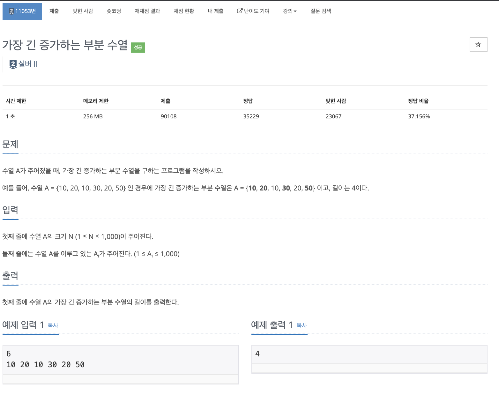

# 문제

<p align="center"></p>

백준 문제 링크 : https://www.acmicpc.net/problem/11053

# 풀이전략

1. 전형적인 증가하는 부분수열 문제이다. top-down, bottom-up 두가지 방식으로 다 풀 수 있다.

# 코드

## 풀이 1 : top-down

```java
public class B_11053 {
    static int[] arr;
    static int[] dp;
    static int N;
    static int LTS(int n){
        if(dp[n] == 0){
            dp[n] = 1;

            for(int i=n-1; i>=0; i--){
                if(arr[i] < arr[n]){
                    dp[n] = Math.max(dp[n], LTS(i)+1);
                }
            }
        }
        return dp[n];
    }


    public static void main(String[] args) throws IOException {
        BufferedReader br = new BufferedReader(new InputStreamReader(System.in));
        N = Integer.parseInt(br.readLine());
        StringTokenizer st = new StringTokenizer(br.readLine());
        arr = new int[N+1];
        dp = new int[N+1];
        int i = 0;
        while(st.hasMoreTokens()){
            arr[i] = Integer.parseInt(st.nextToken());
            i++;
        }
        arr[N] = Integer.MAX_VALUE;
        System.out.println(LTS(N)-1);
    }
}

```

## 풀이 2 : bottom-up

```java
public class B_11053 {
     static int[] arr;
     static int[] dp;
     static int N;


     public static void main(String[] args) throws IOException {
        BufferedReader br = new BufferedReader(new InputStreamReader(System.in));
        N = Integer.parseInt(br.readLine());
        StringTokenizer st = new StringTokenizer(br.readLine());
        int i = 0;
        arr = new int[N];
        dp = new int[N];
        while(st.hasMoreTokens()){
            arr[i++] = Integer.parseInt(st.nextToken());
        }

        for(i=0; i<N; i++){
            dp[i] = 1;
            for(int j=0; j<i; j++){
                if(arr[j] < arr[i] && dp[i] < dp[j] +1){
                    dp[i] = dp[j] + 1;
                }
            }
        }
        int sol = 0;
        for(int el : dp){
            sol = Math.max(el, sol);
        }
        System.out.println(sol);
     }
 }
```

# 회고

풀이 1로 문제를 풀면서 계속 틀리는 문제가 발생했었다. 백준에도 검색해보니 그 이유를 깨닫게 되었다([틀린이유](https://www.acmicpc.net/board/view/79919)). 나도 모르게 당연히 맨 마지막 수열 n이 반드시 추가될 것이라고 코드를 짯기 때문이다. 이러한 것들도 항상 고려하며 집중하며 풀어야한다.
