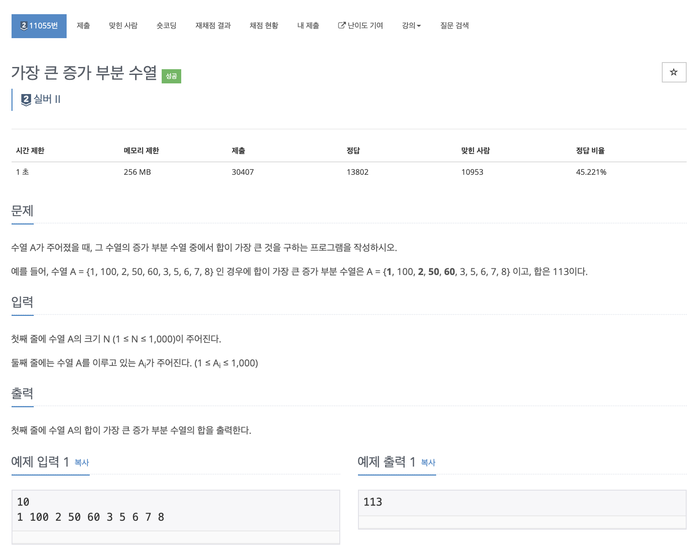

# 문제

<p align="center"></p>

백준 문제 링크 : https://www.acmicpc.net/problem/11055

# 풀이전략

1. 백준 11053 가장 긴 부분수열 문제와 거의 비슷하다. 단 여기서는 합이라는 차이가 있다.
2. 더 짧더라도 크기가 더 클 수 있다.

# 코드

## 풀이 1 : top-down

```java
import java.io.BufferedReader;
import java.io.IOException;
import java.io.InputStreamReader;
import java.util.StringTokenizer;

public class B_11055 {
    static int N;
    static int[] arr;
    static int[] dp;

    public  static int sol(int n){
        if(dp[n] != 0) return dp[n];
        dp[n] = arr[n];
        for(int i = n-1; i>=0; i--){
            if(arr[i] < arr[n]){
                dp[n] = Math.max(dp[n], arr[n] + sol(i));
            }
        }
        return dp[n];
    }

    public static void main(String[] args) throws IOException {
        BufferedReader br = new BufferedReader(new InputStreamReader(System.in));
        N = Integer.parseInt(br.readLine());
        arr = new int[N];
        dp = new int[N];
        StringTokenizer st = new StringTokenizer(br.readLine());
        int i = 0;
        while(st.hasMoreTokens()){
            arr[i++] = Integer.parseInt(st.nextToken());
        }
        int solution = 0;
        for(i=0; i<N; i++){
            solution = Math.max(solution, sol(i));
        }
        System.out.println(solution);
    }
}


```

## 풀이 2 : bottom-up

```java
import java.io.BufferedReader;
import java.io.IOException;
import java.io.InputStreamReader;
import java.util.StringTokenizer;

public class B_11055 {
    static int N;
    static int[] arr;
    static int[] dp;
    public static void main(String[] args) throws IOException {
        BufferedReader br = new BufferedReader(new InputStreamReader(System.in));
        N = Integer.parseInt(br.readLine());
        arr = new int[N];
        dp = new int[N];
        StringTokenizer st = new StringTokenizer(br.readLine());
        int i = 0;
        while(st.hasMoreTokens()){
            arr[i++] = Integer.parseInt(st.nextToken());
        }
        for(i=0; i<N; i++){
            dp[i] = arr[i];
            for(int j=0; j<i; j++){
                if(arr[j] < arr[i] && dp[i] < dp[j]+arr[i]){
                    dp[i] = dp[j] + arr[i];
                }
            }
        }
        int solution = 0;
        for(int el : dp){
            solution = Math.max(solution, el);
        }
        System.out.println(solution);
    }
}
```

# 회고

바로 이전에 11053문제를 풀어서 11055문제는 수월하게 해결할 수 있었다.
