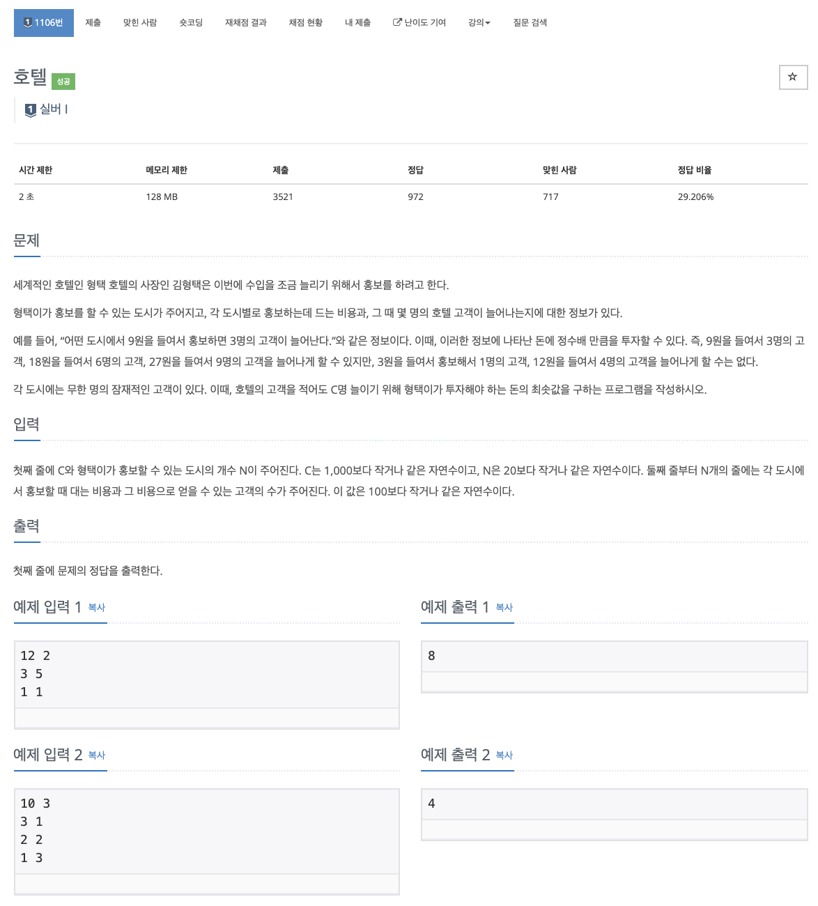

# 문제

<p align="center"></p>

백준 문제 링크 : https://www.acmicpc.net/problem/1106

# 풀이전략

1. 총 투자하는 값을 쪼개면서 내려가면 가장 적은 투자 가능 값을 알수있다.
2. 고객을 적어도 C명 늘리는 것이므로 C에 딱 맞출 필요 없다.
3. 다음 점화식을 이용하여 문제를 해결하였다.

   `for(int i=1; i<=N; i++) dp[n] = Math.min(dp[n], price[i]+sol(n-person[i]));`

# 코드

```java
import java.util.Scanner;

public class B_1106 {
    static int[] price;
    static int[] person;
    static int goal, N;
    static int[] dp;

    public static int sol(int n){
        if(n <= 0) return 0;
        if(dp[n] != Integer.MAX_VALUE) return dp[n];
        for(int i=1; i<=N; i++){
            dp[n] = Math.min(dp[n], price[i]+sol(n-person[i]));
        }
        return dp[n];
    }

    public static void main(String[] args){
        Scanner sc = new Scanner(System.in);
        goal = sc.nextInt();
        N = sc.nextInt();
        price = new int[N+1];
        person = new int[N+1];
        dp = new int[goal+1];
        for(int i=1; i<=N; i++){
            price[i] = sc.nextInt();
            person[i] = sc.nextInt();
        }
        for(int i=0; i<=goal; i++){
            dp[i] = Integer.MAX_VALUE;
        }
        System.out.println(sol(goal));
    }
}


```

# 회고

이 또한 마찬가지로 가장 큰 값을 생각할 때 이 큰 값은 작은 값들로부터 이루어짐을 생각하며 문제를 해결하면 좋다.
