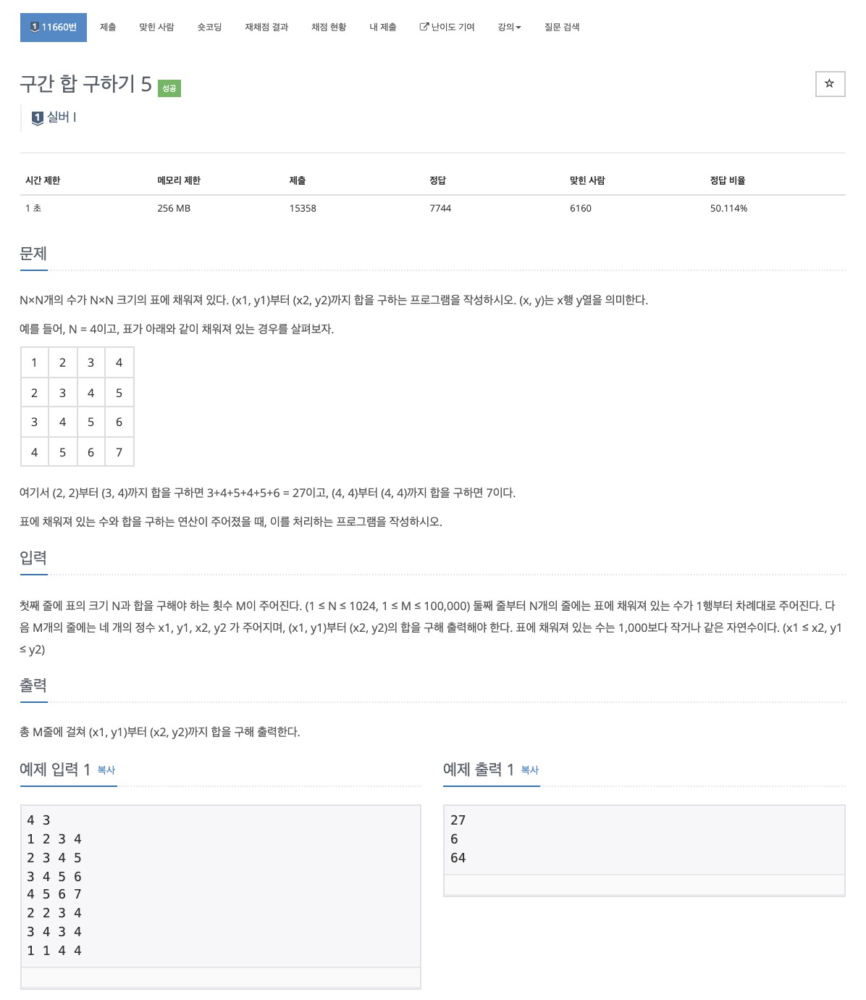

# 문제

<p align="center"></p>

백준 문제 링크 : https://www.acmicpc.net/problem/11660

# 풀이전략

1. 누적합 Board를 만들어야한다.

   `Board(n)(n) = Board(n-1)(n) + Board(n)(n-1) - Board(n-1)(n-1)`

2. 이후 구간합을 구할 수 있다.

   `int answer = board[x2][y2] - board[x1-1][y2] - board[x2][y1-1] + board[x1-1][y1-1];`

# 코드

```java
import java.io.BufferedReader;
import java.io.IOException;
import java.io.InputStreamReader;
import java.util.StringTokenizer;

public class B_11660 {
    static int N, M;
    static int[][] board;

    public static void main(String[] args) throws IOException {
        BufferedReader br = new BufferedReader(new InputStreamReader(System.in));
        StringTokenizer st = new StringTokenizer(br.readLine());
        N = Integer.parseInt(st.nextToken());
        M = Integer.parseInt(st.nextToken());
        board = new int[N+1][N+1];

        for(int i=1; i<=N; i++){
            st = new StringTokenizer(br.readLine());
            for(int j=1; j<=N; j++){
                board[i][j] = Integer.parseInt(st.nextToken()) + board[i-1][j] + board[i][j-1] - board[i-1][j-1];
            }
        }
        for(int i=0; i<M; i++){
            st = new StringTokenizer(br.readLine());
            int x1 = Integer.parseInt(st.nextToken());
            int y1 = Integer.parseInt(st.nextToken());
            int x2 = Integer.parseInt(st.nextToken());
            int y2 = Integer.parseInt(st.nextToken());
            int answer = board[x2][y2] - board[x1-1][y2] - board[x2][y1-1] + board[x1-1][y1-1];
            System.out.println(answer);
        }
    }
}


```

# 회고

누적 Board를 구하고 이제 이를 통해 답을 도출할 수 있다. 수식을 항상 잘 찾아보려고 노력해야겠다.
