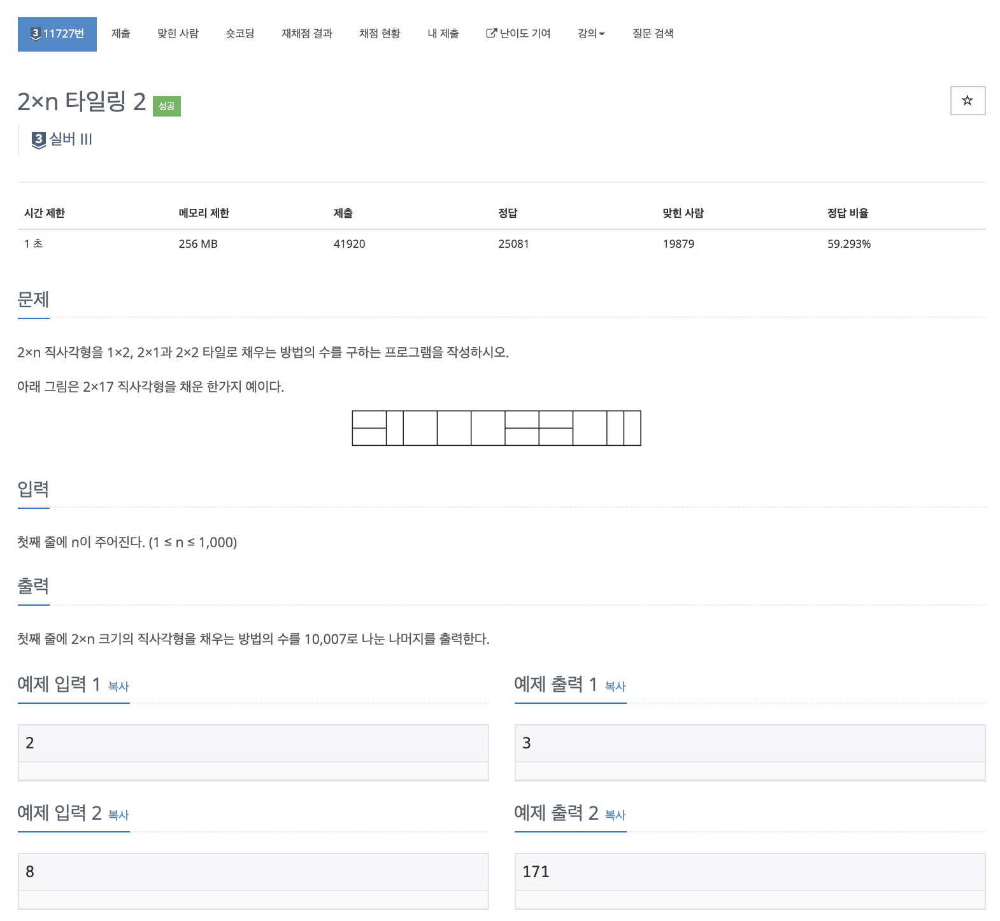

# 문제

<p align="center"></p>

백준 문제 링크 : https://www.acmicpc.net/problem/11727

# 풀이전략

1. 새로운 블럭이 추가될 때, 이전에 있었던 사이즈로 만들 수 있는 부분을 메모이제이션을 통해 활용한다.
2. %10007을 해주는 것을 실수하지 말아야한다.

# 코드

```java
import java.util.Scanner;

public class B_11727 {
    public static void main(String[] args){
        Scanner sc = new Scanner(System.in);
        int n = sc.nextInt();
        long[] dp = new long[n+2];
        dp[1] = 1;
        dp[2] = 3;
        for(int i=3; i<=n; i++){
            dp[i] = (dp[i-1] + 2 * dp[i-2])%10007;
        }
//        System.out.println(dp[n]%10007); // 처음 실수 여기다가 10007을 나눠줘 버리는 실수를 범함
        System.out.println(dp[n]);
    }
}


```

# 회고

처음 문제를 풀 때 맨 마지막에만 %10007 문제를 틀려버렸다. 이러한 것에 주의해야한다. 또한 항상 long을 해줄 때를 잘 고려해서 풀어야 한다.
