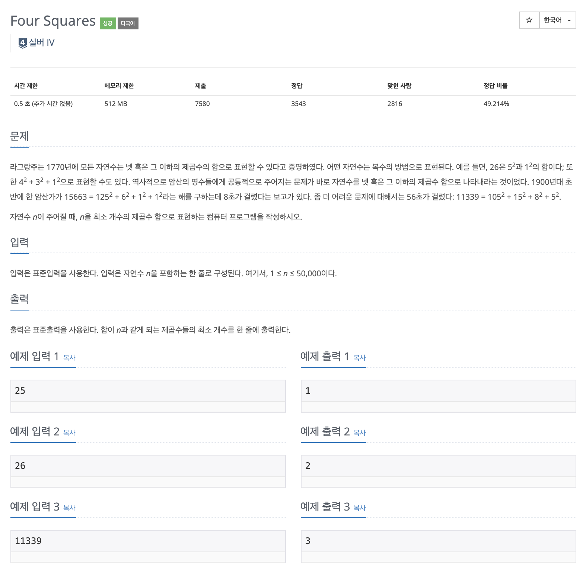

# 문제

<p align="center"></p>

백준 문제 링크 : https://www.acmicpc.net/problem/17626

# 풀이전략

1. 만족하는 가장 작은 제곱수들의 합으로 답을 구하려고 했으나, 이는 틀린 방법 이였다.
   - 만족하는 이전 제곱수들의 합을 다 구해서 그 중의 최소 개수인 것을 찾아야한다.
   - 출처코드 : https://steady-coding.tistory.com/18

# 코드

```java
import java.util.Scanner;

public class B_17626 {
    static int[] dp;
    // 그리디 알고리즘을 적용한 잘못된 풀이방법
//    public static int sol(int n){
//        if(n <= 0) return 0;
//        if(dp[n] != 0) return dp[n];
//        double sqrtN = Math.sqrt(n);
//        if(sqrtN == (int) sqrtN) return dp[n]=1;
//        int k = (int)Math.pow(Math.floor(sqrtN),2);
//        System.out.println("제곱하기전 : " + sqrtN);
//        return dp[n] = 1 + sol(n-k);
//    }


    public static void main(String[] args){
        Scanner sc = new Scanner(System.in);
        int N = sc.nextInt();
        dp = new int[N+1];
        dp[1] = 1;
        int min = 0;
        for(int i=2; i<=N; i++){
            min = Integer.MAX_VALUE;
            // dp[i - j*j] 중 최소를 선택해야함
            for(int j=1; j*j <= i; j++){
                int temp = i - j * j;
                // 사실상 이전에 있는 모든 수들을 파악하여 최솟값을 찾기
                min = Math.min(min, dp[temp]);
            }
            dp[i] = min + 1;
        }
        System.out.println(dp[N]);
    }
}

```

# 회고

너무 오랜만에 DP문제를 풀었기 때문에 약간 감을 잃었던 것 같다. 단순하게 풀지 말고 할 수 있는 모든 경우를 항상 찾아야함을 잊지 말아야한다.
