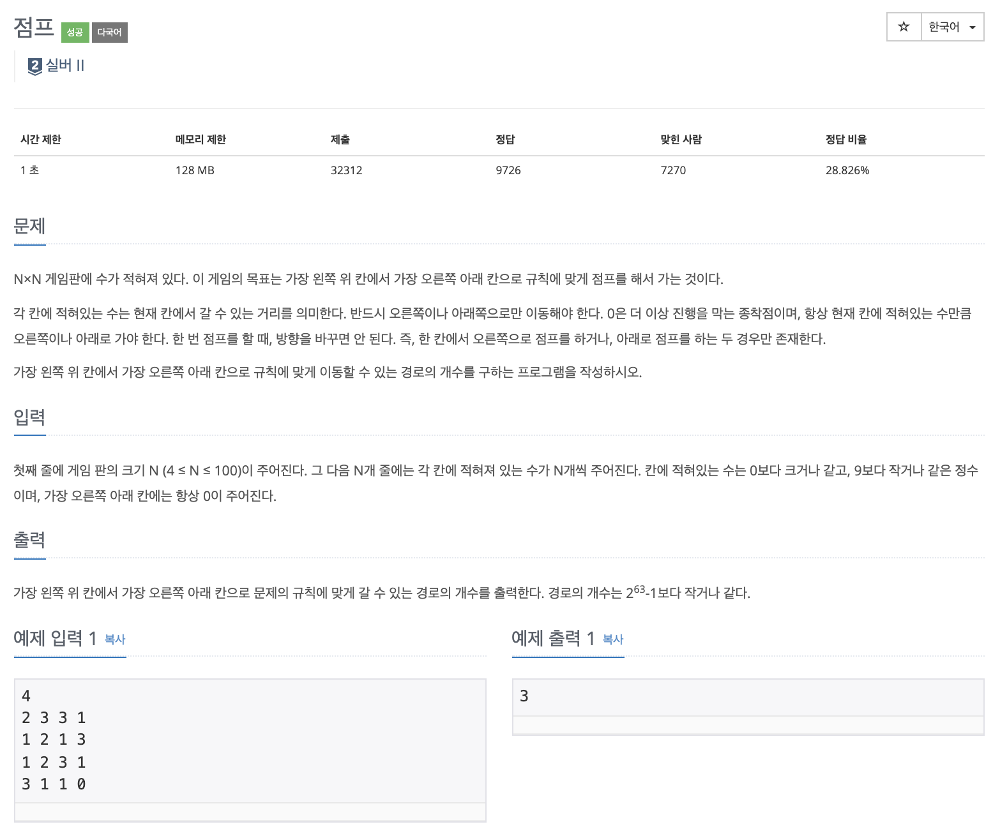

# 문제

<p align="center"></p>

백준 문제 링크 : https://www.acmicpc.net/problem/1890

# 풀이전략

1. 반드시 오른쪽 or 아래 쪽으로만 이동한다
2. 2^63-1 까지 값이 커질 수 있으니 long타입으로 풀어야한다.
3. 해당 점화식을 이용하여 문제를 해결하였다.

   `dp[r][c] = sol(r+jump,c) + sol(r, c+jump)`

# 코드

```java
import java.io.BufferedReader;
import java.io.IOException;
import java.io.InputStreamReader;
import java.util.Scanner;
import java.util.StringTokenizer;

public class B_1890 {
    static int[][] board;
    static long[][] dp;
    static int N;

    static long sol(int r, int c){
        if(r >= N || c >= N) return 0;
        if(dp[r][c] != -1) return dp[r][c];
        int jump = board[r][c];
        if(jump == 0 && r == N-1 && c == N-1) return 1;
        if(jump == 0) return 0;
        dp[r][c] = sol(r+jump, c) +  sol(r, c+jump);
        return dp[r][c];
    }

    public static void main(String[] args) throws IOException {
        Scanner sc = new Scanner(System.in);
        N = sc.nextInt();
        board = new int[N][N];
        dp = new long[N][N];
        for(int i=0; i<N; i++){
            for(int j=0; j<N; j++){
                board[i][j] = sc.nextInt();
                dp[i][j] = -1;
            }
        }

        System.out.println(sol(0, 0));
    }
}


```

# 회고

이동을 할 때 오른쪽, 아래쪽으로만 이동하는것이 문제를 해결하는데 큰 힌트였다. DP문제에서 하듯이 먼저 문제를 작게 보고 작은것들을 하나씩 합치는게 중요한것 같다.
