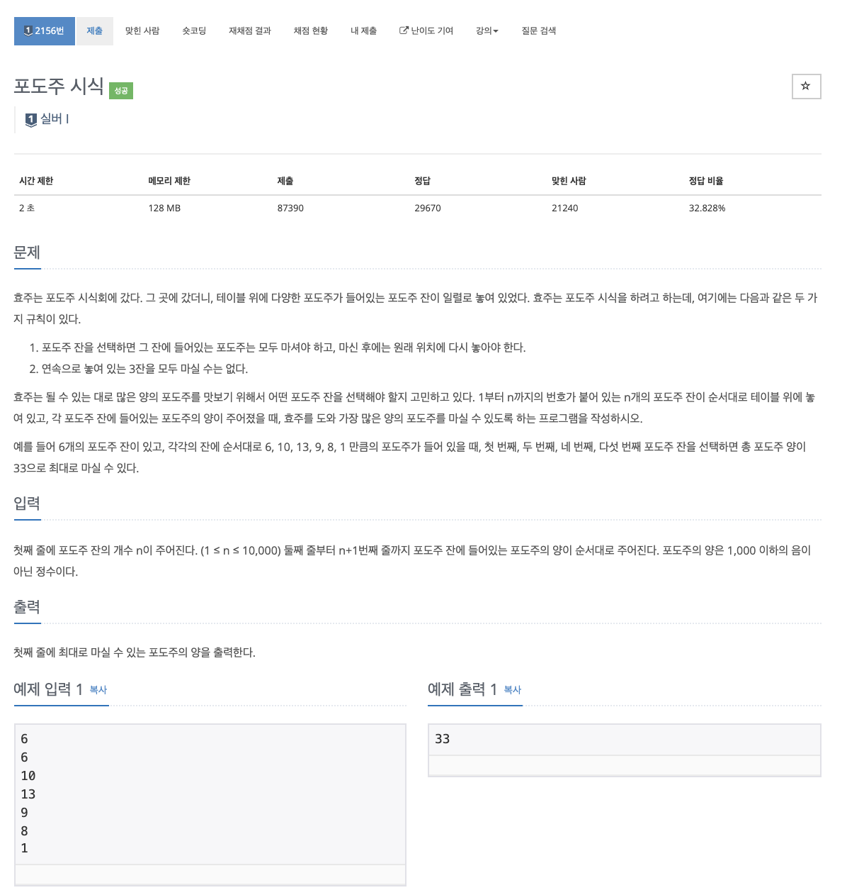

# 문제

<p align="center"></p>

백준 문제 링크 : https://www.acmicpc.net/problem/2156

# 풀이전략

1. 포도주를 3번 연속 마실 수 없으므로 그냥 단순히 먹고갈지 그냥 패스할지로 계산하면 된다.
   - 총 6개의 포도주 잔이 있을 때 앞에 뒤에 456을 합한 것이 다른 것들을 합한 것보다 클 수 있는 경우가 있기 때문이다.
2. 포도주의 양은 1,000이하의 음이 아닌 정수이다... -> 이걸 제대로 하지 못해 틀렸다.
   - 모든 포도주가 0일 경우 시간초과가 날수 있다. [반례](https://www.acmicpc.net/board/view/75121)

# 코드

```java
import java.io.BufferedReader;
import java.io.IOException;
import java.io.InputStreamReader;
import java.util.Scanner;

public class B_2156 {
    static int N;
    static int[] arr;
    static int[][] dp;
    public static int sol(int cnt, int n){
        if(cnt < 0) return 0;
        if(n > N) return 0;
        if(dp[cnt][n] != -1) return dp[cnt][n];
        // 먹고가기
        if(cnt != 0) dp[cnt][n] = arr[n] + sol(cnt-1, n+1);
        // 안먹고 점프
        dp[cnt][n] = Math.max(dp[cnt][n], sol(2, n+1 ));

        return dp[cnt][n];
    }

    public static void main(String[] args) throws IOException {
        BufferedReader br = new BufferedReader(new InputStreamReader(System.in));
        N = Integer.parseInt(br.readLine());
        arr = new int[N+1];
        dp = new int[3][N+1];
        for(int i=0; i<3; i++){
            for(int j=0; j<=N; j++){
                dp[i][j] = -1;
            }
        }
        for(int i=1; i<=N; i++){
            arr[i] = Integer.parseInt(br.readLine());
        }
        System.out.println(sol(2, 1));
    }
}


```

# 회고

모든 것이 0일 경우를 생각하지 않았었다... 이제부터 dp배열은 반드시 `-1로 초기화`하는 습관을 가질것이다!.
