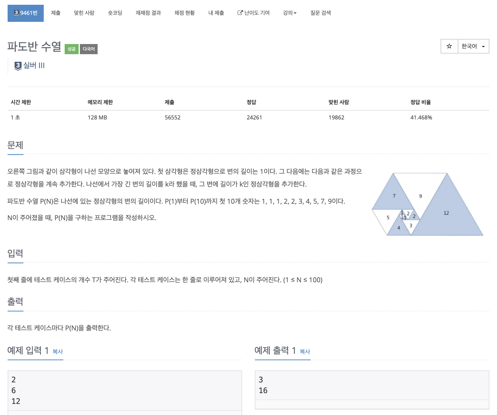

# 문제

<p align="center"></p>

백준 문제 링크 : https://www.acmicpc.net/problem/9461

# 풀이전략

1. DP문제로 점화식을 찾아야 한다.
   - `a(n) = a(n-1) + a(n-4)`
2. 값이 long타입까지 나올 수 있음을 항상 생각해야한다.

# 코드

```java
import java.util.Scanner;
// long을 해주지 않아서 한번 틀렸다 long을 해주는 것을 잊지 말아야한다.
public class B_9461 {

    static long[] dp;
    public static long sol(int n){
        if(dp[n] != 0) return dp[n];
        return dp[n] = sol(n-1) + sol(n-5);
    }
    public static void main(String[] args){
        Scanner sc = new Scanner(System.in);
        int T = sc.nextInt();
        dp = new long[101];
        dp[1] = 1;
        dp[2] = 1;
        dp[3] = 1;
        dp[4] = 2;
        dp[5] = 2;
        for(int i=0; i<T; i++){
            int N = sc.nextInt();
            System.out.println(sol(N));
        }
    }
}


```

# 회고

점화식을 찾아서 쉽게 해결할 수 있었다. 단 long타입을 해주지 않아 먼저 틀렸는데, 앞으로 문제를 해결할때 이게 long이 필요한지 아닌지 항상 고려해야겠다.
