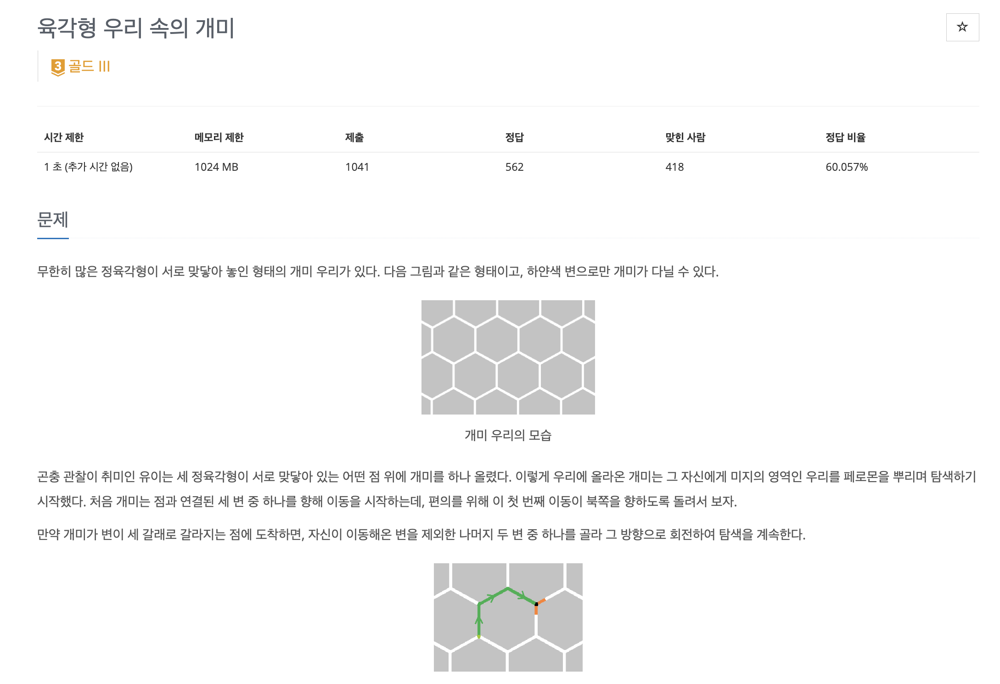

# 문제

<!-- <p align="center"></p> -->

백준 문제 링크 : https://www.acmicpc.net/problem/17370

# 풀이전략

1. N <= 22 라는 조건과 만족하는 조건들의 갯수라는 말을 보고 바로 이 문제는 완전탐색임을 알 수 있어야한다.
2. 회전했을 때 같은 움직임을 가진 경우는 같은 경우로 취급한다. (문제에서 페로몬의 궤적은 동일해도 개미의 이동방향에 따라 경로를 구별한다고 나와있기 때문)
3. 각 개미의 위치에서 갈 수 있는 경로는 2개로 정해져 있다. 이를 빠르게 파악하는게 문제풀이의 핵심이였다.
4. 처음에는 6각형으로 움직인다는게 어려웠지만, 결국 점 좌표로 풀면 해결 가능하다.

# 코드

```java
package backjoon.P17370;

import java.io.*;
import java.util.StringTokenizer;


public class Main {
    // 인풋받을 회전 수
    static int N;
    // 50, 50 이면 중앙지점 25,25에서 출발했다고 가정하면 충분하므로 50,50으로 설정해준다.
    static boolean[][] map = new boolean[51][51];

    static int[] moveX = {0, -1, 1, 0, -1, 1};
    static int[] moveY = {1, 1, 1, -1, -1, -1};

    // 이전 move에 따라 갈 수 있는 move를 적어둔 것
    // 만약에 이전에 0번째 move 즉 0,1로 움직였다면,
    // 다음번에 갈 수 있는 move는 1번째 move (-1,1) 또는 2번째 move(1,1)  밖에 없음
    // 마찬가지로 이전에 -1,1 을 방문했다면, 0,1 또는 0,-1을 방문할 수 밖에 없음 화살표 그림 참고
    static int[][] availableMove = {{2,1}, {0,4}, {5,0}, {1,3}, {3,2}};
    static int answer = 0;
    public static void main(String[] args) throws Exception {
        BufferedReader br = new BufferedReader(new InputStreamReader(System.in));
        StringTokenizer st;
        N = Integer.parseInt(br.readLine());
        map[25][25] = true;
        // 중앙 지점에서 시작
        seeking(0,3,25,24);
        System.out.println(answer);
        br.close();
    }
    public static void seeking(int count, int pastMove, int x, int y){
        if(map[y][x]){
            if(count == N){
                answer++;
            }
            return;
        }
        if(count == N) return;
        map[y][x] = true;
        for(int i=0; i < 2; i++){
            int nextMove = availableMove[pastMove][i];
            seeking(count+1,nextMove , x+moveX[nextMove], y+moveY[nextMove]);
        }
        // DFS처럼 나중에 다른 경로 탐색을 위함
        map[y][x] = false;
    }
}

```

# 회고

나는 문제를 해결하지 못해 다른 [블로그의 풀이](https://howtolivelikehuman.tistory.com/249#recentEntries)를 가져왔다. 사실 문제 자체의 알고리즘이나 구현내용은 크게 어렵지 않았는데, 내가 현재 구현력이 많이 떨어진 것 같다. 빨리 다시 올려야 겠다.

일단 이 문제에서는 6각형으로 회전한다는게 나에게 너무 어렵게 다가왔는데, 하지만 차분하게 좌표로 문제를 해결했으면 될거같다. 또한 경로를 찾을 때는 현재 풀이에서는 DFS가 되어있지만, structure를 만들어서 BFS로 푸는것도 가능하다. 하지만 BFS로 해결하면 메모리를 더 많이 사용하므로, BFS로 할 때 더 유리한 경우인지 아닌지를 잘 파악하여 문제를 접근해야한다.

# Reference

- https://howtolivelikehuman.tistory.com/249#recentEntries
