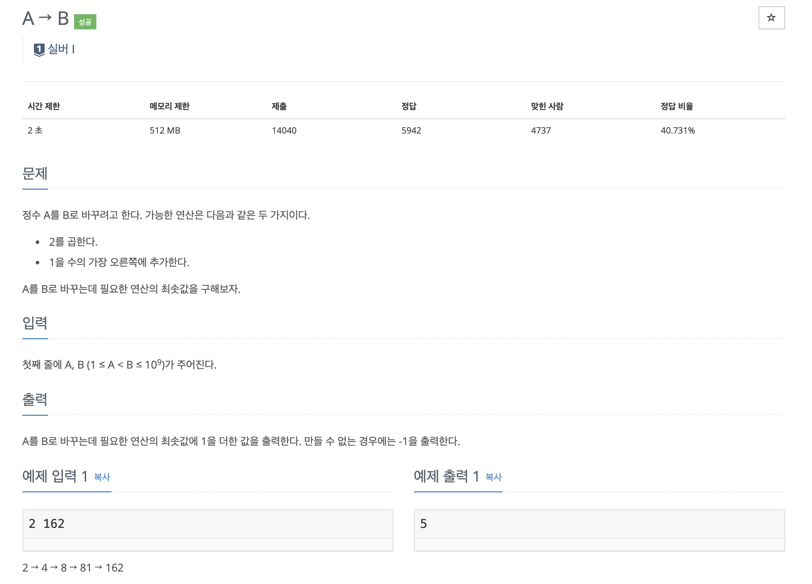

# 문제

<p align="center"></p>

백준 문제 링크 : https://www.acmicpc.net/problem/16953

# 풀이전략

정수를 A에서 B로 바꿀 때 가능한 연산은 2를 곱하거나, 1을 수의 가장 오른쪽에 추가하는 것이다. 이떄 필요한 연산의 최솟값을 구해야한다.

1. A에서 B로 만드는 것은 너무 경우의 수가 많으므로, B에서 A로 가는 방법을 택했다.
2. 가능한 연산의 우선순위를 주어준다.
   - 1을 수의 가장 오른쪽에 추가하는 것은 숫자의 끝이 1로 끝날 때만 할 수 있으므로 이 방법을 우선순위가 높게 설정한다.

# 코드

```java
import java.io.BufferedReader;
import java.io.IOException;
import java.io.InputStreamReader;
import java.util.StringTokenizer;

public class B_16953 {

    public static void main(String[] args) throws IOException {
        BufferedReader br = new BufferedReader(new InputStreamReader(System.in));
        StringTokenizer st = new StringTokenizer(br.readLine());
        int A = Integer.parseInt(st.nextToken());
        int B = Integer.parseInt(st.nextToken());
        int cnt = 0;
        while(A!=B){
            if(B%10 == 1){
                B = (B-1)/10;
            }
            else if(B%2 == 0){
                B = B/2;
            }
            else{
                cnt = -2;
                break;
            }
            cnt++;
            if(B == 0){
                cnt = -2;
                break;
            }
        }
        System.out.println(cnt+1);
    }
}

```

# 회고

문제에서는 A->B를 구하는 거였지만 이를 뒤집어서 생각하여 B->A를 푸는 방법이 좋은 아이디어 였던 것 같다. 문제를 풀때 항상 전형적인 방법이 아닌 다른 방법을 생각해 보아야겠다.
