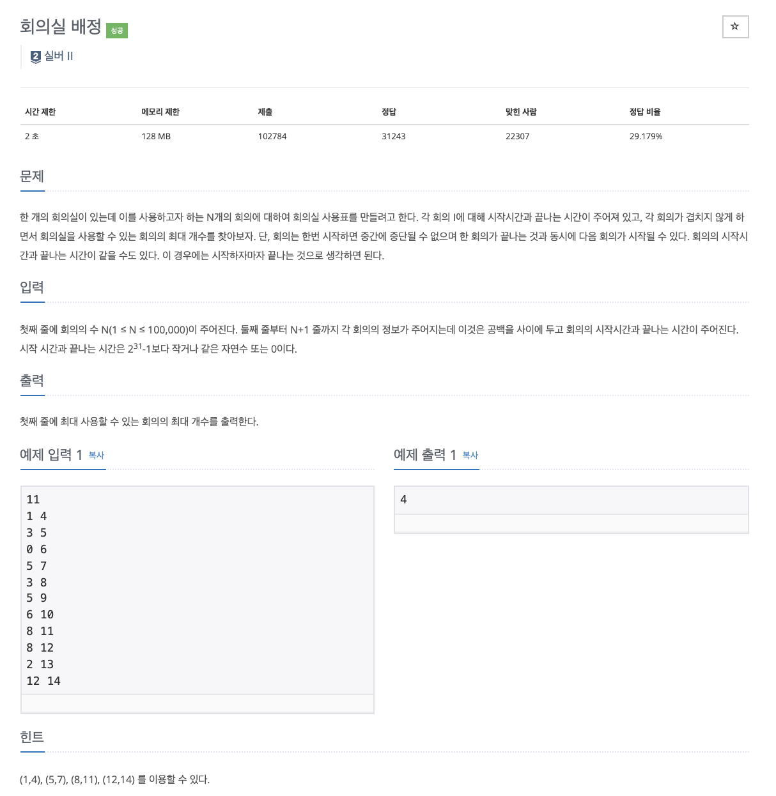

# 문제

<p align="center"></p>

백준 문제 링크 : https://www.acmicpc.net/problem/1931

# 풀이전략

인풋으로 각 회의의 시작시간과 끝나는 시간이 정해진다. 이를 겹치지 않게 사용할 수 있는 회의의 최대 개수를 구해야한다.

1. 회의가 끝나는 시간이 빠른 순으로 정렬을 하여 회의들을 정렬하여 사용한다.
   - priority queue를 사용한다.
2. Pair클래스를 만들어서 사용하면 편하다.
3. comparator가 될 부분은 람다식으로 빠르게 적을 수 있다.

# 코드

```java
import java.io.BufferedReader;
import java.io.IOException;
import java.io.InputStreamReader;
import java.util.PriorityQueue;
import java.util.StringTokenizer;


public class B_1931 {
    static class Pair{
        int x, y;
        Pair(int x, int y){
            this.x = x;
            this.y = y;
        }
    }
    public static void main(String[] args) throws IOException {
        BufferedReader br = new BufferedReader(new InputStreamReader(System.in));
        int N = Integer.parseInt(br.readLine());
        PriorityQueue<Pair> pq = new PriorityQueue<>((e1, e2)-> {
            if(e1.y == e2.y) return e1.x - e2.x;
            return e1.y - e2.y;
        });

        for(int i=0; i<N; i++){
            StringTokenizer st = new StringTokenizer(br.readLine());
            int x = Integer.parseInt(st.nextToken());
            int y = Integer.parseInt(st.nextToken());
            pq.add(new Pair(x,y));
        }
        int lastTime = 0;
        int cnt = 0;
        while(!pq.isEmpty()){
            Pair top = pq.poll();
            if(lastTime > top.x) continue;
            lastTime = top.y;
            cnt++;

        }
        System.out.println(cnt);
    }
}


```

# 회고

빨리 끝나는 순으로 회의를 진행시키면 구할 수 있는 즉 사용할 수 있는 회의의 최대 값을 구할 수 있는 전형적인 그리디 알고리즘 문제이다. 이떄 PriorityQueue와 람다식의 활용을 주의깊게 공부하자.
