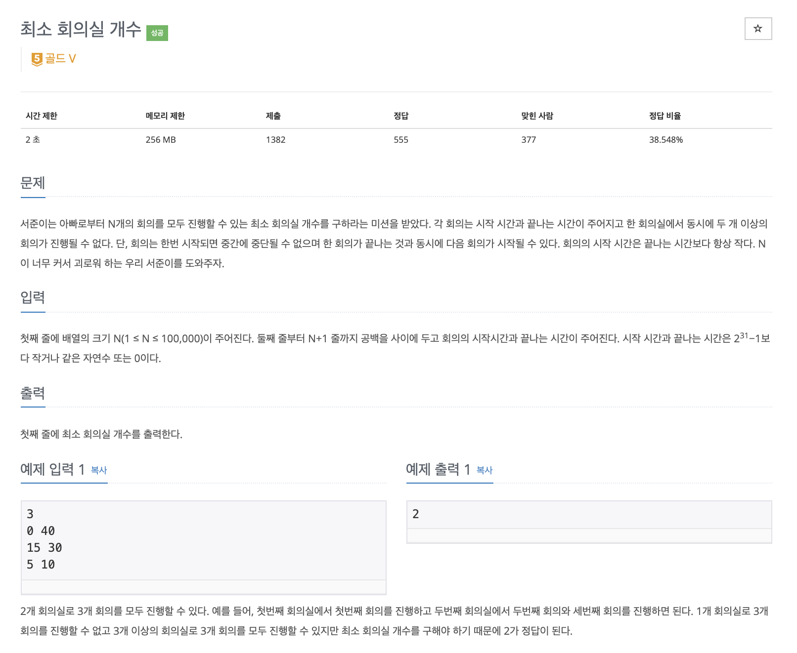

# 문제

<p align="center"></p>

백준 문제 링크 : https://www.acmicpc.net/problem/19598

# 풀이전략

모든 회의를 진행할 수 있는 최소 회의실의 개수를 구하는 문제이다. 즉 중복되는 회의가 생길 때마다 회의실의 개수를 추가해주어야한다.

1. 기본적인 회의실 문제처럼 끝나는 시간을 기준으로 회의실을 정렬해준다. (Proiority Queue 사용)
2. 정렬된 순서대로 시간에 따라 확인을 한다.
   - 새로운 회의의 시작시간이 가장 이전에 진행되었던 회의 끝나는 시간보다 느릴경우 이전 회의는 pop해주고 새로운 회의를 추가해준다.
   - 시간이 겹칠경우 회의를 추가해주고, 회의실의 사이즈를 늘린다.

# 코드

```java
import java.io.BufferedReader;
import java.io.IOException;
import java.io.InputStreamReader;
import java.util.LinkedList;
import java.util.PriorityQueue;
import java.util.Queue;
import java.util.StringTokenizer;

public class B_19598 {
    static class pair {
        public int start, end;
        pair(int x, int y){
            this.start = x;
            this.end = y;
        }
    }
    public static void main(String[] args) throws IOException {
        BufferedReader br = new BufferedReader(new InputStreamReader(System.in));
        int N = Integer.parseInt(br.readLine());

        PriorityQueue<pair> pq = new PriorityQueue<>((e1, e2) ->{
            if(e1.start == e2.start) return e1.end - e2.end;
            return e1.start - e2.start;
        });
        PriorityQueue<Integer> q = new PriorityQueue<>();
        for(int i=0; i<N; i++){
            StringTokenizer st = new StringTokenizer(br.readLine());
            int start = Integer.parseInt(st.nextToken());
            int end = Integer.parseInt(st.nextToken());
            pq.add(new pair(start, end));
        }
        int cnt = 1;
        q.add(pq.poll().end);
        while(!pq.isEmpty()){
            pair next = pq.poll();
            // 꺼낸 회의가 겹칠 때 즉 q의 가장 앞에있는 end값보다 작을 때
            if(next.start < q.peek()){
                cnt++;
            }
            else{
                q.poll();
            }
            q.add(next.end);
        }
        System.out.println(cnt);
    }

}


```

# 회고

기존회의실 문제에 약간의 변형이다. 즉 회의실 문제 기초문제를 잘 이해했다면 이런 문제는 쉽게 응요하여 해결할 수 있다. 기본이 중요하다.
