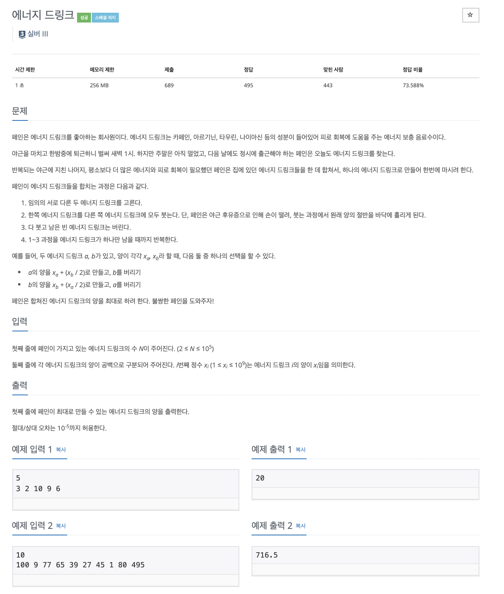

# 문제

<p align="center"></p>

백준 문제 링크 : https://www.acmicpc.net/problem/20115

# 풀이전략

임의의 서로다른 두 에너지 드링크 중 한쪽 에너지 드링크에서 다른 에너지 드링크로 부을 때 붓는 양의 절반을 버리며 합친다.

1. 가장 큰 값을 기준시작으로 다른 값들을 반씩 버리며 합쳐준다.
2. 오차는 10^-5 까지 허용하므로, 이를 잘 처리해주어야한다.

# 코드

```java
import java.io.BufferedReader;
import java.io.IOException;
import java.io.InputStreamReader;
import java.util.*;

public class B_20115 {
    public static void main(String[] args) throws IOException {
        BufferedReader br = new BufferedReader(new InputStreamReader(System.in));
        int N = Integer.parseInt(br.readLine());
        StringTokenizer st = new StringTokenizer(br.readLine());
        ArrayList<Double> arr = new ArrayList<>();

        while(st.hasMoreTokens()){
            arr.add(Double.parseDouble(st.nextToken()));
        }
        arr.sort((e1, e2) -> (int) (e2 - e1));

        double answer = arr.get(0);

        for(int i=1; i<arr.size(); i++){
            answer += arr.get(i)/2;
        }
        // 정리해두기 소수점 반올림 하는 법
        answer = Math.round(answer * 1000)/ 1000.0;

        if (answer == (int)answer) System.out.println((int)answer);
        else System.out.println(answer);

    }

}


```

# 회고

Math.round() 함수는 소숫점 첫번째 자리에 따라 반올림을 해주는 함수이다. 따라서 이를 \*1000해주고 다시 /1000.0 을 해주면 소숫점 밑에 4자리까지 나타내는 것이다.
