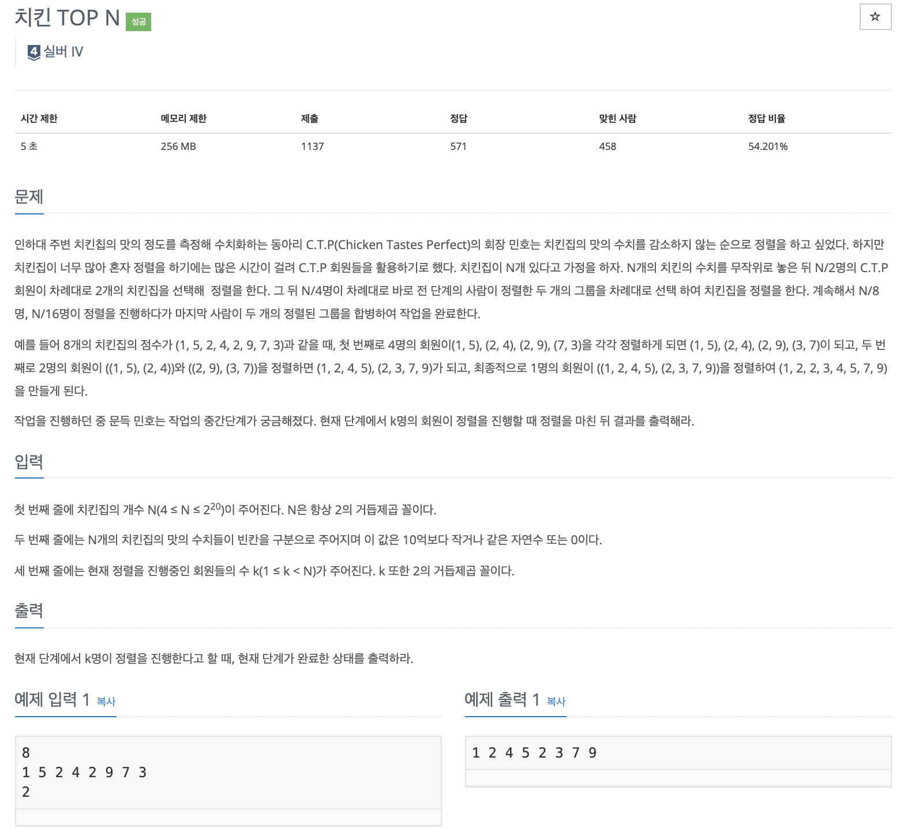

# 문제

<p align="center"></p>

백준 문제 링크 : https://www.acmicpc.net/problem/11582

# 풀이전략

1. 몇명이서 정렬을 진행하는지 즉 얼마나 분할하여 정렬을 해야하는지 파악하는 것이 중요하다.
2. Arrays.sort(arr, startIdx, endIdx)로 부분 정렬이 가능하다.

# 코드

```java
import java.util.*;

public class B_11582 {

    public static void mySort(int[] arr, int k){
        int sortSize = arr.length/k;

        int i = 0;
        while(i < arr.length){
            Arrays.sort(arr, i, i+sortSize);
            i += sortSize;
        }
    }

    public static void main(String[] args){
        Scanner sc = new Scanner(System.in);
        int n = sc.nextInt();
        int[] arr = new int[n];
        for(int i=0; i<n; i++){
            arr[i] = sc.nextInt();
        }
        int k = sc.nextInt();
        mySort(arr, k);

        for(int el : arr){
            System.out.print(el+ " ");
        }
    }
}

```

# 회고

간단하게 부분정렬을 사용하여 구현할 수 있었다.
