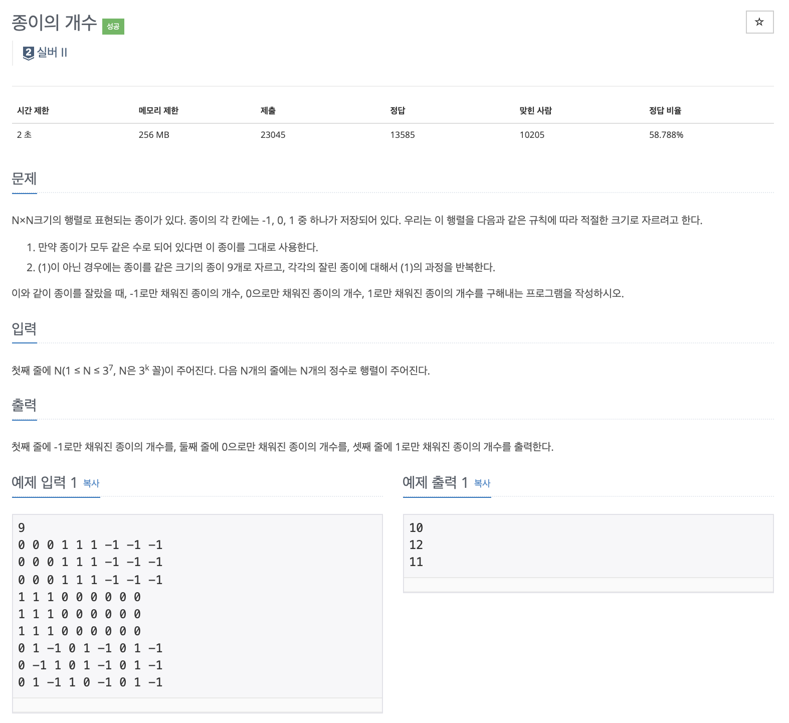

# 문제

<p align="center"></p>

백준 문제 링크 : https://www.acmicpc.net/problem/1780

# 풀이전략

1. 한번 분할 할 때마다 9부분으로 나누고 해당 부분들이 종이로 만들어 질 수 있는지 찾아야한다.
2. 일반적인 분할정복 문제지만 분할할 부분이 9개나 되므로 실수하지 않도록 주의해야한다.

# 코드

```java
import java.io.*;
import java.util.*;
public class B_1780 {
    public static int[][] board;
    public static int minusOne = 0;
    public static int zero = 0;
    public static int plusOne = 0;

    public static void increseNum(int num){
        if(num == -1) minusOne++;
        else if(num == 0) zero++;
        else plusOne++;
    }
    public static boolean numCheck(int row, int col, int size){
        int num = board[row][col];
        for(int i=row; i<row+size; i++){
            for(int j=col; j<col+size; j++){
                if(board[i][j]!=num) return true;
            }
        }
        increseNum(num);
        return false;
    }
    public static void partition(int row, int col, int size){

        if(size == 1){
            increseNum(board[row][col]);
            return;
        }
        int nextSize = size/3;
        if(numCheck(row, col, nextSize)) partition(row, col, nextSize);
        if(numCheck(row + nextSize, col, nextSize)) partition(row+nextSize, col, nextSize);
        if(numCheck(row + nextSize * 2, col, nextSize)) partition(row+nextSize*2, col, nextSize);
        if(numCheck(row, col + nextSize, nextSize)) partition(row, col+nextSize, nextSize);
        if(numCheck(row + nextSize, col + nextSize, nextSize)) partition(row+nextSize, col+nextSize, nextSize);
        if(numCheck(row + nextSize * 2, col + nextSize, nextSize)) partition(row+nextSize*2, col+nextSize, nextSize);
        if(numCheck(row, col + nextSize * 2, nextSize)) partition(row, col+nextSize*2, nextSize);
        if(numCheck(row + nextSize, col + nextSize * 2, nextSize)) partition(row+nextSize, col+nextSize*2, nextSize);
        if(numCheck(row + nextSize * 2, col + nextSize * 2, nextSize)) partition(row+nextSize*2, col+nextSize*2, nextSize);
    }
    public static void main(String args[]) throws IOException {
        Scanner sc = new Scanner(System.in);
        int N = sc.nextInt();
        board = new int[N][N];
        for(int i=0; i<N; i++){
            for(int j=0; j<N; j++){
                board[i][j] = sc.nextInt();
            }
        }
        if(numCheck(0,0,N)) partition(0,0,N);
        System.out.println(minusOne);
        System.out.println(zero);
        System.out.println(plusOne);
    }
}

```

# 회고

이전에 풀었던 색종이만들기 문제(2630)와 거의 같은 문제이다. 단 9개로 나누는 부분만 차이가 있었다. 역시 이전문제들 부터 확실하게 익히고 다음 문제로 넘어가면 더 자신감 있게 문제를 해결할 수 있다.
