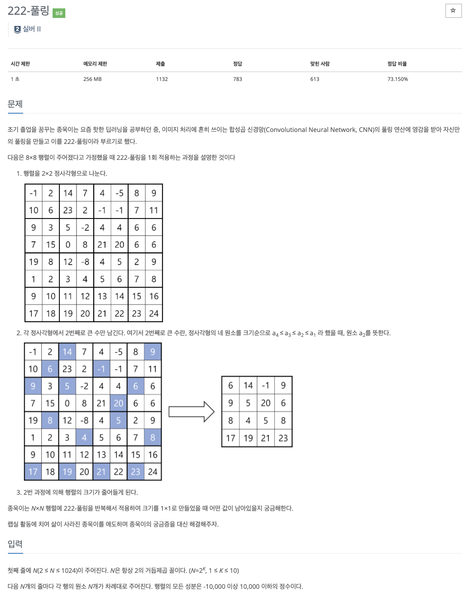

# 문제

<p align="center"></p>

백준 문제 링크 : https://www.acmicpc.net/problem/1780

# 풀이전략

1. 4부분씩 분할하여 가장 작은 부분들로 내려가고, 4부분이 합쳐질 때마다 2번쨰로 큰 숫자가 무엇인지 구해야한다.
2. 2번째로 큰 숫자를 구할 때, 1, 2, 3, 3 처럼 제일 큰 숫자가 2개이면 3또한 2번째로 큰 숫자가 될 수 있다는 것을 유의해야한다.

# 코드

```java
import java.util.*;
public class B_17829 {
    public static int[][] board;

    public static int getSecondValue(int ...values){
        int secondValue = Integer.MIN_VALUE;
        int maxValue = Integer.MIN_VALUE;
        for(int val : values){
            if(maxValue <= val){
                secondValue = maxValue;
                maxValue = val;
            }
            if(val < maxValue && secondValue < val ) secondValue = val;
        }
        return secondValue;
    }

    public static int partition(int row, int col, int size){
        if(size == 1) return board[row][col];
        // 4개로 나누기
        int nSize = size/2;
        return getSecondValue(partition(row, col, nSize),partition(row+nSize, col, nSize),partition(row, col+nSize, nSize),partition(row+nSize, col+nSize, nSize));
    }
    public static void main(String[] args){
        Scanner sc = new Scanner(System.in);
        int N = sc.nextInt();
        board = new int[N][N];
        for(int i=0; i<N; i++){
            for(int j=0; j<N; j++){
                board[i][j] = sc.nextInt();
            }
        }
        System.out.println(partition(0,0,N));
    }
}

```

# 회고

다음과 같이 4개로 나눈것들을 크기비교를 해서 2번째로 큰 숫자를 구하도록 구현하였다. 생각보다 코드가 깔끔하게 짜졌지만 더 깔끔하게 짜도록 노력해야겠다.
