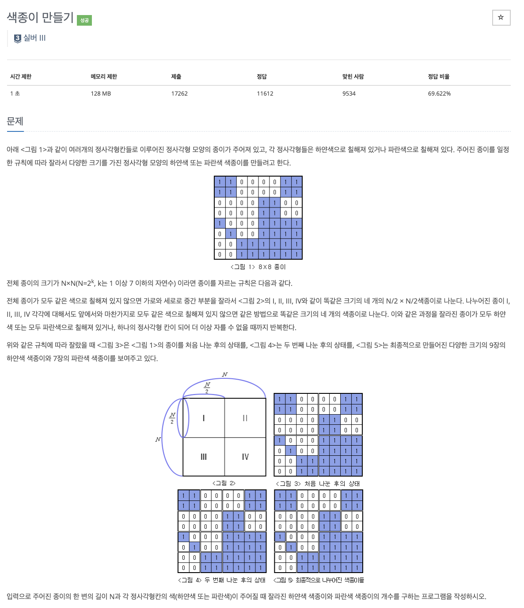

# 문제

<p align="center"></p>

백준 문제 링크 : https://www.acmicpc.net/problem/11582

# 풀이전략

1. 전형적인 분할정복 문제로 분할 한 부분마다 종이가 자를 규칙을 만족하는지 아닌지를 파악해야한다.
2. 각 partition마다 4번 분할을 하여 만족하는지를 파악하도록 재귀함수를 이용하여 구현해야한다.

# 코드

```java
import java.util.*;

public class B_2630 {
    public static int white = 0;
    public static int blue = 0;
    public static int[][] board;

    public static boolean colorCheck(int row, int col, int size){
        int color = board[row][col];

        for(int i=row; i<row+size; i++){
            for(int j=col; j<col+size; j++){
                if(board[i][j] != color){
                    return false;
                }
            }
        }
        return true;
    }

    public static void partition(int row, int col, int size) {
        if (colorCheck(row, col, size)) {
            if (board[row][col] == 0) {
                white++;
            } else {
                blue++;
            }
            return;
        }
        int newSize = size / 2;
    }
    public static void main(String[] args){
        Scanner sc = new Scanner(System.in);

        int N = sc.nextInt();

        board = new int[N][N];

        for(int i=0; i<N; i++){
            for(int j=0; j<N; j++){
                board[i][j] = sc.nextInt();
            }
        }

        partition(0,0,N);
        System.out.println(white);
        System.out.println(blue);
    }
}

```

# 회고

전형적인 분할정복 문제로 해당 풀이법을 잘 알아두고 쉽게 활용할 수 있도록 익혀야 한다.
