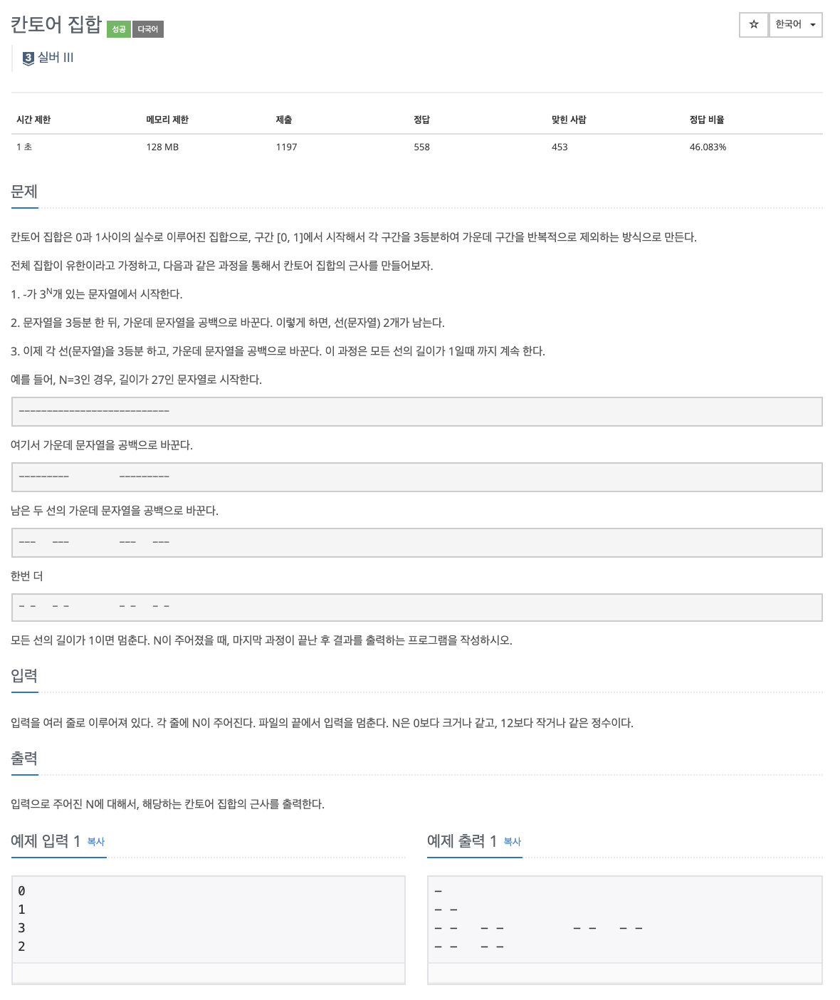

# 문제

<p align="center"></p>

백준 문제 링크 : https://www.acmicpc.net/problem/4779

# 풀이전략

1. 한번 분할 할 때마다 3부분으로 나누고 가운데 부분을 공백으로 바꾸어야한다.
2. 프로그램 종료 여부는 EOF로 확인해야한다.
   - BufferReader로 readLine을 할때 return값이 null이면 EOF이다.
   - Scanner를 사용할 경우, Scanner.hasNextLine()을 통해 EOF여부를 확인할 수 있다.

# 코드

```java
import java.io.*;
import java.util.*;
public class B_4779 {
    public static int[] a;
    public static void solution(int start, int size){
        if(size == 1) return;

        int nextSize = size/3;
        solution(start, nextSize);
        for(int i=start+nextSize; i<start+2*nextSize; i++) a[i] = 1;
        solution(start+2*nextSize, nextSize);
    }
    public static void main(String args[]) throws IOException {
//        Scanner sc = new Scanner(System.in);
        BufferedReader br = new BufferedReader(new InputStreamReader(System.in));
        BufferedWriter bw = new BufferedWriter(new OutputStreamWriter(System.out));

        String input = "";
//        while(sc.hasNextLine()){
        while((input = br.readLine())!= null){
//            int N = sc.nextInt();
            int N = Integer.parseInt(input);
            int nSize = (int)Math.pow(3,N);
            a = new int[nSize];
            solution(0, nSize);
            for (int el : a) {
                if (el == 1) bw.write(' ');
                else bw.write('-');
            }

            bw.newLine();
            bw.flush();
        }
        bw.close();
    }
}

// bw, br을 반드시 사용해야한다
// 시간초과가 나지 않기 위함
```

# 회고

추가적으로 구현하면서 Scanner로 사용하니 시간 초과가 나왔다. 찾아보니 BufferedReader, BufferedWriter가 Scanner보다 훨씬 빠른 속도로 입출력을 지원한다는 것을 알게 되었다. 사실 자바로 코딩테스트 언어를 바꾸고 나서 처음 입출력을 찾아봤을때 Scanner가 더 간단해 보여서 Buffer에 대해서 제대로 찾아보지 않고 Scanner로 시작했었다(역시 배움을 갈망하지 않았던 나 자신을 반성해야겠따.... ㅠㅠ). 이제부터 입력 출력을 할때 웬만하면 Buffered친구들로 하고 사용에 관해서는 나중에 따로 포스팅하도록 하겠다.
