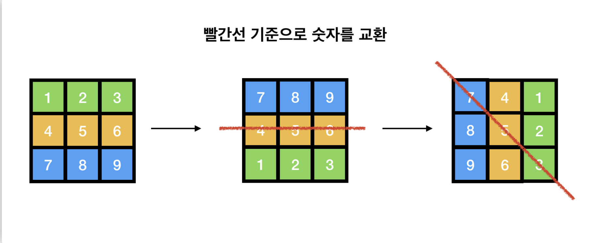

최근에 알고리즘 문제를 풀면서, 배열의 회전을 사용하는 문제를 만났다, 해당 [문제](https://www.acmicpc.net/problem/21609)에게 처참하게 깨져 버렸다. 나중에 다시 한번 시도할 것이다. 따라서 배열을 회전할 때 어떻게 해야하는지 미리 정리해두면 나중에 잘 사용할 수 있을거라고 판단하여 이번 기회에 정리하려고 한다.

# N \* N 배열 90도 회전

[뱀귤님 블로그](https://bcp0109.tistory.com/150)의 글에서 몇번에 swap으로 90도 회전을 시키는 방법을 알게 되었다.

<p align="center"></p>
다음 그림처럼 두번의 빨간선을 기준으로 맞은편의 숫자들을 한번씩 교환해주면 배열을 90도 회전할 수 있게 된다.

<br>해당 내용의 구현코드는 다음과 같다.

### 시계방향 90도

```java
public void rotate(int[][] matrix)
{
    int n = matrix.length;

    // 첫번째 빨간선 : 위아래 바꾸기
    for(int i=0; i<n /2; i++){
        for(int j=0; j<n; j++){
            int temp = matrix[i][j];
            matrix[i][j] = matrix[n-i-1][j];
            matrix[n-i-1][j] = temp;
        }
    }

    // 두번째 빨간선 : 시계 대각선 바꾸기
    for(int i=0; i<n; i++){
        for(int j=i; j<n; j++){
            if(i==j) continue;
            int temp = matrix[i][j];
            matrix[i][j] = matrix[n-i-1][n-j-1];
            matrix[n-j-1][n-i-1] = temp;
        }
    }
}
```

### 반시계 방향 90도

반시계방향 90도는 시계방향 90도와 거의 같지만, 대각선 바꾸기를 할 때 위의 사진 기준으로 시계방향 90도는 7,5,3을 거치는 대각선을 만들었찌만, 반시계 방향 90도는 9,5,1을 거치는 대각선을 그려주면 된다.

```java
public void rotate(int[][] matrix)
{
    int n = matrix.length;

    // 첫번째 빨간선 : 위아래 바꾸기
    for(int i=0; i<n /2; i++){
        for(int j=0; j<n; j++){
            int temp = matrix[i][j];
            matrix[i][j] = matrix[n-i-1][j];
            matrix[n-i-1][j] = temp;
        }
    }

    // 두번째 빨간선 : 반시계 대각선 바꾸기
    for(int i=0; i<n; i++){
        for(int j=0; j<n-i; j++){
            if(i==j) continue;
            int temp = matrix[i][j];
            matrix[i][j] = matrix[n-1-i][n-1-j];
            matrix[n-1-i][n-1-j] = temp;
        }
    }
}
```

### 직사각형도 할 수 있나?

하지만 위의 방법으로 하면 정사각형만 가능하지, 다른 직사각형에는 불가능하다. 모든 사각형을 구하는 공식은 다음과 같다

직사각형의 배열을 회전했을 때 새로운 배열을 선언하고 회전을 해야함을 놓치면 안된다.

# 일반화 할 수 있는 회전

### 시계방향 90도 회전

```java
private static int[][] rotate(int[][] m){

    int N = m.length;
    int M = m[0].length;

    int[][] copyMap = new int[M][N];

    for(int i=0; i<M; i++){
        for(int j=0; j<N; j++){
            copyMap[i][j] = m[n-1-j][i];
        }
    }
    return copyMap;
}
```

### 반시계방향 90도 회전

```java
private static int[][] rotate(int[][] m){

    int N = m.length;
    int M = m[0].length;

    int[][] copyMap = new int[M][N];

    for(int i=0; i<N; i++){
        for(int j=0; j<M; j++){
            copyMap[i][j] = m[j][m-1-i];
        }
    }
    return copyMap;
}
```

# 180도, 270도 회전

180도, 270도 회전은 90도 회전을 한번 더 반복해야한다.

# Reference

- https://bcp0109.tistory.com/150
- https://velog.io/@yul_00/Java-2%EC%B0%A8%EC%9B%90-%EB%B0%B0%EC%97%B4-%ED%9A%8C%EC%A0%84-xf2gjagw
