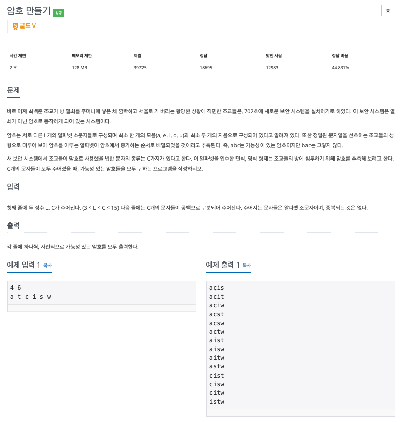

# 문제

<p align="center"></p>

백준 문제 링크 : https://www.acmicpc.net/problem/1759

# 풀이전략

입력받은 문자열을 사용하여 암호를 만드는 때 이때 오름차순, 모음, 자음 개수를 맞춰 주어야한다.

1. 암호는 오름차순이다.
   - 오름 차순이기 때문에 먼저 정렬을 해주어 사용하면, 방문 여부를 체크하는 것보단 index로 해줄 수 있다.
2. 모음의 개수는 1개이상, 자음의 개수는 2개이상이라는 것을 확인해주어야한다.
3. 문자열의 변화가 많으므로 StringBuilder를 사용한다.
   - delete메서드를 사용하면 StringBuilder에 부분을 삭제해줄 수 있다.

# 내 코드

```java
import java.io.BufferedReader;
import java.io.IOException;
import java.io.InputStreamReader;
import java.util.ArrayList;
import java.util.Collections;
import java.util.StringTokenizer;

public class B_1759 {
    static StringBuilder sb = new StringBuilder();
    static ArrayList<Character> arr;
    static char[] vowel = {'a', 'e', 'i', 'o', 'u'};
    static int L, C;

    public static boolean isAnswer(String str){
        int vowelCnt = 0;
        int consonantCnt = 0;
        boolean addConsonanat = true;
        for(int i=0; i<str.length(); i++){
            for(int j=0; j<vowel.length; j++){
                addConsonanat = true;
                if(str.charAt(i) == vowel[j]){
                    addConsonanat = false;
                    vowelCnt++;
                    break;
                }
            }
            if(addConsonanat) consonantCnt++;
            if(vowelCnt >= 1 && consonantCnt >=2) return true;
        }
        return false;
    }

    public static void DFS(int idx){
        // 목적지 체크인
        sb.append(arr.get(idx));
        // 목적지인가?
        if(sb.length() == L){
            if(isAnswer(sb.toString())) System.out.println(sb.toString());
            sb.delete(sb.length()-1, sb.length());
            return;
        }
        // 갈수있는가?
        for(int i=idx+1; i<arr.size(); i++){
            // 간다
            DFS(i);
        }
        //체크아웃  맨 뒤에값 삭제하기
        sb.delete(sb.length()-1, sb.length());
    }

    public static void main(String[] args) throws IOException {
        BufferedReader br = new BufferedReader(new InputStreamReader(System.in));
        StringTokenizer st = new StringTokenizer(br.readLine());
        L = Integer.parseInt(st.nextToken());
        C = Integer.parseInt(st.nextToken());
        arr = new ArrayList<>();
        st = new StringTokenizer(br.readLine());
        for(int i=0; i<C; i++){
            arr.add(st.nextToken().charAt(0));
        }
        Collections.sort(arr);
        for(int i=0; i<arr.size(); i++){
            DFS(i);
        }

    }
}
```

# 모범 코드

# 회고

이 또한 마찬가지로 가장 큰 값을 생각할 때 이 큰 값은 작은 값들로부터 이루어짐을 생각하며 문제를 해결하면 좋다.
