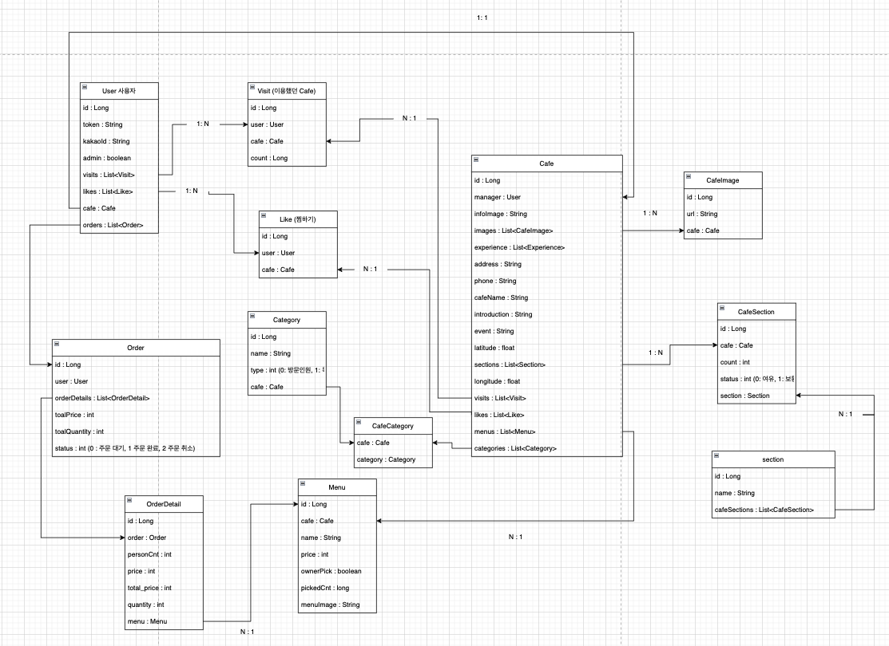
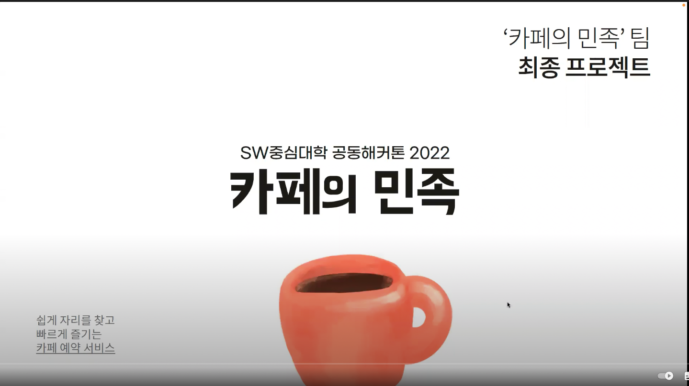
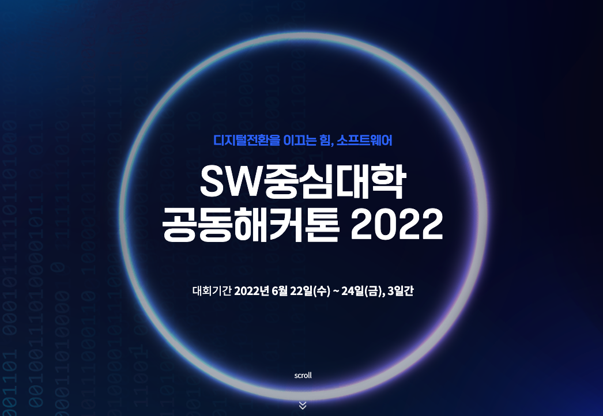

이번 포스팅에서는 제가 2022 소프트웨어 중심대학 해커톤에서 개발한 카페의 민족 프로젝트에 대해 포스팅 하겠습니다. 2022 소프트웨어 중심대학 해커톤은 2박 3일 동안 진행되어 해당 기간 동안 다른 학교 학생들과 팀을 꾸리고, 디자이너와 소통하며 기획 및 개발을 진행하는 대회입니다. 저는 해당 프로젝트에서 백엔드 개발자로 참여하였습니다.

- [깃허브로 이동](https://github.com/SW-HACKATHON-CAMIN)

# 사자같이

카페의 민족은 카페 혼잡도를 바탕으로 좌석을 예약하고, 나에게 맞는 최적의 카페를 찾는데에 도움을 주는 웹입니다.

- [상세 서비스 소개로 이동](https://drive.google.com/file/d/1b8RnOfiZLf_08h5DNHbGaldAXCl1gZVC/view?usp=sharing)

## 제가 개발한 주요 기능

### 위치 기반 필터 조회

- 카카오 지도 API를 통해 현재 위치(위도, 경도)를 받아오면 현재 위치에서 1km 반경에 있는 카페들을 가져옵니다.
- 각 카테고리 (방문인원, 방문목적 등) 에 따라 필터 조회가 가능합니다.

### ERD 및 도메인 구조 설계

- Cafe, User, Order 등 총 12개의 Entity를 만들어 ERD를 설계 하였습니다.
- 해당 ERD를 바탕으로 저희 백엔드 프로젝트의 기본 구조를 만들었습니다.

### Section, Category, Menu, Cafe 의 CRD API 구현

- Section, Category, Menu, Cafe 와 해당 Entity 들의 관계를 연결하는 Entity까지의 C,R,D API를 구현하였습니다.
- 연관관계 편의 메서드와 정적 팩토리 메서드를 사용하여 코드의 질을 높였습니다.
- cascade 옵션을 사용하여 연관관계를 편리하게 관리하였습니다.

### 관리자 페이지 용 API 구현

- Order 조회, 각 Cafe의 섹션 가져오기 API를 구현하였습니다.

### 도커를 통한 배포

- 해커톤이라는 짧은 기간 동안 주어진 서버에 JDK부터 시작해서 여러 프로젝트 세팅을 위한 도구들을 설치하기 보단, 도커 이미지파일을 올려 배포를 하여 배포를 위한 서버 세팅 시간을 단축하였습니다.

## 발표 및 데모 영상

## 회고

2박 3일이라는 짧은 시간 동안 이렇게 좋은 프로젝트를 진행할 수 있어서 너무 좋았습니다.

팀 빌딩에서부터 모든 팀원들과 소통이 잘 되었고, 해커톤 기간 동안에도 계속 소통이 잘되고 서로가 서로를 배려하는 문화속에서 너무 즐겁게 개발을 하였습니다.

프로젝트를 시작하며, 해커톤 관리자 분이 리더, 소통, 자료취합, 영상, 서버로 역할을 나누라고 하여 저희가 표면적으로는 역할을 나누었지만, 결국 서로가 서로를 자진해서 도우며, 필요한 일이 있을 때는 너나 할거 없이 적극적으로 참여 했기 때문에 역할의 분리라는 개념이 없었습니다.

이렇게 기쁘게 각자 노력하며 충실히 개발을 하니 SW중심대학협의회장상(우수상 3위)라는 큰 상을 받게 되었고 너무 기뻤습니다.

이 해커톤을 진행하면서 정말로 저와 함께 백엔드를 개발해준 지원님, 멋쟁이 팀장 재윤님, 항상 자리에 남아 열심이 프론트를 짜주시던 지현님, 그리고 그냥 최고인 디자이너 재인님 모두모두 감사합니다. 이번 인연을 계기로 계속 같이 나아가는 동료가 되었으면 좋겠습니다 ㅎㅎ. 좋은 기억 남겨주셔서 모두 감사합니다.
