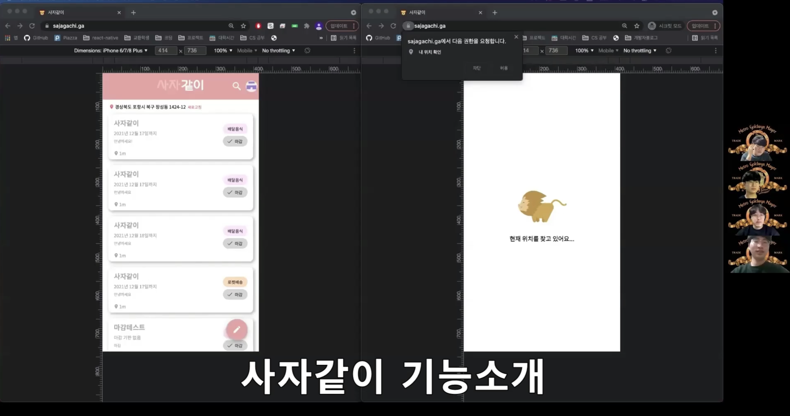
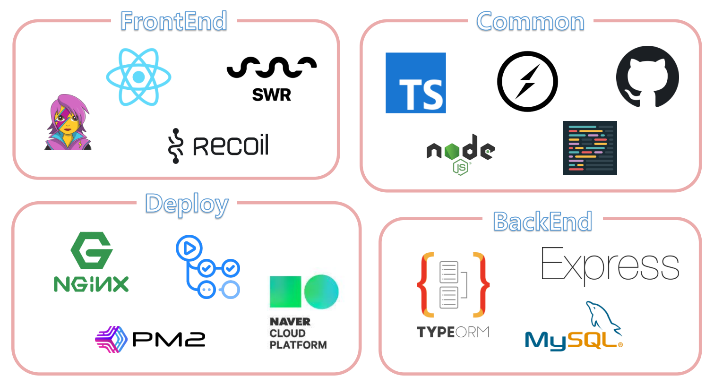

안녕하세요. 이번 포스팅에서는 제가 2021 네이버 부스트캠프에서 한달 동안 진행했던 프로젝트에 대해서 소개하겠습니다.

- [깃허브로 이동](https://github.com/boostcampwm-2021/WEB19-sajagachi)

# 사자같이

사자같이 앱은 `buy` 사자 `together` 같이 라는 의미로, 최근 음식 배달비의 증가, C사의 빠른 배송을 위한 최소 구매 등 1인으로서 서비스를 이용할 때 생기는 부담을 공동구매를 통해 덜어주기 위해 이 프로젝트를 기획하여 개발하였습니다.

## 주요 기능

### 사용자 간 채팅

- **socket.io**를 통해 공구에 참여한 참여자 간의 채팅 기능을 제공합니다.
- 채팅 내역 보여줄 때 무한스크롤을 구현하여 사용자에게 편의성을 제공합니다.
- 사용자는 채팅방에서 이미지를 보낼 수 있습니다.
- 사용자 강퇴 기능을 제공합니다.

### 위치, 카테고리, 검색어 기반 공동 구매 게시글 필터링

- 다양한 옵션을 통한 검색 기능을 제공합니다.
- 데이터베이스 성능 최적화를 통해 **1000만**개의 데이터에서도 빠른 검색 성능을 자랑합니다.
- 현재 나의 위치에서 약 반경 1km 위치의 사용자들의 게시글을 제공합니다.

### 공동 구매 게시글 작성

- 제목, 내용, 공동 구매 아이템 url, 마감 인원, 마감 날짜 입력
- URL 유효성 검사
- 게시글 작성자의 현재 위치를 게시글에 반영

### 위치 기반 서비스

- 사용자의 위치를 기반으로 근처에서 등록된 게시글을 검색할 수 있습니다.
- 사용자가 원하는 위치에 따른 검색을 제공하기 위해 네이버 지도 api를 사용합니다.

### 공동 구매 참여자들 간의 포인트 거래

- 참여자들의 포인트를 모아 공동구매가 이루어집니다.
- 공동 구매 참여자들이 각자 포인트를 제출합니다.
- 제출한 포인트는 공동구매가 완료되는 동시에 공동구매 호스트에게 전달됩니다.

## 데모영상

## 기술스택

# 내가 구현한 기능

## 슬로우 쿼리 개선

## 위치, 카테고리, 검색어 기반 필터링 및 필터링 모달 구현

## 메인페이지 레이아웃, 기능, 관련 API 구현

## 채팅페이지 레이아웃, 기능, 관련 API 구현
