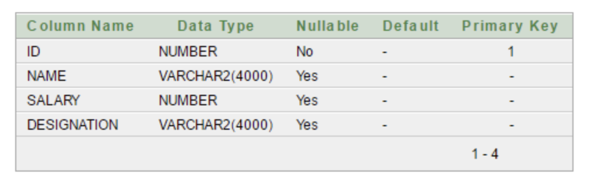

오늘은 [javaTpoint](https://www.javatpoint.com/spring-mvc-crud-example) 에 있는 CRUD예제를 짜보면서 Spring MVC에서 각 요소들이 어떤 역할들을 어떻게 하는지 정리해볼 것이다.

# 사전작업 - DB table 생성

이번에 주어진 예제를 위한 DB table 생성을 위한 코드는 다음과 같다.

# Reference

-

- https://lhoris.tistory.com/33
