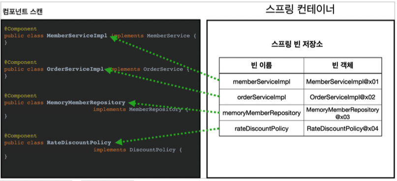
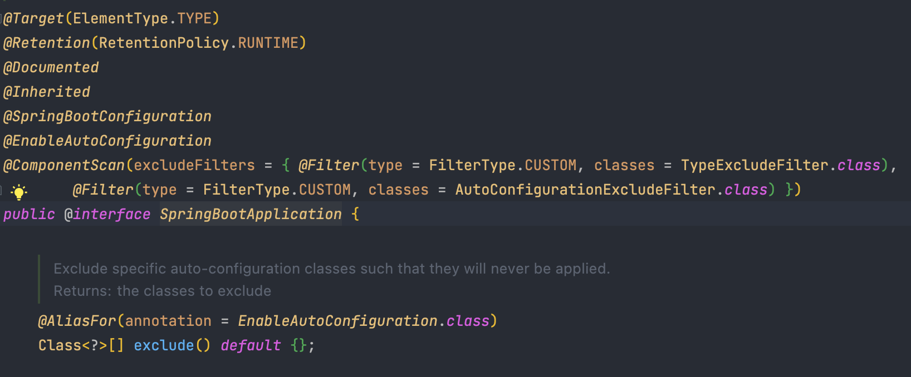

# 컴포넌트 스캔

수동적으로 빈을 등록하기 위해서는 XML 파일에 `<bean>` 이나, @Bean을 통해서 Config 파일을 구성해야 했다. 하지만 이렇게 등록해야 할 빈이 수십, 수백개가 되면, 일일이 등록하기도 힘들고, 설정 정보도 커지며, 누락하는 문제도 발생한다.

따라서 스프링은 설정 정보가 없어도 `자동으로 스프링 빈을 등록하는 컴포넌트 스캔`이라는 기능을 제공한다.

또한 이떄 의존관계도 자동 주입하는 `@Autowired` 라는 기능도 제공한다.

## @Componet

컴포넌트 스캔은 `@Componet` 어노테이션이 붙은 클래스를 스캔해서 스프링 빈으로 등록한다.

컴포넌스 스캔이 발생하면 위의 사진처럼 @Component가 붙은 클래스들이 스프링 빈으로 등록된다.

## @ComponentScan

`@ComponentScan`은 `@Component`가 붙은 모든 클래스를 스프링 빈으로 등록한다.

- 빈 이름 등록
  - 기본 전략으로는 클래스의 이름이 camelCase로 변환된 것이 빈 이름으로 등록된다.
  - @Component("mycomponent") 이런식으로 @Component를 사용하면 빈 이름이 mycomponent가 된다.

Component 스캔은 탐색할 패키지의 시작위치를 (basePackages 옵션을 통해) 지정할 수 있다. 만약 지정하지 않으면 @ComponentScan이 붙은 설정 정보 클래스의 패키지가 시작 위치가 된다.

### 컴포넌스 스캔의 기본 대상

- @Component
- @Controller
- @Service
- @Repository
- @Configuration

하지만 결국 해당 어노테이션들의 내부를 보면 @Component 를 포함하고 있다.

## Spring Boot, Spring project 에서의 Component Scan

SpringBoot의 경우 가장 먼저 생성되는 <프로젝트이름>Application 파일의 `@SpringBootApplication` 어노테이션 안에 `@ComponentScan` 어노테이션이 존재한다.

또한 일반 Spring Legacy Project의 경우에는 xml 파일에서

> <context:component-scan base-package="~~"></context:component-scan>
> 태그를 통해 컴포넌트 스캔을 할 시작 패키지를 등록할 수 있다.

# reference

- 김영한, Spring 기본편
