# Intellij란?

IntelliJ란 Java 개발 툴(IDE) 중 하나인 프로그램입니다. 이전에는 이클립스나 Spring STS를 많이 사용하였지만, 현재는 인기가 조금씩 IntelliJ로 넘어오는 추세입니다.

## 이클립스 STS와 비교했을 때의 장점 (제가 생각했을 때)

1. IDE의 안정성
   이클립스를 사용하다보면 이유는 모르겠는데 안되다가 프로젝트 clean (maven clean)으로 해결 될 때가 자주 있습니다. 이에 반해 저는 IntelliJ를 사용하면서 이러한 오류를 느껴본 적이 없습니다.
2. 편리하고 다양한 단축키 -> 개발하는데 편리
   제 기준으로는 IntelliJ에서 제공하는 많은 단축키가 개발하는데의 많은 편의를 제공합니다.
   - [제가 자주 사용하는 IntelliJ 명령어 (맥북 기준)](https://teal-poultry-405.notion.site/Intellij-82816fea95d843dcafb8775d1256c5f8)

## 단점

1. 수업에서의 사용
   우리학교 대부분의 교수님들이 자바 관련 수업을 할 때 이클립스를 주로 사용하기 때문에, 관련 자료가 훨씬 많습니다. 물론 모든 정보는 구글에 있지만, 수동적인 학습이 익숙한 사람한테는 적응하기 어려울 수 있습니다.
2. 유료
   개인사용자로서는 3년에 89달러를 내야합니다. 하지만 학생은 무료로 사용할 수 있습니다.

# IntelliJ 설치법 & 학생인증 (무료사용)

## 학생인증

### 1. IntelliJ 무료 라이센스 발급 페이지 접속

https://www.jetbrains.com/ko-kr/community/education/#students

지금 신청하기 클릭

### 2. 신청

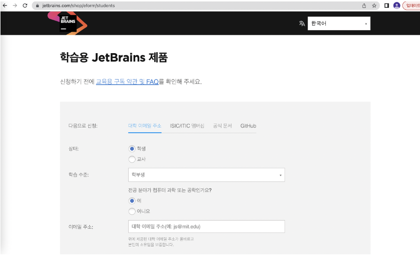

신청할 때 폼을 입력하시면 (handong.ac.kr 메일 사용), 인증 관련 메일이 옵니다.

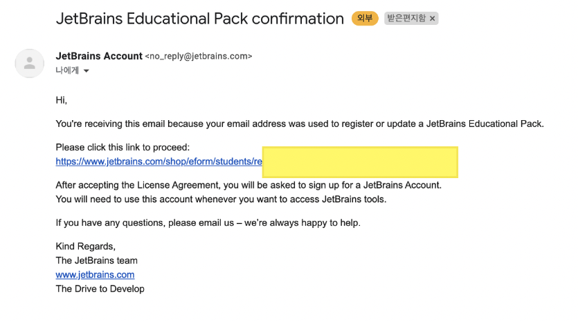

이후 해당 메일을 클릭하면 다음과 같은 페이지가 나오고, Get start to use를 클릭하여 이후 나오는 페이지에서 Accept를 해주면 됩니다.

이제 모든 인증을 마쳤으면, 방금 인증 받은 메일로 회원가입을 하신 후 로그인을 진행하시면 됩니다.

이후 로그인을 진행하시면 아래 사진과 같이 학생 라이센스가 등록되어있음을 확인할 수 있습니다.

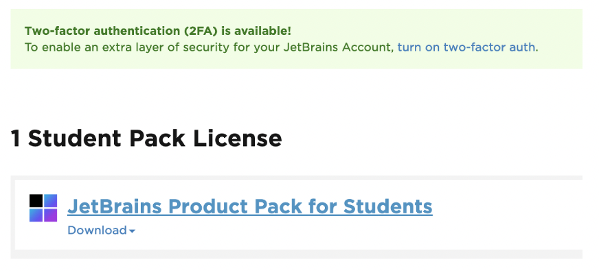

이후에는 JetBrains 의 [IntelliJ 다운로드 페이지](https://www.jetbrains.com/ko-kr/idea/download/#section=mac) 에 가셔서 IntelliJ(Ulitmate 버전)를 다운받으시고, 사용할 때 이번에 학생인증을 받고 회원가입하신 계정으로 인증하시면 무료로 사용할 수 있습니다.

IntelliJ 다운로드 페이지

- https://www.jetbrains.com/ko-kr/idea/download/#section=mac

## IntelliJ 설치

위에서 말한 [IntelliJ 다운로드페이지](https://www.jetbrains.com/ko-kr/idea/download/#section=mac)에 가셔서 각자 OS에 맞게 IntelliJ를 설치하시면 됩니다.

만약 설치 중간에 무엇인가 인증하라는 알림창이 나오면, 위에서 학생인증을 받은 JetBrain 계정으로 인증받으시면 됩니다.

### Mac

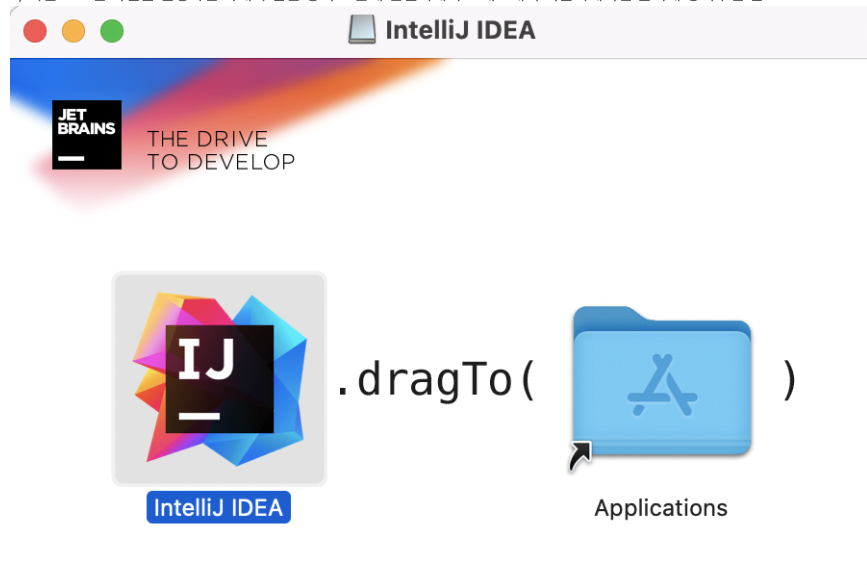

다운로드한 dmg 파일을 클릭하면 위와 같은 화면이 나오는데, IntelliJ IDEA를 Application이라는 폴더에 Drag and drop(끌어당겨서 놓기) 하시면 설치가 진행되고, 실행하면 아래와 같은 화면을 얻을 수 있습니다.

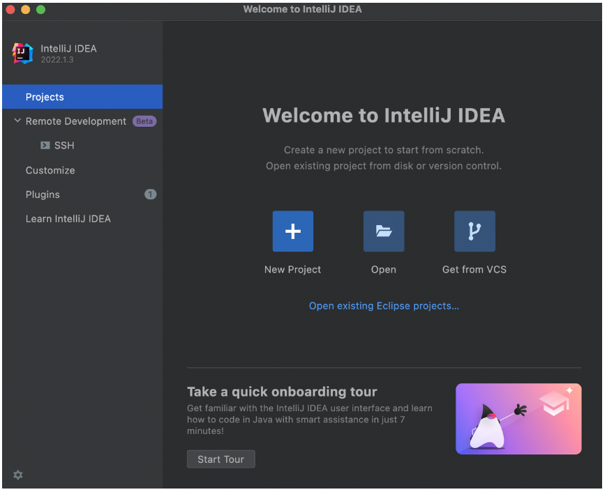

### Window

윈도우의 경우도 설치가 비슷합니다. 아래 사진의 순서대로 진행하시면 됩니다.

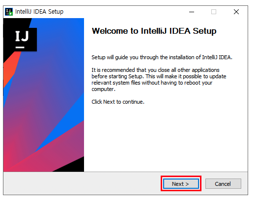

- next 클릭

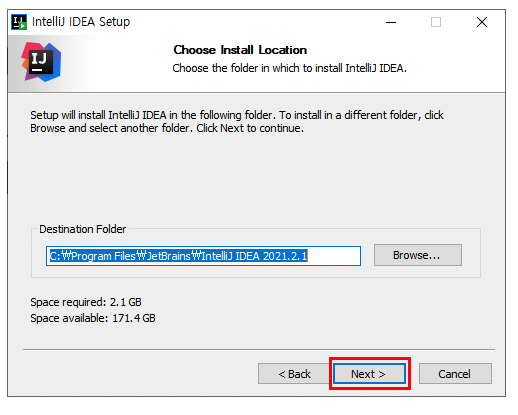

- IntelliJ 설치 경로 설정 

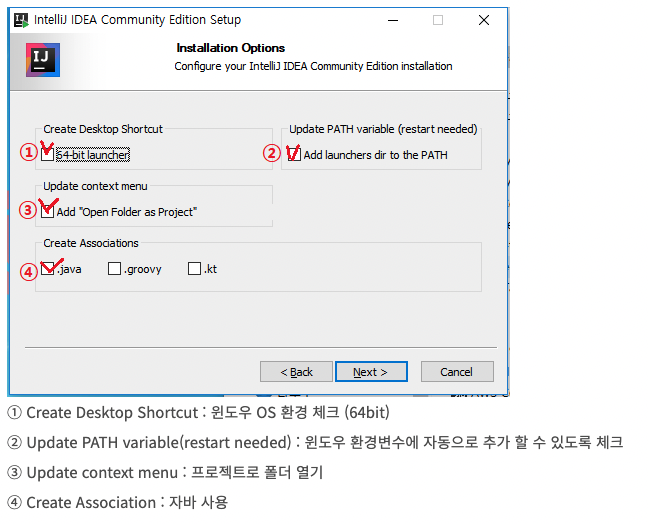

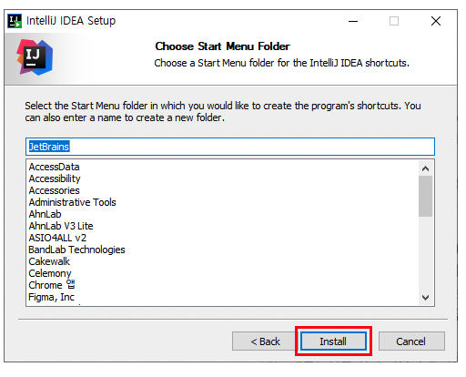

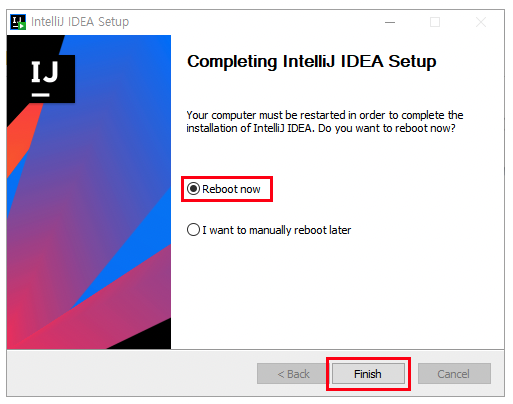

- 설치가 완료되면 reboot를 해줍니다.

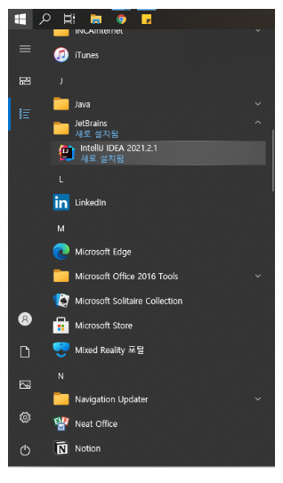

- 이후 설치된 것을 다음과 같이 확인할 수 있습니다.

클릭해서 들어가면 DataSharing 해도 되는지 동의 문구가 나오는데, 괜찮다면 동의하고, 괜찮지 않다면 Don't Send 를 클릭하셔도 됩니다.

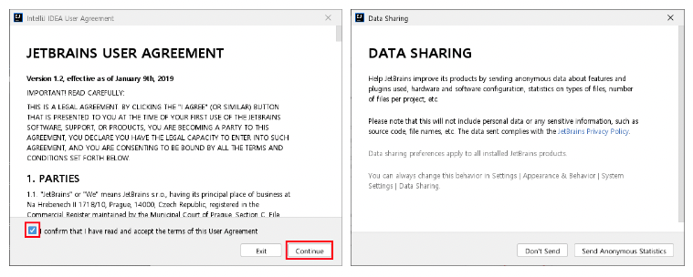

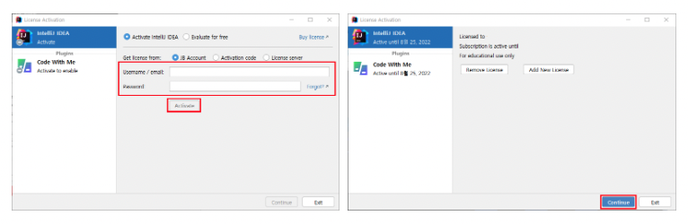

계정 인증을 진행하고 실행하시면 다음과 같은 화면이 나옵니다.

# reference

## 학생인증

- https://taltal.tistory.com/122
- https://goddaehee.tistory.com/215

## Mac IntelliJ 설치

- https://taltal.tistory.com/123

## Window IntelliJ 설치

- https://goddaehee.tistory.com/195
- https://security-nanglam.tistory.com/532
