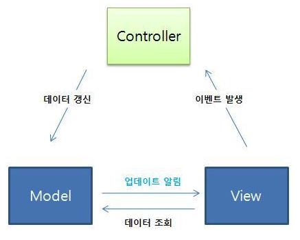
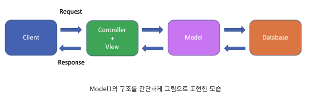
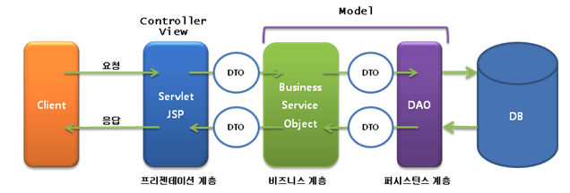
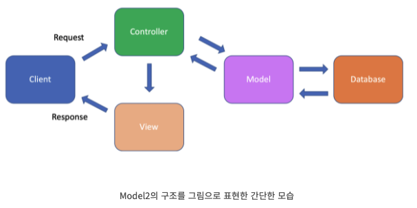
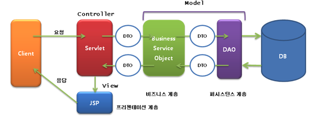
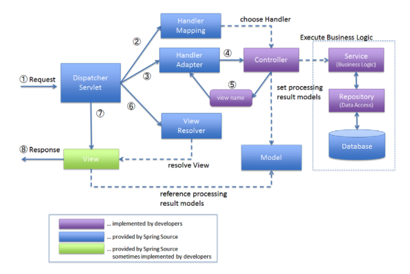
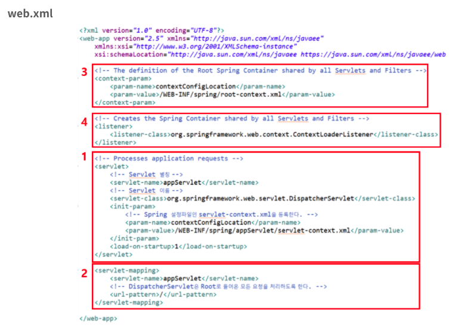
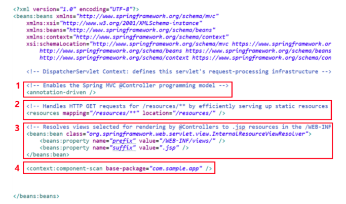

# Model, View, Controller

뒤에 내용을 하기전 Model, View, Controller가 각각 무슨 역할을 하는지 알면 더 잘 이해할 수 있으므로 여기서 말하도록 하겠다.

## Model이란

어플리케이션이 무엇을 할 것인지 정의한다.

- 내부 비즈니스 로직을 처리하기 위한 역할을 한다. 즉 DB와 연동하여 사용자가 입력한 데이터나 출력할 데이터를 다룬다.
  - ex) 데이터 추가, 변경, 삭제 등
- Model은 다른 컴포넌트들에 대해 알지 못한다. 자기 자신의 역할만 한다.

## View

사용자에게 화면(UI)을 보여준다.

- 무엇을 보여주기 위한 역할을 한다.
- 모델이 처리한 데이터나 작업결과를 가지고 사용자에게 출력할 화면을 만든다.
- View도 다른 컴포넌트들에 대해 알지 못한다. 자기 자신의 역할만 한다.

## Controller

Model과 View사이에 있는 컴포넌트이다.

- `Model의 데이터를 어떻게 처리할지 알려주는 역할`을 한다. Model과 View를 조정해주는 역할을 한다.
  - 클라이언트의 요청을 받으면 해당 요청에 대한 실제 업무를 수행하는 Model을 호출한다.
  - Model이 업무수행을 완료하면 그 결과를 View에 전달한다.
- Controller는 다른 컴포넌트들에 대해 알고 있다.

# JSP Model 1

JSP Model1의 구조는 다음과 같다.

- Controller와 View가 합쳐진 형태이다.
  - JSP가 Controller와 View 기능을 가장 처리한다. 따라서 JSP파일이 가장 중요한 역할을 수행한다.
    - Controller : JSP에서 사용자 요청 관련된 코드
    - View : JSP에서 HTML과 CSS
- Model의 역할은 JavaBean이 담당한다.

## 동작흐름

1. Client가 request를 보낸다.
2. 웹 서버가 요청을 받아서 해당 servlet Container로 전달한다.
3. 해당하는 JSP파일을 실행하여 작업을 한다.

- Model에 접근해야한다면 이때 하며 Model의 접근하며 DB도 접근한다.

4. JSP파일에서 실행된 작업으로 클라이언트에게 response를 위한 html문서를 구성한다.
5. Client에게 response를 보낸다.

### Model1의 장점

- 개발 속도가 빠르다
- 개발 비용이 적게 든다

### Model1의 단점

- Controller와 View를 하나로 만들었기 때문에 유지보수 측면에서 불리하다.
- 디자이너가 디자인을 변경할 경유 자바 코드가 섞여있기에 문제 발생

따라서 규모가 작은 프로젝트에 적합하지만 이러한 단점들을 보완하기위해 만들어진것이 MVC패턴이다.

# JSP Model2 (MVC)

MVC는 Model, View, Controller의 약자이다.

- Model(POJO)은 데이터베이스와 연동하여 클라이언트의 요청을 처리해주는 내부 비즈니스 로직역할을 한다.
- View(JSP)는 클라이언트에게 보여질 디자인 페이지이다.
- Controller(Servlet)는 Model과 View를 연결해주는 역할을 한다.

## 동작흐름

1. Client가 request를 보낸다.
2. 웹 서버가 요청을 받아서 해당 Web Container로 전달한다.
3. Servlet(Controller)이 응답한다.
4. 필요한 JavaBean 즉 모델을 불러서 데이터를 가져온다.
5. Controller는 받아온 데이터를 View와 연결하여 페이지를 만든다.
6. 생성한 페이지를 웹 서버로 전송한다.
7. Client에게 response를 보낸다.

# Spring MVC Framework

Spring MVC Framework는 MVC패턴을 따르면서 Spring만의 독자적인 Class를 통해 처리를한다.

아래 내용은 [aridom블로그](https://aridom.tistory.com/61)에 정리된 내용이지만 너무 정리가 잘 되어있어서 가져온다.

1. Client로부터 요청이 들어오면 DispatcherServlet이 호출된다.
2. DispatcherServlet은 받은 요청을 HandlerMapping에게 던져준다. 요청받은 URL을 분석하여 HandlerMapping 적합한 Controller를 선택하여 반환한다.
3. DispatcherServlet는 다음으로 HandlerAdapter를 호출한다. HandlerApdater는 해당하는 Controller 중 요청한 URL에 맞는 적합한 Method를 찾아준다.
4. Controller는 Business Logic을 처리하고, 해당하는 결과를 View에 전달할 객체를 Model에 저장한다.
5. Controller는 View name을 DispatcherServlet에게 리턴한다.
6. DispatcherServlet은 ViewResolver를 호출하여 Controller가 리턴한 View name을 기반으로 적합한 View를 찾아준다.
7. DispatcherServlet은 View 객체에 처리결과를 넘겨 최종 결과를 보여주도록 요청한다.
8. View 객체는 해당하는 View를 호출하며, View는 Model 객체에서 화면 표시에 필요한 객체를 가져와 화면 표시를 처리하고 Client에게 넘겨준다.

## web.xml

1. Servlet은 웹 프로그래밍에서 Client의 요청을 처리하고 그 결과를 Client에게 전송하는 기술이다. 다음과 같은 특징을 가지고 있다.
   - Client의 요청에 대해 동적으로 작동한다.
   - HTML을 사용하여 요청에 응답한다.
   - Java Thread를 이용하여 동작한다.
   - MVC 패턴에서 Controller로 이용된다.

- Spring Framework에선 Servlet을 DispatcherSerlvelt을 이용한다.
  - Fron Controller로써 모든 HTTP요청을 받아들여 다른 객체들 사이의 흐름을 제어한다.
  - Servlet의 요청에 관해 정의하는 곳이 servlet-context.xml이다
    - Controller, Annotation, ViewResolver등을 설정해준다.

2. Servlet 별칭을 통해 DispatcherServlet을 mapping 해준다. url-pattern을 여기서는 '/'로 설정하였기 대문에 Root 경로로 들어온 모든 요청을 처리할 수 있게 된다.
3. 모든 Servlet및 Filter가 공유하는 Root Spring Container를 정의한다.
   - ContextConfiLocation이라는 파라미터를 이용함으로써 ContextLoader가 호출할 수 있는 설정 파일을 여러개 쓸 수 있다.
   - root-context.xml은 Root Context를 구성한다. 주로 Service나 Repository(DAO), DB 등 Business Logic과 관련된 설정을 해준다.
4. 모든 Servlet 및 Filter가 공유하는 Spring Container를 생성한다.

## servlet-context.xml

1. 적합한 Controller Annotation을 인식하도록 <annotation-driven />을 사용한다. HandlerMapping 역할을 한다.
2. HTTP GET 요청을 통해 Spring에서 정적인 리소스 인 CSS, HTML 등 파일들을 처리할 수 있도록 등록한다.
3. Controller가 반환한 View name을 기반으로 적합한 View(JSP)를 찾을 수 있도록 경로를 지정한다. ViewResolver 역할을 한다.
4. component-scan은 XML에 각 Bean을 일일이 지정하지 않고 @Component를 통해 자동으로 Bean을 등록시켜준다. base-package 경로를 기반으로 탐색하여 Annotation을 식별하여 Bean을 생성한다.

# reference

- https://tecoble.techcourse.co.kr/post/2021-04-26-mvc/
- https://juyoungit.tistory.com/119
- https://scshim.tistory.com/272
- https://aridom.tistory.com/61
