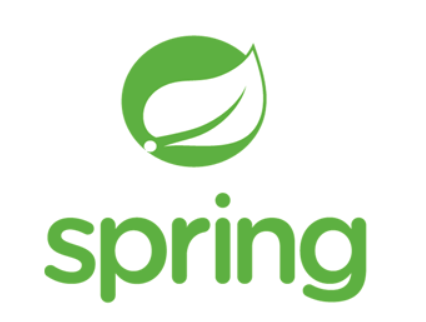

# Spring Framework

Spring이란 J2EE(EJB)라는 것을 대체하는 framework로 세상에 등장했다. 스프링이라는 이름은 전통적인 J2EE(EJB)라는 겨울을 넘어 새로운 시작 봄이 왔다는 뜻으로 이름을 지었다.

- IOC(Invertion of Control : 제어역행)
- DI(Dependency Injection : 의존성 주입 )
- AOP(Aspect-Oriented Programming : 관점 지향 프로그래밍)

## 장점

- 정형화 되어 있기 때문에 일정 수준의 품질을 기대할 수 있다.
- 개발 후 유지보수 및 기능의 확장성에서도 품질을 보장한다.
- 한국에서는 해당 ㅡ레임워크의 수요가 크다.

## 단점

- 내부에서 많은 기능을 가졌기 때문에 상당히 무겁다.
- 많은 기능을 제공해서 편리하지만, 이 기능들을 습득하기위해 상당한 노력과 시간이 필요하다.

# Spring Boot

Spring Boot는 Spring framework에서의 불편함을 몇가지 해결해준 것이다.

1. Embeded Tincat을 사용하기 때문에 (Spring Boot 내부에 Tomcat 이 있다.) 따로 Tomcat을 설치하거나 매번 버전을 관리해 주어야 하는 수고로움을 덜어준다.
2. starter을 통한 dependency 자동화

- Spring framework에서는 각각의 dependency들을 호환되는 버전을 일일이 맞추어야해서 version관리에 어려움이 많았다. 하지만 starter가 대부분의 dependency를 관리해주기 때문에 훨씬 편해졌다.

3. XML설정을 하지 않아도 된다.
4. jar file을 이용해 자바 옵션만으로 손쉽게 배포가 가능하다.

Spring boot는 Spring Framework라는 큰 틀에 속하는 도구이기 때문에 Spring Framework에 대한 이해가 중요하다.

## Spring Boot starter

Spring boot starter는 마치 npm처럼 prom.xml(메이븐) 이나 build.gradle(그레들)에 spring-boot-starter-{원하는 것} 를 추가해주면 spring boot가 그에 필요한 라이브러리들을 알아서 받아온다.

`spring-boot-starter-*`

# reference

- https://kimvampa.tistory.com/35
- https://server-engineer.tistory.com/739
