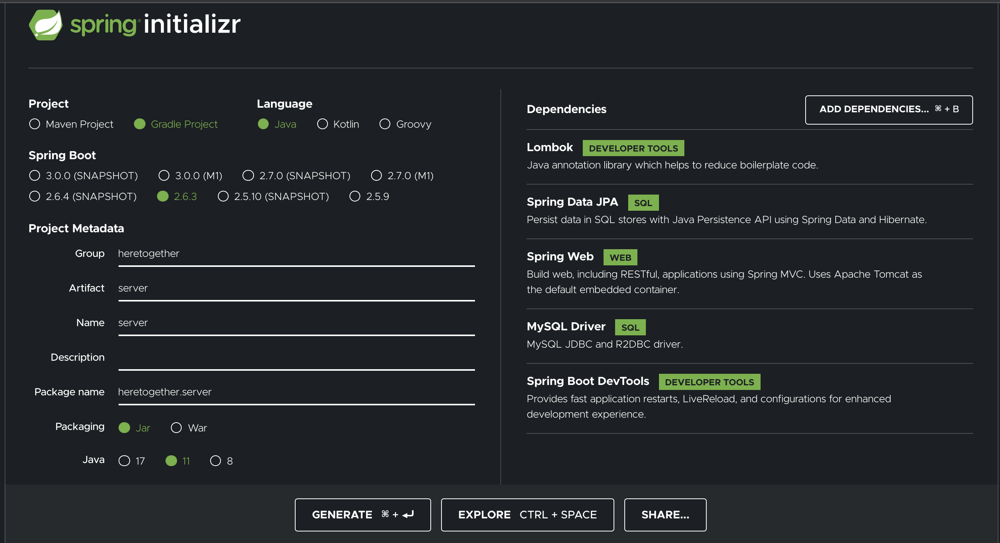
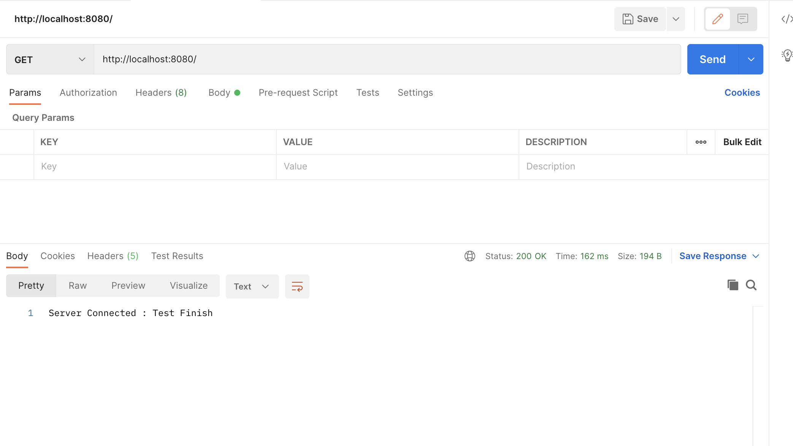

이전부터 Spring Boot로 프로젝트를 해보고 싶었기 때문에, 이번에 HereTogether 프로젝트를 진행하면서 본격적으로 Spring Boot에 대해 공부 할 것이다. 이번 포스팅 즉 Spring Boot로 Project 생성하기가 이 프로젝트의 첫 걸음이 될 것 같다.

# Spring Initializer로 프로젝트 생성하기

Spring Boot로 프로젝트를 시작하기 위해선 [start.spring.io](https://start.spring.io/)로 가서 원하는 Dependency를 선택해야한다.

<p align="center"></p>

## Gradle vs Maven

- Maven은 마치 HTML을 쓰는 것처럼 태그를 감싸는 방법으로 dependency를 추가해준다.
- Gradle은 마치 react에서 package.json파일로 모듈들을 추가해주는 방법처럼 dependencies에 해당하는 모듈들을 추가해주면 된다.

-> 가독성이 Gradle이 훨씬 좋기 때문에 나는 Gradle을 선택하였다.

## Dependency 선택 이유

### Lombok

- annotation을 사용하여 getter, setter 등을 따로 코드에 적지 않아도 Lombok이 알아서 적어주는 등 코드가 더욱 가독성이 좋고 심플하게 만들어 주기 때문에 선택하였다.

### Spring Data JPA

- Spring framework에서 자바의 ORM인 JPA 사용하기 위해 선택하였다.

### Spring web

- 이번 프로젝트에서 Spring MVC를 사용하지 않을 것이지만, spring-boot-starter-tomcat 처럼 웹 개발을 관련해서 꼭 필요한 기능들이 한번에 모여있기 때문에 선택하였다.

### MySQL Driver

- DB로 MySQL을 사용할 것이기 때문에 이를 사용하기위해 선택하였다.

### Spring Boot DevTools

- Spring boot에서 제공하는 개발 편의를 위한 모듈로 마치 nodemon처럼(조금은 다름) 브라우저로 전송되는 내용들에 대한 코드가 변경되면, 자동으로 어플리케이션을 재시작하여 브라우저에도 업데이트를 해주는 역할을 하기에 선택하였다.

이후 만들어진 프로젝트를 intellij나 eclipse에서 open해준다.

# MySQL연동 : application.yml 생성

.properties파일을 생성할 수도 있지만, 나는 indentation으로 구분하는 yml방식이 조금 더 가독성이 좋아 보였기 때문에 선택하였다.

MySQL을 사용하기로 했으므로, MySQL 연동을 위해 yml파일을 생성해야 한다.

```yml
spring:
  datasource:
    url: jdbc:mysql://localhost:3306/(DB이름)?serverTimezone=UTC&characterEncoding=UTF-8&useSSL=false
    username: (DB유저이름)
    password: (DB유저비밀번호)
    driver-class-name: com.mysql.jdbc.Driver
```

해당 파일은 src/main/resources에 위치해야한다.

# 프로젝트 생성 확인

나는 API서버를 만들 예정이기 때문에 해당 서버가 잘 동작하는지 확인한다.

```java
package heretogether.server.hello;

import org.springframework.web.bind.annotation.GetMapping;
import org.springframework.web.bind.annotation.RestController;

@RestController
public class listController {
    @GetMapping("/test")
    public String welcome(){
        return "Server Connected : Test Finish";
    }
}

```

Postman으로 GET요청을 보낸 결과 서버가 잘 도착함을 확인할 수 있었다.

<p align="center"></p>

# Reference

- https://hello-bryan.tistory.com/329
- https://seokdev.site/300
