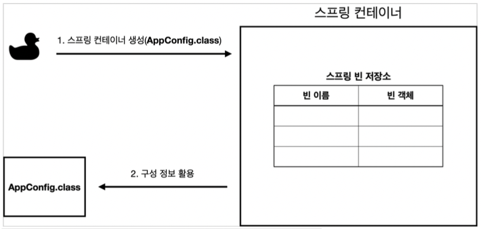
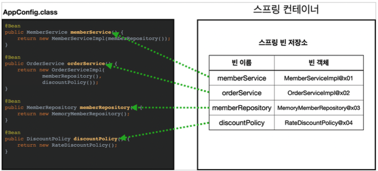
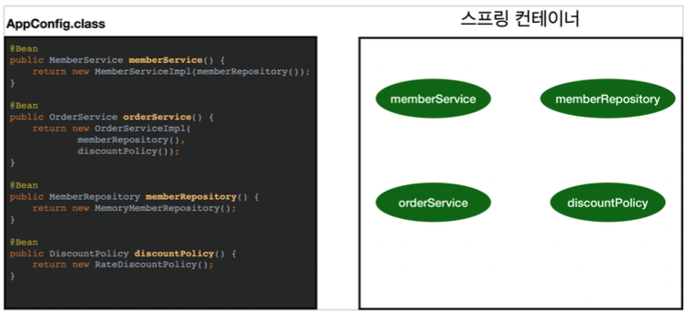
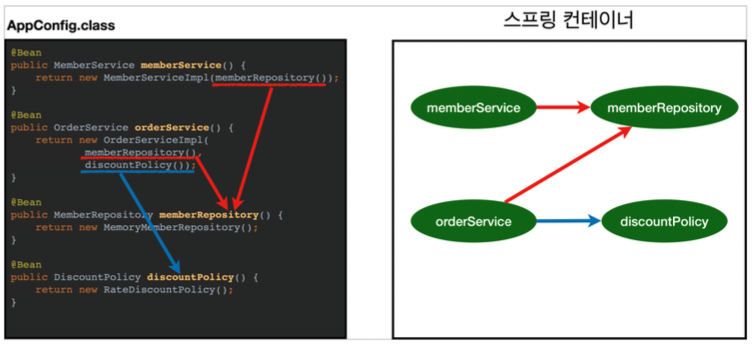

# 스프링 컨테이너란?

스프링 컨테이너는 Application Context를 스프링 컨테이너라고 한다.

이전 예제에서는 AppConfig에서 직접 객체를 생성하고 DI를 했지만, 이제부터는 스프링 컨테이너를 사용한다.

- Spring Container는 @Configuration이 붙은 설정 정보로 구성한다.
- @Bean이라는 어노테이션을 통해, 해당 어노테이션이 적힌 메서드를 모두 호출해서 스프링 컨테이너에 빈을 등록한다.

```java
@Configuration
public class AppConfig {

    @Bean
    public MemberService memberService() {
        return new MemberServiceImpl(memberRepository());
    }
    @Bean
    public MemberRepository memberRepository() {
        return new MemoryMemberRepository();
    }
    @Bean
    public OrderService orderService() {
        return new OrderServiceImpl(memberRepository(), discountPolicy());
    }
    @Bean
    public DiscountPolicy discountPolicy(){
        return new RateDiscountPolicy();
    }
}
```

위에서 말했듯이 @Configuration을 통해 Spring Container를 정의하고, 내부 메서드에 @Bean을 통해 스프링 컨테이너에 Bean을 등록할 수 있다.

이렇게 스프링 컨테이너를 등록하면 ApplicationContext라는 인터페이스를 통해 내부의 빈을 사용할 수 있다.

```java
public class ApplicationContextBasicFindTest {

    AnnotationConfigApplicationContext ac = new AnnotationConfigApplicationContext(AppConfig.class);

    @Test
    @DisplayName("빈 이름으로 조회")
    public void findBeanByName(){

        MemberService memberService = ac.getBean("memberService", MemberService.class);

        assertThat(memberService).isInstanceOf(MemberServiceImpl.class);
    }

    @Test
    @DisplayName("이름 없이 타입으로만 조회")
    public void findBeanByType(){
        //given
        MemberService memberService = ac.getBean(MemberService.class);
        assertThat(memberService).isInstanceOf(MemberServiceImpl.class);
    }

    @Test
    @DisplayName("구체 타입으로 조회")
    public void findBeanByName2(){

        MemberService memberService = ac.getBean("memberService", MemberServiceImpl.class);

        assertThat(memberService).isInstanceOf(MemberServiceImpl.class);
    }

    @Test
    @DisplayName("빈 이름으로 조회 X")
    public void findBeanByNameX(){

        assertThrows(NoSuchBeanDefinitionException.class, () -> ac.getBean("xxxxx", MemberService.class));

    }
}
```

위에 예시는 ApplicationContext를 사용해 등록되어 있는 빈을 조회하는 테스트코드이다.

- getBean 메서드를 통해 빈을 조회할 수 있다.
- 구현체 타입, 이름으로만 조회할 수 있다.
- 존재하지 않는 빈을 조회한다면 NoSuchBeanDefinitionException이 발생한다.

# 스프링 컨테이너의 생성 과정

스프링 컨테이너의 생성 과정은 아래 그림을 순서대로 이해한다면 쉽게 이해할 수 있다.

### 1. 스프링 컨테이너 생성

<p align="center"></p>

> new AnnotationConfigApplicationContext(AppConfig.class)

위에 new 를 하는 순간 컨테이너 가 생성되고, AppConfig.class를 통해 구성정보가 지정된다.

### 2. 스프링 빈 등록

<p align="center"></p>

이후 Spring 컨테이너는 파라미터로 넘어온 클래스(AppConfig) 정보를 사용해서 스프링 빈을 등록한다.

### 3. 스프링 빈 의존관계 설정 - 준비

<p align="center"></p>

### 4. 스프링 빈 의존관계 설정 - 완료

<p align="center"></p>

스프링 컨테이너는 설정 정보를 참고해서 DI를 진행한다.

# 스프링 빈 조회 - 상속관계

위에 예제에서 보면 알 수 있듯이 스프링 컨테이너에 등록된 빈을 조회하기 위해서는 getBean메서드를 사용했다.

스프링 빈을 조회할때도 일반 클래스와 마찬가지로 상속관계가 존재한다. 따라서 모든 자바 객체의 최고 부모인 `Object` 타입으로 조회하면, 모든 스프링 빈을 조회한다.

```java
public class AppicationContextExtendsFindTest {

    AnnotationConfigApplicationContext ac = new AnnotationConfigApplicationContext(TestConfig.class);

    @Test
    @DisplayName("부모 타입으로 조회시, 자식이 둘 이상 있으면, 중복 오류가 발생한다.")
    public void findBeanByParentTypeDuplication(){

        assertThrows(NoUniqueBeanDefinitionException.class, () ->ac.getBean(DiscountPolicy.class));

    }

    @Test
    @DisplayName("부모 타입으로 조회시, 자식이 둘 이상 있으면, 빈 이름을 지정하면 된다.")
    public void findBeanByParentTypeBeanName(){

        DiscountPolicy rateDiscoundPolicy = ac.getBean("rateDiscountPolicy", DiscountPolicy.class);
        assertThat(rateDiscoundPolicy).isInstanceOf(RateDiscountPolicy.class);

    }

    @Test
    @DisplayName("특정 하위 타입으로 조회")
    public void findBeanBySubType(){
        RateDiscountPolicy bean = ac.getBean(RateDiscountPolicy.class);
        assertThat(bean).isInstanceOf(RateDiscountPolicy.class);
    }

    @Test
    @DisplayName("부모 타입으로 모두 조회하기")
    public void findAllBeanByParentType(){
        //given
        Map<String, DiscountPolicy> beansOfType = ac.getBeansOfType(DiscountPolicy.class);
        assertThat(beansOfType.size()).isEqualTo(2);
        for (String key : beansOfType.keySet()) {
            System.out.println("key = " + key + " value = " + beansOfType.get(key));
        }
    }

    @Test
    @DisplayName("부모 타입으로 모두 조회하기 - Object")
    public void findAllBeanByObjectType(){
        Map<String, Object> beansOfType = ac.getBeansOfType(Object.class);
        for (String key : beansOfType.keySet()) {
            System.out.println("key = " + key + " value = " + beansOfType.get(key));
        }

    }

    @Configuration
    static class TestConfig{
        @Bean
        public DiscountPolicy rateDiscountPolicy(){
            return new RateDiscountPolicy();
        }

        @Bean
        public DiscountPolicy fixDiscountPolicy(){
            return new FixDiscountPolicy();
        }
    }
}

```

위의 예시는 상속관계에 대한 스프링 빈 조회 관련 테스트들을 모아둔 것이다. 크게 보면 부모 타입으로 조회하면 자식 타입들이 모두 선택되고, 따라서 자식이 둘 이상 존재하면 단일 부모타입 조회 시 Exception이 발생한다는 것이다.

# reference

- 김영한, Spring 기본편
