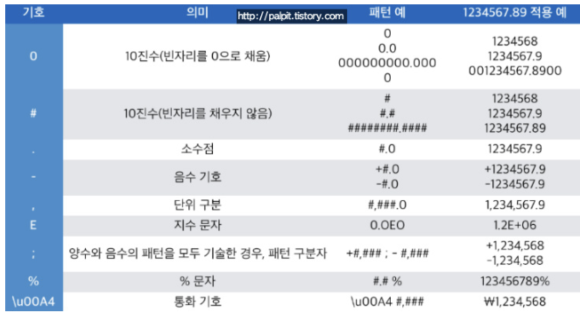
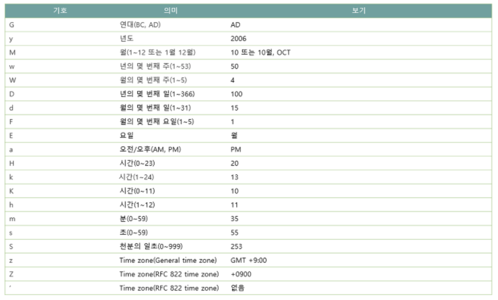

# Calendar와 Date

Calender와 Date는 자바 탄생부터 지금까지 20년 넘게 사용되는 패키지이다. 단 최근에는 새로 추가된 java.time 패키지로 기존의 모든 단점들이 개선되어 주로 사용된다.

## Calendar

캘렌더는 추상클래스이기 때문에 직접 개체를 생성할 수 없고, 메서드를 통해(getInstance) 완전 구현된 클래스의 인스턴스를 얻어야한다.

```java
Calender cal = new Calendar(); // 에러 발생! 추상클래스이기 때문에 인스턴스를 만들 수 없다.
// 대신에 아래와 같이 사용한다.
Calender cal = Calender.getInstance();
```

### Date와 Calendar 간의 변환

1. Calendar 를 Date로 변환

```java
	Calendar cal = Calendar.getInstance();
	// 아래와 같이 Date객체를 만들 수 있다.
	Date d = new Date(cal.getTimeInMills()); //Date(long date)로 새롭게 Date 객체 생성
```

2. Date를 Calendar 로 변환

```java
Date d = new Date();

Calendar cal = Calendar.getInstance();
cal.setTime(d);
```

## Calender 사용

- getInstance()를 통해서 얻은 인스턴스는 기본적으로 현재 시스템의 날짜와 시간에 대한 정보를 가지고 있기 때문에 이를 원하는 날짜나 시간으로 설정하려면 set메서드를 사용하고, 원하는 값을 가져오려면 get메서드를 사용한다.
- get(Calendar.MONTH)로 얻어오는 값의 범위가 1~12가 아니라 **0~11이다**. 즉 0이면 1월, 1이면 2월을 뜻한다.

```java
import java.util.*;

class CalendarEx1{
	public static void main(String[] args){
		// 기본적으로 현재 날짜와 시간으로 설정된다
		Calendar today = Calendar.getInstace();

		System.out.println("이 해의 년도 : " + today.get(Calendar.YEAR));
		System.out.println("월(0~11, 0:1월) : " + today.get(Calendar.MONTH));
		System.out.println("이 해의 몇째주 : " + today.get(Calendar.WEEK_OF_YEAR));
		System.out.println("이 달의 몇째주 : " + today.get(Calendar.WEEK_OF_MONTH));

		System.out.println("이 달의 몇 일 : " + today.get(Calendar.Date));
		System.out.println("이 달의 몇 일 : " + today.get(Calendar.DAY_OF_MONTH));
		System.out.println("이 해의 몇 일 : " + today.get(Calendar.DAY_OF_YEAR));
		System.out.println("요일(1~7), 1:일요일 : " + today.get(Calendar.Day_OF_WEEK));
		System.out.println("이 달의 몇번 째 요일 : " + today.get(Calendar.DAY_OF_WEEK_IN_MONTH));
		// ex) 이달의 4번째 월요일 : 4 출력
		System.out.println("오전_오후(0:오전, 1:오후) : " + today.get(Calendar.AM_PM));

		System.out.println("시간(0~11): " + today.get(Calender.HOUR));
		System.out.println("시간(0~23): " + today.get(Calender.HOUR_OF_DAY));
		System.out.println("분(0~59): " + today.get(Calender.MINUTE));
		System.out.println("초(0~59): " + today.get(Calender.SECOND));
		System.out.println("밀리초(0~999): " + today.get(Calender.MILLISECOND));

		System.out.println("이달의 마지막 날 : " + today.getActualMaximum(Calendar.DATE)) ;
		// 이달의 마지막 일을 찾는다
	}
}
```

두 날짜간의 차이를 구하기 위해서는 두 날짜를 최소단위인 밀리초단위(Millisecond)로 변경한 다음 그 차이를 구하면 된다.

- getTimeInMillis()는 1/1000초 단위로 값을 반환하기 때문에 초단위로 얻기 위해서는 1000으로 나눠줘야한다.
- 일단위로 얻기 위해서는 24 _ 60 _ 60 으로 나눠줘야한다.
- 두 날짜간의 시간상의 전후를 알기위해서는 그냥 양수인지 음수인지를 파악하거나 after(Object when), before(Object when) 함수를 사용해도 된다.

```java
Calendar time1 = Calendar.getInstance();
Calendar time2 = Calendar.getInstance();
// long type으로 지정하는것이 좋다
long difference = Math.abs(time2.getTimeInMillis() - time1.getTimeInMillis()) / 1000;

System.out.println("time1과 time2의 차이는 " + difference + "입니다");
final int[] TIME_UNIT = {3600, 60, 1};
final String[] TIME_UNIT_NAME = {"시간", "분", "초"};
String tmp = "";
for(int i=0; i< TIME_UNIT.length; i++){
	tmp += difference/TIME_UNIT[i] + TIME_UNIT_NAME[i];
	difference %= TIME_UNIT[i];
}
System.out.println("시분초로 변환하면 " + tmp + "입니다.");
```

## 날짜 증가 및 감소

add(int field, int amount)

- 지정한 필드의 값을 원하는 만큼 증가 또는 감소가 가능하다

```java
date.set(2015, 7, 31); // 2015년 8월 31일로 설정한다.

date.add(Calendar.DATE, 1); // date의 날짜를 1일 후로 설정한다.
date.add(Calendar.MONTH, -6) // date의 날짜를 6달 전으로 바꾼다
```

roll(int feild, int amount)

- add와 마찬가지로 지정한 필드의 값을 증가 또는 감소시킬수 있지만, add와의 차이점은 다른 필드에 영향을 미치지 않는다.
- 예를들어 31일이 넘어가도 그때는 새롭게 month는 그대로 유지하고 date만 1일이 되는 것이다.

```java
date.set(2015, 7, 31); // 2015년 8월 31일로 설정한다.

date.add(Calendar.DATE, 1); // date의 날짜를 1일 후로 설정한다.
date.add(Calendar.MONTH, -6) // date의 날짜를 6달 전으로 바꾼다
```

Calendar 클래스의 추가적인 내용은 필요할 때마다 [공식문서](https://docs.oracle.com/javase/8/docs/api/java/util/Calendar.html)를 참조해가며 적용하면 좋을 것 같다.

# 형식화 클래스

어떤 것을 출력하거나 입력할 때 필요에 따라 형식을 지정해주어서 사용할 줄 알면 편리한 기능이다.

## DeciamlFormat

DecimalFormat은 숫자 데이터를 정수, 부동소수점, 금액 등 다양한 형식으로 숫자를 형식화 하는데 사용한다.

<p align="center"></p>
위의 사진처럼 각 기호들마다 숫자를 형식화 할 때 사용할 수 있는 기능들이 있다.
아래와 같이 사용한다.

```java
double number = 1234567.89;
DeciamlFormat df = new DecimalFormat("#.#E0");
String result = df.format(number);
```

위에 예시처럼 DecimalFormat생성자의 원하는 형식 대로 넣어주어 생성해주고 이를 format 함수를 통해 형식화 시킨다.

더 자세한 사용에 관해서는 [공식문서](https://docs.oracle.com/javase/8/docs/api/java/text/DecimalFormat.html)를 확인하자.

## SimpleDateFormat

Date와 Calendar 만으로 날 짜 데이터를 원하는 형태로 다양하게 출력하는 것이 불편하고 복잡할 때 SimpleDateFormat을 사용하여 간단히 할 수 있다.

<p align="center"></p>
- DecimalDateFormat 처럼 SimpleDateFormat 에서도 사용하는 각각의 기호들이 있다. 해당 기호들을 원하는 방법대로 적절히 사용하는 것이 중요하다.

간단한 예를 들면

```java
Date today = new Date();
SimpleDateFormat df = new SimpleDateFormat("yyyy-MM-dd");
// 오늘 날짜를 yyyy-MM-dd 형태로 변환하여 반환한다.
String result = df.format(today); // Date객체를 format 함수에 넣어주어 사용한다.

SimpleDateFormat df2 = new SimpleDateFormat("yyyy년-MM월-dd일 E요일 HH시 mm분 ss초");
// 다음과 같이 중간에 원하는 문자를 넣어주어 formating이 가능하다
String result2 = df.format(today);
```

위에 예시처럼 date객체를 format함수에 넣어주어 원하는 SimpleDateFormat의 꼴에 따라 값을 출력해준다.

- Date인스턴스만 format 메서드에 사용할 수 있다.

parse(String source)를 사용해서 날짜 데이터의 출력형식에 따른 date객체를 가져올 수 있다.

```java
import java.util.*;
import java.text.*;

class DateFormatEx3{
	public static void main(String[] args){
		DateFormat df = new SimpleDateFormat("yyyy년 MM월 dd일");
		DateFormat df2 = new SimpleDateFormat("yyyy/MM/dd");

		// parse함수는 입력된 형식이 일치하지 않을 경우 예외가 발생하므로 예외처리가 필요하다.
		try{
			Date d = df.parse("2015년 11월 23일"); // 다음과 같이 df의 형식을 빼와서
			System.out.println(df2.format(d)); // 새로운 df2의 형식에 넣을 수 있다.
		} catch(Exception e){}
	}
}

```

더 자세한 관련 내용은 [공식문서](https://docs.oracle.com/javase/8/docs/api/java/text/SimpleDateFormat.html)를 통해 필요할 때마다 찾아서 익히면 될 것 같다.

## MessageFormat

MessageFormat은 데이터를 정해진 양식에 맞게 출력할 수 있게 한다. 또한 parse를 이용하여 지정된 양식에서 필요한 데이터만을 손쉽게 추출해 낼 수도 있다.

```java
import java.text.*;

class MessageFormatEx1{
	public static void main(String[] args){
		String msg = "Name: {0} \ntel: {1} \nAge:{2} \nBirthday:{3}";

		Object[] arguments = {
			"이자바", "02-123-1234", "27", "07-19"
		};

		String result = MessageFormat.format(msg, arguments);
		System.out.println(result);

		MessageFormat mf = new MessageFormat(msg);
		Object[] objs = mf.parse("Name: 홍길동 \ntel:010-111-1111 \nAge:27 \nBirthday:01/01");

		for(Object obj : objs){
			System.out.println(obj);
		}
	}
}

```

# java.time 패키지

지금까지 사용했던 Date와 Calendar가 가지고 있던 단점들을 해소하기 위해 더 다야한 기능을 하는 java.time 패키지가 추가되었다.

- java.time : 날짜와 시간을 다루는데 필요한 핵심 클래스들을 제공
- java.time.chrono : 표준(ISO)이 아닌 달력 시스템을 위한 클래스들을 제공
- java.time.format : 날짜와 시간을 파싱하고, 형식화하기 위한 클래스들을 제공
- java.time.temporal : 날짜와 시간의 필드(field)와 단위(unit)를 위한 클래스들을 제공
- java.time.zone : 시간대(time-zone)와 관련된 클래스들을 제공

Calendar클래스와 달리 위에 time패키지에 속한 클래스들은 String클래스처럼 불변(immutable)한 성질을 갖고 있다.

- 무엇인가 변경이 있을 때 마다 수정이 아닌 **새로운 객체**를 반환한다.

## LocalDate 와 LocalTime

LocalDate는 날짜를 표현하는 클래스이며, LocalTime은 시간을 표현하는 클래스이다. 날짜와 시간이 모두 필요할때는 LocalDateTime 클래스를 사용한다.

- LocalDate.now() : 현재의 날짜를 반환한다.
- LocalTime.now() : 현재의 시간을 반환한다.
- 클래스.of : 각 객체를 생성해 준다.

```java
LocalDate today = LocalDate.now(); // 오늘의 날짜
LocalTime now = LocalTime.now(); // 현재시간

LocalDate birthDate = LocalDate.of(1999, 12, 31); //1999년 12월 31일의 객체 생성
LocalTime birthTime = LocalTime.of(23, 59, 59); //23시 59분 59초
```

이외에도 LocalDate에는 getYear, getMonthValue 등의 함수가 있고 LocalTime에는 getHour, getMinute등의 함수가 있다. 이후 공식문서에서 필요에 따라 찾아쓰면 좋을 것 같다. [LocalDate공식문서](https://docs.oracle.com/javase/8/docs/api/java/time/LocalDate.html), [LocalTime공식문서](https://docs.oracle.com/javase/8/docs/api/java/time/LocalTime.html)

## 필드의 값 변경하기 - with(), plus(), minus

### with()

필드의 값을 변경하기 위해서는 with로 시작하는 메서드를 사용한다

```java
LocalDate withYear(int year)
LocalDate withMonth(int month)
LocalDate withDayOfMonth(int dayOfMonth)
LocalDate withDayOfYear(int dayOfYear)

LocalTime withHour(int hour)
LocalTime withMinute(int minute)
LocalTime withSecond(int second)
LocalTime withNano(int nanoOfSecond)
```

이렇게 이름만 봐도 알드시 with()를 사용하면 원하는 필드를 직접 지정하여 변경해줄수 있다. 단 위에 변경하는 메서드들은 항상 새로운 객체를 생성해서 반환하므로 아래처럼 반환은 받는 참조변수가 꼭 있어야한다.

```java
date = date.withYear(2000);
time = time.withHour(12);
```

### plus(), minus()

마찬가지로 필드의 값을 더하거나 뺴주는 메소드로 plus()와 minus()가 있다. 아래 예시는 plus나 minus 다 사용가능하다

```java
LocalTime plus(TemporalAmount amountToAdd)
LocalTime plus(long amountToAdd, TemporalUnit unit)

LocalDate plus(TemporalAmount amountToAdd)
LocalDate plus(long amountToAdd, TemporalUnit unit)

LocalDate plusYears(long yearsToAdd)
LocalDate plusMonths(long monthsToAdd)
LocalDate plusDays(long daysToAdd)
LocalDate plusWeeks(long weeksToAdd)

LocalTime plusHours(long hoursToAdd)
LocalTime plusMinutes(long hoursToAdd)
LocalTime plusSeconds(long hoursToAdd)
LocalTime plusNanos(long hoursToAdd)
```

## 날짜와 시간의 비교 - isAfter(), isBefore(), isEqual()

```java
boolean isAfter(chronoLocalDate other)
boolean isBefore(chronoLocalDate other)
boolean equal(chronoLocalDate other) // 연표까지 같아야함
boolean isEqual(chronoLocalDate other) //연표는 달라도 됨, LocalDate에만 있음

//ex
myDate.isEquals(otherDate); // 이런식으로 사용함
```

# LocalDateTime과 ZonedDateTime

> LocalDate + LocalTime -> LocalDateTime <br>
> LocalDateTime + 시간대 -> ZonedDateTime

위의 식처럼 LocalDateTime은 LocalDate와 LocalTime을 합쳐서 만든다. 따라서 LocalDateTime을 만들기 위한 다양한 of들 및 생성하는 방법이 있다. [공식문서](https://docs.oracle.com/javase/8/docs/api/java/time/LocalDateTime.html)를 참고하자.

Zone은 시간대(time-zone)를 뜻한다. 즉 "Asia/Seoul", "America/New_Yourk" 와 같은 특정 시간대를 추가하는 역할을 한다.

# 마무리

지금까지 시간을 나타내는 다양한 클래스들에 대해서 알아보았다. 워낙 내용이 많고 얕으니 필요할때마다 공식문서를 참고하며 활용하도록 하자.

# Reference

형식화 관련 사진 : https://tenlie10.tistory.com/30
